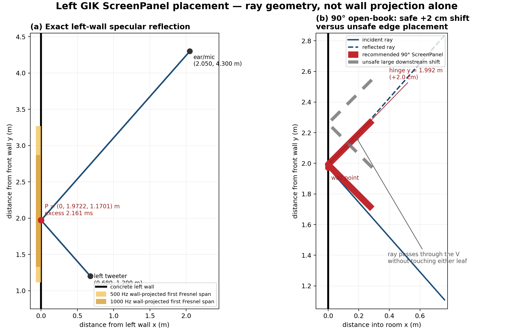
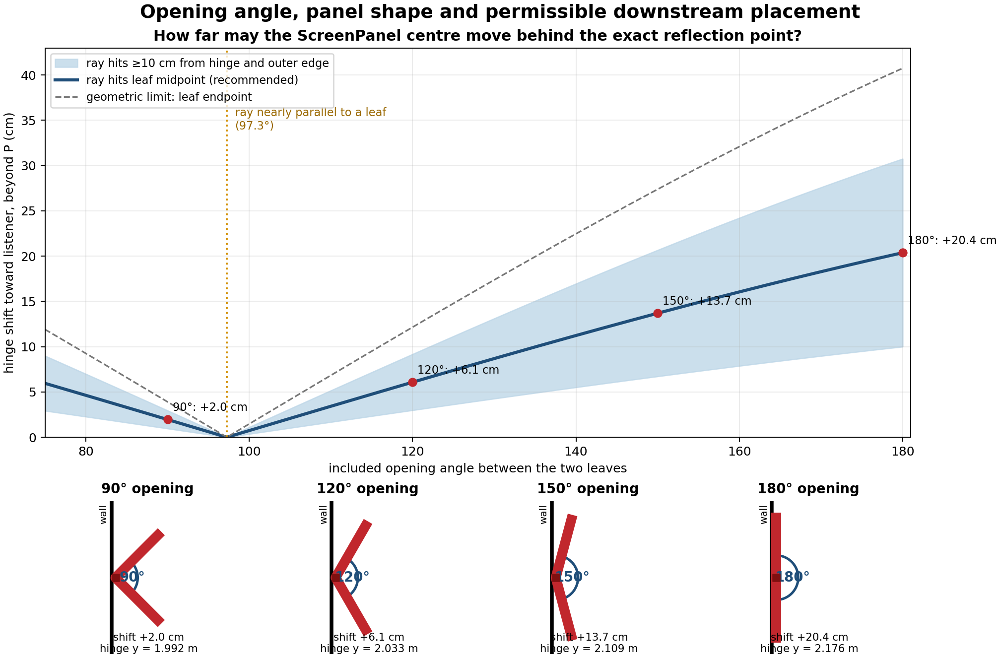
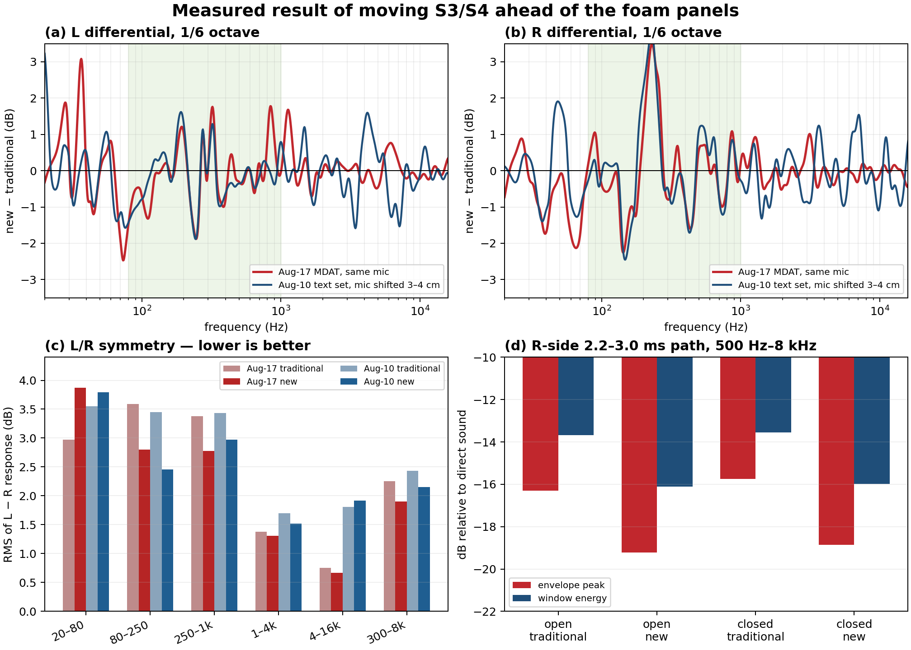

# GIK ScreenPanel placement at the left-wall reflection point — 120 cm configuration

## Scope and answer

This note answers two connected questions for the 120.blue room:

1. Where exactly is the left loudspeaker's first reflection point on the
   concrete left wall?
2. With the hinged GIK ScreenPanel standing as an open book, should its
   longitudinal centre/hinge be placed on that point, or should the screen be
   shifted farther from the loudspeaker while still covering the point?

It also records the measured result of the new treatment order on the open
right side: GIK panels S3/S4 first, prolonging the 1.75 m half-wall, followed
by foam panels F1/F2.

The exact left-wall point for the left loudspeaker is:

> **197.22 cm from the front wall and 117.01 cm above the floor.**

For a ScreenPanel opened to approximately 90 degrees, do **not** move the
hinge far enough that this wall point merely falls at the projected edge of
the screen. The ray then passes through the open V without touching either
absorber leaf. The recommended 90-degree placement is:

> **Put the hinge/longitudinal centre at 199 cm from the front wall:** about
> **2 cm farther from the speaker than the exact wall point.**

This small shift makes the outgoing ray cross approximately the middle of the
rear leaf instead of meeting the hinge. A practical safe range is **198.2 to
200.2 cm**, assuming a 10 cm margin from both the hinge and outer leaf edge.

The intuition behind moving the panel farther from the speaker is therefore
partly right: the ray should meet absorptive face, not the hinge. But a large
translation is safe only when the ScreenPanel is opened much flatter. If more
physical clearance is required, change the opening angle as well as the
position.

## 1. Geometry and exact reflection point

The coordinates come from [`roomgeom.py`](roomgeom.py), based on the tape survey
of 2026-08-10. Coordinates are:

- $x$: distance from the left wall;
- $y$: distance from the front wall;
- $z$: height above the floor.

The relevant points in metres are:

| item | coordinate $(x,y,z)$ |
|---|---:|
| left tweeter $S$ | $(0.680, 1.200, 1.200)$ |
| listening point $M$ | $(2.050, 4.300, 1.080)$ |
| image of the left tweeter $S'$ | $(-0.680, 1.200, 1.200)$ |

The specular path is obtained by reflecting the source through the wall and
drawing the straight line from $S'$ to $M$. Its intersection with $x=0$ is:

$$
P = (0,\ 1.972161,\ 1.170110)\ \mathrm{m}.
$$

The direct path is 3.391357 m and the reflected path is 4.132469 m. Their
0.741112 m difference corresponds to **2.16068 ms** at 343 m/s. This is the
exact version of the earlier rounded **1.97 m / 2.2 ms** result in the
[room panel map](room-form-panels.png).



The height is already appropriate for a floor-standing 183 cm ScreenPanel:
the point is 117 cm high, leaving approximately 117 cm below it and 66 cm
above it.

## 2. Why projected wall coverage is not sufficient

The legacy GIK ScreenPanel is 815 mm wide when unfolded and has two hinged
halves, each approximately **407.5 mm** wide. It is 1830 mm high and about
76 mm thick. Those dimensions and its intended use at reflection points are
given by GIK's [ScreenPanel product description](https://www.gikacoustics.com/blogs/products/screen-panel-gobo-product-video).

In plan view, assume:

- the hinge touches the concrete wall;
- the two equal leaves open symmetrically into the room;
- $a$ is the included opening angle between the leaves;
- $w=0.4075$ m is one leaf's width;
- the centre/hinge is shifted by $\Delta y$ toward the listener, away from the
  speaker.

Each endpoint is then:

$$
d = w\sin\left(\frac{180^\circ-a}{2}\right)
$$

into the room, and

$$
h = w\cos\left(\frac{180^\circ-a}{2}\right)
$$

along the wall from the hinge.

The incident and outgoing rays both have a plan-view slope of approximately
1.1355 m along the wall per metre into the room. For a downstream hinge shift,
the maximum shift at which either ray only just touches a leaf endpoint is:

$$
\Delta y_{\mathrm{limit}} = \left|h - 1.1355d\right|.
$$

Putting the ray at an endpoint is fragile. The recommendation below instead
places the intersection at the middle of the active leaf:

$$
\Delta y_{\mathrm{recommended}} =
\frac{1}{2}\Delta y_{\mathrm{limit}}.
$$

The shaded region in the following plot retains at least 10 cm of absorber
between the ray and either leaf edge. The scaled plan-view sketches below the
graph show the included 90, 120, 150 and 180 degree openings explicitly; the
black line is the wall, the square is the hinge and the red segments are the
two absorbing leaves.



There is a critical opening near **97.3 degrees** where a leaf is nearly
parallel to the ray. Around that angle almost any translation makes the ray
miss the panel. That is why the longitudinal wall projection alone gives the
wrong answer for an open-book absorber.

## 3. Recommended positions by opening angle

| included opening | depth into room | projected half-span | safe downstream shift | recommended shift | recommended hinge $y$ | nearest endpoint $y$ |
|---:|---:|---:|---:|---:|---:|---:|
| 90 deg | 28.8 cm | 28.8 cm | 1.0-3.0 cm | **2.0 cm** | **1.992 m** | 1.704 m |
| 120 deg | 20.4 cm | 35.3 cm | 3.0-9.2 cm | **6.1 cm** | **2.033 m** | 1.680 m |
| 150 deg | 10.5 cm | 39.4 cm | 6.7-20.7 cm | **13.7 cm** | **2.109 m** | 1.716 m |
| 180 deg, flat | 0 cm | 40.8 cm | 10.0-30.8 cm | **20.4 cm** | **2.176 m** | 1.768 m |

The nearest endpoint in the recommended 90-degree position is 50.4 cm behind
the tweeter along the room-length direction and approximately **64 cm from the
tweeter in plan**. Opening the panel flatter increases that plan clearance to
about 68 cm at 120 degrees, 77 cm at 150 degrees and 89 cm when flat.

### Practical decision

- **If the panel must remain self-supporting at about 90 degrees:** mark the
  hinge at **199 cm** from the front wall. Do not translate it substantially
  farther.
- **If more speaker clearance is important:** open it to about 150 degrees and
  put the hinge at **211 cm**, provided it remains mechanically secure.
- **If it can be held almost flat against the wall:** put the hinge at about
  **218 cm**. The exact reflection point then lies near the middle of the
  speaker-side half, not precariously at the outer edge.
- **Do not use the “point just covered by the edge” rule.** Even flat, it gives
  no tolerance for tape error, speaker toe-in, listener movement or the finite
  reflection footprint.

## 4. Finite reflection footprint

A single geometrical ray locates the centre of a reflection, but real audio
occupies a finite first Fresnel zone. Solving the exact path-length condition

$$
|S-Q|+|Q-M| = |S-P|+|P-M| + \frac{\lambda}{2}
$$

for points $Q$ on the concrete wall gives these wall-projected spans:

| frequency | longitudinal span $y$ | width along wall | vertical span $z$ |
|---:|---:|---:|---:|
| 250 Hz | 0.821-3.826 m | 3.005 m | 0.043-2.281 m |
| 500 Hz | 1.114-3.271 m | 2.157 m | 0.404-1.927 m |
| 1 kHz | 1.328-2.869 m | 1.540 m | 0.641-1.695 m |
| 2 kHz | 1.493-2.588 m | 1.095 m | 0.800-1.537 m |
| 4 kHz | 1.619-2.396 m | 0.776 m | 0.910-1.429 m |

The 81.5 cm ScreenPanel can cover the full longitudinal first Fresnel span
only from roughly 4 kHz upward. It still attenuates lower-frequency reflection
energy, but it cannot absorb the whole 500 Hz or 1 kHz footprint by itself.
This reinforces two placement rules:

1. intercept the exact central ray on absorptive material, not on the hinge or
   edge;
2. do not sacrifice central coverage merely to gain a few centimetres of
   loudspeaker clearance.

Vertically, the floor-standing panel covers the full 1 kHz-and-up zone and
almost all the 500 Hz zone; at 500 Hz only the uppermost approximately 10 cm
lies above the 183 cm panel.

## 5. Measured result of the new right-side order

Two independent differential sets compare the traditional right-side order
(foam first, then GIK) with the new order (GIK S3/S4 first, then foam):

- `../DRC-120.blue/foam.screens.opendoor.mdat`, measured 2026-08-17 with effectively the same
  microphone position;
- `../DRC-120.blue/120.blue.Rscreen.txts.boh/`, measured 2026-08-10 with a 3-4 cm microphone
  displacement between the new and `trad` measurements.

All response comparisons below use common 1/6-octave smoothing and remove only
the median 500 Hz-5 kHz acquisition offset. REW stores frequency response and
impulse response as separate measurement products, as described in its
[measurement API documentation](https://www.roomeqwizard.com/help/help_en-GB/html/api.html).



### 5.1 Left/right response symmetry

The metric is the RMS of the smoothed $L-R$ response; lower is more symmetric.

| band | Aug-17: traditional to new | Aug-10: traditional to new | conclusion |
|---|---:|---:|---|
| 20-80 Hz | 2.97 to 3.87 dB | 3.55 to 3.79 dB | no bass benefit |
| **80-250 Hz** | **3.59 to 2.80 dB** | **3.45 to 2.46 dB** | **strongest repeatable gain** |
| **250 Hz-1 kHz** | **3.38 to 2.78 dB** | **3.43 to 2.97 dB** | **moderate gain** |
| 1-4 kHz | 1.38 to 1.31 dB | 1.70 to 1.52 dB | small gain |
| 4-16 kHz | 0.75 to 0.67 dB | 1.81 to 1.92 dB | not repeatable |
| 300 Hz-8 kHz | 2.25 to 1.90 dB | 2.43 to 2.15 dB | modest overall gain |

The two differential curves correlate at **0.90/0.92 for L/R over 80-250 Hz**
and at **0.69/0.86 over 250 Hz-1 kHz**. Above 1 kHz the agreement largely
disappears, consistent with the microphone displacement and comb-filter
sensitivity. The credible audible change is therefore a modest improvement in
lower-midrange L/R matching and phantom-centre stability, not a global tonal
transformation.

This matches the earlier material argument: foam and GIK treatment may look
geometrically symmetric, but they are spectrally very different in the
125-500 Hz band. See the [previous treatment arithmetic](NOTES.md).

### 5.2 The S3 reflection path

The right loudspeaker's geometrical reflection point on the prolonged right
wall lies at about 2.24 ms. In the measured 2.2-3.0 ms region, filtered from
500 Hz to 8 kHz:

| door state | traditional peak | new peak | peak change | energy change |
|---|---:|---:|---:|---:|
| open | -16.30 dB | -19.23 dB | **-2.93 dB** | **-2.43 dB** |
| closed | -15.75 dB | -18.86 dB | **-3.11 dB** | **-2.43 dB** |

This is the strongest path-specific result and validates putting S3 at the
right-speaker mirror point. Total R-channel energy in the wider 2-5 ms window
falls only about 0.6 dB because the much stronger floor reflection near 1.8 ms
is unchanged.

### 5.3 S4, bass and the entrance door

- The expected L-to-S4 cross-room path near 8.5 ms does not fall repeatably:
  the two comparisons give approximately +0.6 and -0.2 dB peak changes.
- There is no treatment benefit below about 80 Hz. This is expected from two
  porous panels and the room's modal behaviour.
- Opening the entrance door changes the response by less than about 0.2 dB
  above 63 Hz and by no more than roughly 0.4 dB over 40-63 Hz. A weak
  35-50 Hz late-energy increase is marginal and, if real, is slightly more
  ringing rather than an improvement.

The door is therefore not an audible control variable at the 120 cm speaker
position.

## 6. Qualification: the left-panel move is a confound

The 2026-08-17 measurement-group note says that the first left GIK panel was
also moved closer to the left-speaker reflection point. Therefore the full
new-versus-traditional response comparison is a comparison of the **combined
layout**, not a perfectly isolated test of only the S3/S4 versus F1/F2 order.

That does not invalidate the path-specific S3 result: the approximately 3 dB
reduction occurs on the R-side 2.2-3.0 ms path and repeats with the door open
and closed. It does mean that broad L-channel changes should not be assigned
solely to the right-side reorder.

## 7. Installation and verification procedure

1. Measure along the concrete left wall from the front-wall plane.
2. Mark the exact ray point at **197.2 cm**, height **117.0 cm**.
3. Choose and record the actual included angle between the ScreenPanel leaves.
4. Mark the hinge according to the table:
   - about **199 cm** at 90 degrees;
   - about **203 cm** at 120 degrees;
   - about **211 cm** at 150 degrees;
   - about **218 cm** if flat.
5. Confirm that the ray-facing fabric, not the wooden hinge/frame, occupies
   the intersection.
6. Do not move the microphone, loudspeaker, S2, S3/S4 or the door during the
   comparison.
7. Sweep the L loudspeaker at two candidate S1 angles/positions and compare:
   - the 1.5-3 ms ETC region;
   - 80 Hz-1 kHz L/R symmetry;
   - the response after common 1/6-octave smoothing.

The primary recommended test is **90 degrees at 199 cm versus 150 degrees at
211 cm**. That directly answers whether the extra physical clearance of the
flatter setup costs any measurable reflection attenuation.

## 8. Rebuilding the figures and PDF

The figures are generated by:

```sh
python3 gik_screen_panel_placement-120cm.py
```

The measurement figure additionally requires `javaobj-py3` to decode the REW
MDAT:

```sh
python3 -m pip install javaobj-py3
```

Build the PDF from this directory with:

```sh
pandoc GIK-SCREEN-PANEL-PLACEMENT-120cm.md \
  -o GIK-SCREEN-PANEL-PLACEMENT-120cm.pdf \
  --from=markdown+gfm_auto_identifiers \
  --pdf-engine=pdflatex \
  --include-in-header=pdf-header.tex \
  --toc --toc-depth=3 \
  --metadata title="GIK ScreenPanel placement and measured panel-order result — 120 cm configuration" \
  --metadata author="giacomo" \
  -V geometry:a4paper -V geometry:margin=2cm \
  -V fontsize=10pt -V colorlinks=true \
  -V linkcolor=RoyalBlue -V urlcolor=RoyalBlue -V toccolor=black
```
