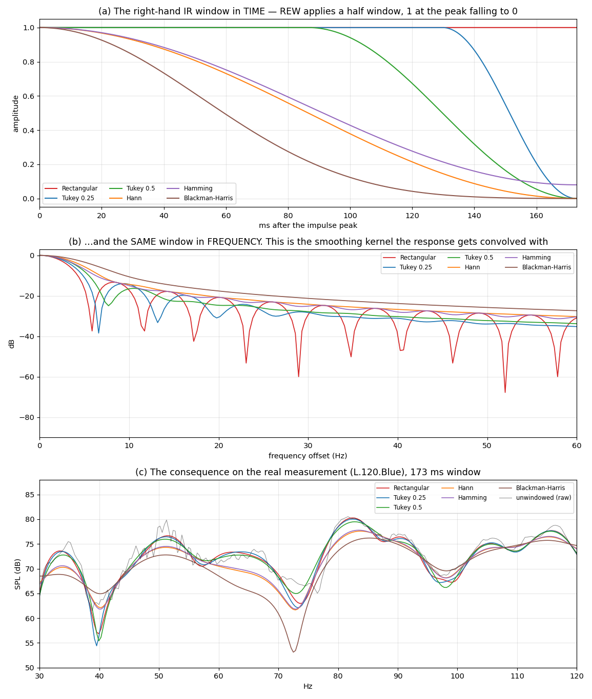
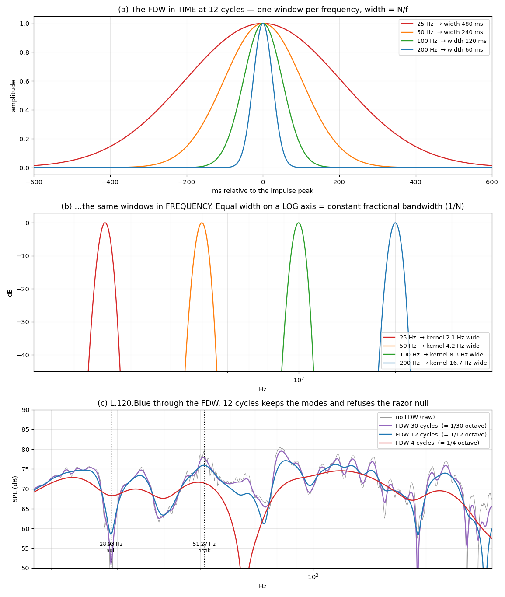
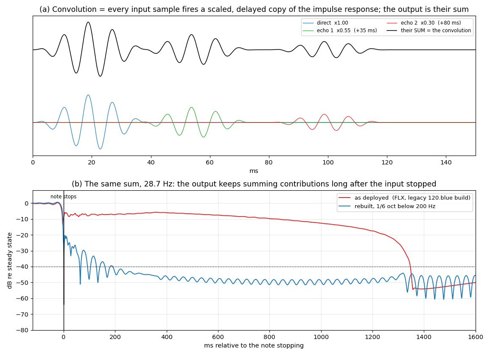

# Working notes — 2026-08-01

Session notes and open threads. The finished reference material lives in
`MANUAL.md`; this file is the running state of the investigation.

---

## 1. Where the tool stands

`allpass_tool.py` + `audio_io.py` are complete and regression-tested (six
suites, all passing). Everything described in `MANUAL.md` is implemented:
detection with timing-reference gates, the correction-vs-timing ladder,
user-added corrections, home target curves, REW-compatible smoothing with a
Gaussian kernel, complex phase smoothing, delay removal by coherent
alignment, Auto EQ (common and per-channel), and WAV/RAW/TXT export.

Current recommendation for this measurement set: all-pass on **L**, and
prefer the **−0.25 dB row (f0 41.8 Hz, Q 1.55, 24 ms, 0.99 cycles)** over the
nominal best (43.3 Hz, Q 2.75, 40 ms, 1.75 cycles). Half the group delay for
a quarter of a dB.

---

## 2. X801 analysis (measured today)

> ### ⚠ "X801" names two filters of different *scope* — added 2026-08-09
>
> A crossover correction is a property of the loudspeaker and must be
> independent of speaker position, so two files called X801 ought to be the
> same filter. **They are — as far as the crossovers go.** Measured side by
> side (both perfect all-passes, 0.0000 dB):
>
> | | GD @20 Hz | @100 Hz | @350 Hz | @4 kHz |
> |---|---|---|---|---|
> | `DRC-185/Xo801.wav` | **−23.74 ms** | −2.42 | −1.46 | −0.115 |
> | `DRC-120.blue/X801.wav` | **−1.31 ms** | −1.39 | −1.39 | −0.115 |
>
> **Above 350 Hz the two agree to 0.0051 ms rms** (max 0.078 ms) — bit-for-bit
> the same crossover correction, as position-independence demands. What
> differs is an *extra* low-frequency term present only in `Xo801.wav`:
>
> | | 20 Hz | 30 Hz | 60 Hz | 100 Hz | 200 Hz | 350 Hz | ≥700 Hz |
> |---|---|---|---|---|---|---|---|
> | `Xo801` − `X801` (ms) | −22.43 | −12.13 | −2.83 | −1.03 | −0.34 | −0.08 | **0.00** |
>
> That term is not a crossover correction at all — it is the **box +
> high-pass bass-rolloff phase alignment** discussed at length in §3(a). So:
>
> - `X801.wav` (120.blue) = **crossovers only**
> - `Xo801.wav` (185) = **the same crossovers + bass linearisation**
>
> Neither is wrong; they are different *scopes*. **§2 and §3 are about
> `Xo801.wav`; §20 and §21 are about `X801.wav`.**
>
> **What the extra term is — identified 2026-08-09.** Fitting it against
> Butterworth high-pass group delay:
>
> | order | best fc | residual rms |
> |---|---|---|
> | 3 | 19.69 Hz | 0.450 ms |
> | **4** | **20.66 Hz** | **0.391 ms** |
> | 5 | 22.37 Hz | 1.010 ms |
>
> A **4th-order high-pass at ~20.7 Hz** is a bass-reflex (ported) box
> alignment. So `Xo801` was built with the crossover-linearisation tab **plus**
> a box/rolloff linearisation; `X801` was built with the crossover tab alone.
> **Nothing is "wrong" with either.** Entering just the two crossover
> frequencies — as in `X801` — is the correct minimal design and is exactly
> what it did.
>
> **Verdict: keep `X801` (crossover-only). `Xo801` is not better here.**
> Its cost is genuinely small — isolated, the bass term pre-rings only
> **1.6 ms at −40 dB** (34 ms at −60 dB, 0.7 % pre-peak energy), so §3(a) was
> right that the pre-ring scare was overblown. The problem is the *benefit*:
> the 20.7 Hz / 4th-order figure is a **model fitted to the filter itself**,
> never checked against a nearfield measurement of an actual 801, and below
> 100 Hz the room contributes several times more phase than the ~22 ms being
> corrected. Low cost, unverified benefit. Restore it only after measuring the
> speaker's real rolloff nearfield.
>
> *(`drc_acceptance.py` fails `Xo801.wav` on group delay at 20 Hz. That is the
> test being applied out of scope — its 10 ms limit assumes a room-correction
> filter, and `Xo801`'s LF group delay is deliberate. Not evidence of a
> defect.)*
>
> Confirmed: `X801 (revised)`, the trace actually baked into `FLX`/`FRX`,
> matches `X801.wav` to **0.0015 ms rms** — the deployed chain carries the
> crossover-only version.

`Xo801.wav` — 131072 taps, 48 kHz, float64, centred — is a **pure phase-only
filter**: magnitude flat to 0.00 dB across 20 Hz–20 kHz, total phase rotation
878°. Its relative group delay runs −23.5 ms at 20 Hz to ~0 at 20 kHz.

Mirroring it gives the Nautilus 801's own excess phase, i.e. what it corrects:

| freq | 20 Hz | 25 Hz | 30 Hz | 40 Hz | 60 Hz | 100 Hz | 200 Hz | 350 Hz | 1 kHz | 4 kHz |
|---|---|---|---|---|---|---|---|---|---|---|
| group delay (ms) | 23.8 | 18.3 | 13.5 | 8.1 | 4.2 | 2.4 | 1.9 | 1.5 | 0.31 | 0.13 |
| in cycles | 0.48 | 0.46 | 0.40 | 0.32 | 0.25 | 0.24 | 0.38 | 0.52 | 0.31 | 0.51 |

Large low-frequency values are the bass alignment (box + high-pass rolloff);
the local bumps near 350 Hz and 4 kHz are the two crossover points.

**Key observation: expressed in cycles the 801's phase error never exceeds
about half a cycle anywhere.** That is below the thresholds we are using to
judge our own all-pass, which costs 0.99 cycles (low-ringing row) to 1.75
cycles (best row) at 42 Hz. The speaker's native phase behaviour is better
than the room correction we are contemplating.

**Cost of full linearisation — CORRECTED 2026-08-02.** Earlier numbers here
measured the *filter in isolation* (32.9% pre-peak energy, −40 dB at 3.4 ms,
−60 dB at 42 ms). That is the wrong object to judge. The filter's pre-ring is
what *cancels* the speaker's own lag; what reaches the ear is the product.
Measured by convolving the actual room responses with `Xo801.wav`:

| impulse response | −20 dB | −40 dB | −60 dB | pre-peak energy |
|---|---|---|---|---|
| X801 filter alone | 0.31 ms | 3.38 ms | 42.0 ms | 32.9% |
| L0 measured, no filter | 0.10 ms | 0.48 ms | 3.62 ms | 17.1% |
| **L0 × X801** | 0.10 ms | 1.38 ms | 14.67 ms | **6.3%** |
| R0 measured, no filter | 0.08 ms | 0.44 ms | 3.04 ms | 13.5% |
| **R0 × X801** | 0.10 ms | 0.62 ms | 12.56 ms | **1.8%** |

Pre-peak energy **falls** versus the uncorrected speaker (17.1 → 6.3% on L,
13.5 → 1.8% on R): the corrected impulse is more compact, not less. The only
real residue is the −60 dB tail lengthening from ~3 ms to ~13–15 ms. At
−40 dB it is 0.6–1.4 ms, inside the backward-masking window.

**Phase result of the same convolution** (bulk delay removed from each):

| | 40 | 100 | 200 | 350 | 500 | 1k | 2k | 4k | 8k | 12k Hz |
|---|---|---|---|---|---|---|---|---|---|---|
| L0 measured | 52.9 | 13.5 | −97.2 | −118.8 | 108.5 | 74.1 | 30.1 | −5.8 | 47.2 | 163.5 |
| L0 × X801 | −15.7 | 30.0 | −13.9 | 53.5 | −24.9 | 13.6 | 6.3 | −2.7 | −11.2 | −23.1 |
| R0 measured | −78.5 | 1.3 | −32.2 | −131.1 | 160.6 | 42.7 | 31.4 | −13.3 | 51.0 | 170.6 |
| R0 × X801 | −146.3 | 15.8 | 52.3 | 40.6 | 29.5 | −18.4 | 7.5 | −10.3 | −6.2 | −15.8 |

Phase excursion 200 Hz–12 kHz: L **268.6° → 78.4°**, R **341.1° → 70.7°**.
Over 40 Hz–12 kHz L goes 428.1° → 78.4°. From 1 kHz up L stays within ±23°
of zero across three octaves.

---

## 3. Open questions for tomorrow

**a. Is full linearisation of the 801 worth its pre-ring?** — **RESOLVED
2026-08-02: yes, keep X801 in full.** The convolution test in section 2
settles it.

> ⚠ **Scope note added 2026-08-09.** "Full" here means `DRC-185/Xo801.wav` =
> crossovers **+** a 4th-order ~20.7 Hz box-rolloff linearisation (§2). The
> filter deployed at 120 cm is the crossover-only `X801.wav`, so this
> resolution is **not** reflected in what is playing. The pre-ring verdict
> stands (the bass term alone pre-rings 1.6 ms at −40 dB), but the *benefit*
> was never verified against a measurement of the speaker — see §2 for why the
> current recommendation is to leave it out. Judging the filter by its own impulse response was the error;
in the acoustic product the pre-peak energy is *lower* than uncorrected.
The partial-correction ladder below is retained for reference but there is
no longer a reason to prefer a partial version. Everything from here to
the end of (a) is the earlier — and superseded — reasoning.

*The defect.* Every loudspeaker's bass rolloff — box plus crossover
high-pass — is minimum phase, and minimum phase means low frequencies come
out **later** than high ones. On the 801: 23.75 ms later at 20 Hz than at
4 kHz. This is normal, not a fault.

*The cure.* You cannot make the bass arrive earlier — that would be
non-causal. So a linearising filter delays **everything else** until it
matches. That is exactly what `Xo801.wav` is: magnitude flat to 0.00 dB,
pure timing, 878° of phase rotation.

*Why that produces pre-ringing.* Cancelling a minimum-phase delay requires
a filter that is not minimum phase; strictly it is anti-causal. It is made
realisable by delaying the whole thing (the 1365 ms of bulk latency in the
file), and the price is that its impulse response is roughly symmetric
about its peak: energy lands **before** the main event as well as after.
Musically, a kick drum acquires a faint low-frequency precursor that starts
before the strike.

*Why that is perceptually suspicious.* Nothing in nature does this. Sounds
decay after their attack, never before it. Hearing has strong **forward**
masking — a loud event masks what follows — but backward masking is weak
and only spans roughly 5–20 ms. So a pre-echo is more exposed than a
post-echo of the same level.

*Measured cost of the shipped X801* (Hilbert envelope, relative to peak):
pre-echo above −40 dB starts **3.4 ms** before the peak, above −60 dB
**42 ms** before.

*What partial correction buys* — same correction curve, scaled:

| variant | residual at 20 Hz | residual 350 Hz | pre-echo −40 dB | pre-echo −60 dB |
|---|---|---|---|---|
| full (shipped X801) | 0.00 ms | 0.00 ms | 3.4 ms | 42.0 ms |
| 50% of the correction | 11.88 ms | 0.74 ms | 2.5 ms | 26.5 ms |
| 25% of the correction | 17.81 ms | 1.11 ms | 2.0 ms | 16.9 ms |

*The structural insight.* Phase rotation 20 Hz→100 Hz is only **187°** of
the total **878°** — about 21%. Yet that 21% is what sets the pre-echo
length, because at 20 Hz one cycle lasts 50 ms, so any correction down
there is inherently long in time. The crossover corrections at 350 Hz
(1.48 ms) and 4 kHz (0.13 ms) are cheap in time and sit where hearing is
most sensitive to timing.

~~Therefore: correct the crossovers, be sparing in the bottom two octaves.~~
**Superseded** — this conclusion followed from judging the filter in
isolation and does not survive the convolution test in section 2.

Caveat on method: a crude high-pass weighting of the correction
("only above 100 Hz") behaves badly — it halves the −60 dB pre-echo to
20.9 ms but *worsens* the −40 dB onset to 7.8 ms, because the abrupt
transition rings on its own. Use rePhase's own band controls / a gentle
taper rather than a hard split.

*Where to see the 801's lag in REW* (asked 2026-08-02):

- **Not** in the room measurement's Group Delay — room modes swing L0 from
  +34.8 ms at 20 Hz to −8.7 ms at 40 Hz, larger and rougher than the
  speaker's own smooth 23.9 → 8 ms. It is buried.
- **Not** in REW's *Excess* Group Delay either. The bass lag is box +
  high-pass rolloff, i.e. **minimum phase**, and the excess-phase trace
  removes exactly that by definition. (Measured L0 excess GD reads −160 ms
  at 20 Hz — room and windowing residue, not the speaker.) This is also
  *why* the correction must be anti-causal.
- **Do** import `Xo801.wav` into REW (File → Import → Impulse Response) and
  view Graph → Group Delay: the mirror image, −23.9 ms at 20 Hz rising to 0
  at 20 kHz, with the crossover steps at 350 Hz and 4 kHz. Cleanest view,
  no room in it.
- To see it on the speaker itself, remove the room: nearfield woofer, or
  gated / frequency-dependent windowing, with t=0 set at the IR peak.
- Watch smoothing: at 1/3 octave the 20 Hz peak reads 17.75 ms instead of
  23.90 ms. Use none or 1/6 for group delay.

*How it was settled:* by measurement, in section 2 — convolving the real
L0/R0 room responses with `Xo801.wav` and looking at the product rather
than at the filter. The earlier plan here (build a 50%-scaled X801 in
rePhase, level-match, A/B on kick drum and bass attacks) is **dropped**:
full correction wins on the measurement, so there is no candidate to
compare against.

**b. Subwoofer integration before all-pass.** *(now the top priority —
strengthened 2026-08-02 by the clarity measurement below)*

Clarity C50 in the 40 Hz third-octave, measured from the IR recovered off
the REW grid, for every rung of the ladder:

| setting | group delay | C50 @40 Hz | null fill |
|---|---|---|---|
| no all-pass | — | **5.0 dB** | — |
| best, 43.3 Hz Q2.75 | 40 ms | 1.5 dB | +21.1 dB |
| −0.25 dB, 41.8 Hz Q1.55 | 24 ms | 2.4 dB | +21.0 dB |
| lower Q, 42.0 Hz Q1.00 | 15 ms | 1.5 dB | +21.1 dB |
| −2 dB, 42.0 Hz Q0.40 | 6 ms | 0.6 dB | +21.1 dB |

Two things fall out. **Every rung fills the null equally (+21 dB)** — the Q
buys nothing extra in level. And **every rung costs 3–4 dB of clarity at
40 Hz**, so the all-pass trade is "21 dB of level for ~3 dB of clarity"
almost regardless of which row you pick. The ranking *among* the rows is not
trustworthy from this metric (see caveat), but the direction is consistent
across all four.

A subwoofer fills the same null by acoustic summation at **zero** group delay
and therefore zero clarity cost. That is why (b) now outranks the all-pass
choice entirely: it is the same 21 dB without the 3 dB.

*Method caveats, so these numbers are not over-read:* T20 could NOT be
reproduced from the text export (reconstruction gave 0.15–0.22 s against
REW's own 0.53 s at 50 Hz) — those numbers were discarded rather than tuned
into agreement, and RT60 should be read in REW, not here. C50 at 40 Hz is
coarse: one cycle is 25 ms and the 1/3-octave band filter itself rings
~110 ms, so a 50 ms "early" window holds barely two cycles. Treat the 3–4 dB
drop as real and the differences between rows as noise.

**Original note:**
A third, differently-placed source can *fill* an L/R interference null at no
group-delay cost. Before accepting 24–40 ms of all-pass at 42 Hz, test
whether sub placement/level/delay reduces the 40–47 Hz null. Same physics as
today's problem (relative phase at the summation point), cheaper cure.

**c. Re-check the all-pass after per-channel EQ.**
Measured effect is small (L−R phase difference 8.8° mean, coherence in the
null 0.065 → 0.064, optimum moves 43.25 → 43.00 Hz) but it is not exactly
zero the way common EQ is. Workflow: all-pass → per-channel EQ → reopen and
confirm.

**d. Possible tool extension.**
Add phase-linearisation design to `allpass_tool.py`: target a group-delay
curve, show the resulting pre-ring on the existing burst/ringing page, and
export. The group-delay machinery, the burst test and the export path already
exist. This would let the (a) trade-off be seen on a plot before committing.

---

## 4. rePhase functions worth using here (discussion summary)

Ranked for this system:

1. **Partial / mixed-phase linearisation** — see (a) above.
2. **Delay, for subwoofer integration** — see (b) above. Biggest likely
   audible gain in the bass.
3. **Minimum-phase vs linear-phase realisation of magnitude corrections** —
   for bass modal work minimum phase is almost always right: no pre-ring, and
   a cut also shortens the mode's decay.
4. **Filter length and windowing** — 524289 taps at 192 kHz buys low-frequency
   resolution but also permits long pre-ring. Be deliberate rather than
   defaulting to maximum.
5. **Linear-phase crossovers** — only if the 801s ever go active, replacing
   the passive network. Much cleaner than correcting a passive network after
   the fact.

**Where rePhase stops:** it is a parametric designer — you tell it what to
build; it cannot invert a measurement. Measurement-derived correction of
magnitude *and* excess phase (with frequency-dependent windowing) is the
domain of DRC-FIR / Acourate / Audiolense. Sensible division of labour:
measurement-derived correction for the broad response, rePhase for surgical,
understood, parametric interventions like today's all-pass.

---

# Session 2026-08-03 — the null is a PLACEMENT problem

**This section supersedes the all-pass framing of the whole investigation.**
The 40–47 Hz null was never an inter-channel accident to be repaired with a
filter. It is a direct consequence of where the speakers stand, and it is
fixed by moving them, not by DSP.

## 5. The 25% rule — root cause, finally

Correct room dimensions (from `room.png`, not the earlier sketch reading):

- **length 7.40 m**, width **4.186 m** at the speaker line, opening to
  **5.986 m** past the right half-wall (which runs 1.75 m in from the front
  wall), ceiling slanted **2.4 → 3.0 m**, plus a **12 m corridor** coupled in
  through a 1.4 m opening. Volume ≈ 58 m³. **Not a box** — treat width and
  corridor numbers as indicative; the *length* axis is solid because speakers
  and listener both sit on it.

Axial modes landing in the null band:

| axis | n=1 | n=2 | n=3 |
|---|---|---|---|
| length 7.400 m | 23.2 | **46.4** | 69.5 |
| width 4.186 m | **41.0** | 81.9 | 122.9 |

Speaker coupling to mode *n* is `cos(nπd/L)`:

| d | % of length | n=2 (46.4 Hz) | n=3 (69.5 Hz) |
|---|---|---|---|
| 1.20 m | 16.2% | **0.524** | **0.042** |
| 1.233 m | 16.7% | 0.502 | **0.000** |
| 1.50 m | 20.3% | 0.293 | −0.333 |
| **1.85 m** | **25.0%** | **0.000** | −0.707 |

**1.85 m is exactly L/4.** The speakers sit on the pressure node of the
46.4 Hz mode and cannot drive it at all. The listener at 4.54 m (61.4% of the
length) sits where that same mode has **76% of full amplitude**. That is the
hole: the listener needs a mode the speakers cannot feed.

> `c/(4d) = c/L` when `d = L/4`. The SBIR quarter-wave arithmetic and the 25%
> modal null are **the same 46.4 Hz for the same reason**. This is why the
> earlier single-wall image-source model got the right frequency but only
> ~4 dB of depth — one wall cannot make a 29 dB null when its reflection
> arrives 6.8 dB down. The modal picture supplies the missing depth.

**Both bass defects at 185 cm come out of this one table:**

| | 185 cm | 120 cm | measured band change |
|---|---|---|---|
| n=2 coupling (46 Hz) | 0.000 | 0.524 | 32–45 Hz: **−12.3 → −3.8 dB** |
| n=3 coupling (69 Hz) | 0.707 | 0.042 | 63–90 Hz: **+5.9 → +0.7 dB** |

The 18 dB bass tilt at 185 cm — the thing that sounded "lean and defined" —
is the 46 Hz mode missing and the 69 Hz mode at full strength. Geometry alone
predicts the sign and rough size of both.

## 6. Why 120 cm specifically, and why it feels sudden

The 46.4 Hz loss going outward from 120 cm is smooth but **accelerating**:
−0.6 dB at 125, −1.3 at 130, −5.1 at 150, −12.3 at 170, −21.8 at 180. That is
the measured "few dB, then more dB" survey.

The *suddenness* at 120 is the other mode: **L/6 = 123.3 cm is the exact null
of the 69.5 Hz mode**, 3 cm away. At 120 cm you get near-full 46 Hz coupling
and near-zero 69 Hz coupling simultaneously — the 40-to-70 Hz **balance**
peaks sharply there (+21.8 dB, against −23.8 dB at 180 cm). Balance is what
is heard as "the bass came back".

Also: near a modal node the coupling crosses zero *linearly*, so sensitivity
is maximal exactly there. 5 cm at 1.85 m is an infinite relative change; the
same 5 cm at 1.20 m is 4%. **185 cm sat on the steepest point of the curve;
120 cm is in a flat region.**

## 7. Consequences for the all-pass work

- The all-pass was treating a symptom. Filling the null restores the room's
  own 42 Hz decay (~435 ms, L alone) which the cancellation had been hiding —
  measured: sum late energy +8.2 dB at 100–400 ms, single channel only +0.9.
  **The null was acting as a free 42 Hz absorber.**
- On dry electronic bass the all-pass gives **+0.2 dB**, not +21 dB: a 2-cycle
  note is ~16 Hz wide and the null is ~6 Hz, so it was only costing ~1.3 dB.
  **The null is a sustained-tone defect.**
- Q barely matters. All Q values shift the same energy the same way
  (attack window −1.3 to −2.6 dB, 100–400 ms +8.1 to +8.2 dB).
- Two claims made and retracted this session: "high Q is surgical, the
  transient sails through" (read off a fragile rise-time metric; the
  energy-in-time measurement says Q is near-irrelevant), and an
  energy-weighted group-delay-spread metric that predicted the opposite of
  the measurement. **Trust the energy-in-time windows, not rise time.**
- `gd_at_f0()` in the tool is correct (`4Q/ω₀`). A scratch script used
  `8Q/ω₀` and produced a 2× group-delay table in discussion — the tool and
  `MANUAL.md` were never wrong.

## 8. 120 cm costs depth — and why

Measured early energy relative to direct (300 Hz–8 kHz):

| | 0.3–2 ms | 2–5 ms | 5–10 ms | 10–20 ms |
|---|---|---|---|---|
| 185 L / R | −9.2 / −8.1 | −5.5 / −5.8 | −11.4 / −10.0 | −7.8 / −5.8 |
| 120 L / R | −7.9 / −7.3 | −4.6 / −5.3 | −9.9 / −8.1 | −8.5 / −3.2 |

Front-wall reflection moves from **10.3 ms / −6.8 dB** (185) to **6.7 ms /
−4.3 dB** (120) — earlier *and* louder, crossing from the "depth" window into
the fusion window. L/R asymmetry in the 10–20 ms window also grows from 2.0
to 5.3 dB.

**The reflection point is at 0.90–1.00 m off centre, i.e. ON the 2.5 m screen,
not beside it.** Panels flanking the screen catch only the outer fringe of the
Fresnel zone (0.84 m of available wall per side against a 1.6 m patch needed
at 500 Hz). An acoustically transparent screen with absorption behind it is
the only complete fix.

## 9. Treatment arithmetic — what does and does not work

GIK FlexRange 50 Hz, published α: 0.37 @40, 0.35 @50, 0.82 @63, 0.57 @80,
**1.58 @100, 1.69 @125**, ~1.2–1.3 above 160.

- At 40–50 Hz two panels change room absorption by ~5% → T60 −5%, inaudible.
  Halving T60 at 40 Hz needs **30–80 panels**. Bass is a placement/subwoofer
  problem here, permanently.
- At 100–250 Hz each panel is 0.9–1.2 sabins. That is where they earn their
  money, and it is the band carrying the early reflection.
- **NRC 1.05 is the average of 250/500/1000/2000 Hz.** It says nothing about
  bass; do not let it appear in a bass argument.
- Porous absorbers are *velocity* devices, so a panel flat on a wall does
  nothing where its thickness ≪ λ/4 (22 cm vs 1.72 m at 50 Hz). For a
  *specular travelling wave* at mid/high frequencies there is no node to
  hunt — flat on the wall at the mirror point is correct.

**Room asymmetry:** left wall full length, right side opens after 1.75 m into
a 12 m corridor. The 242 panels compensating this are doing real work — but
mixing 10 cm rockwool (α≈0.9 @250 Hz) with 6 cm pyramidal foam (α≈0.2 @250 Hz)
matches the geometry and mismatches the spectrum by ~4× in the 125–500 Hz
band. **Use all 242s.** Spectral matching beats geometric matching.

## 10. Open threads — revised

1. **Confirm the modal model by measurement.** Sweep at 1.10, 1.20, 1.233,
   1.30 m and check the 46/69 Hz balance against the coupling table. If it
   holds, placement is a solved problem and the all-pass can be retired.
2. **The screen** is the depth blocker. Price an AT screen before buying
   flanking panels.
3. **Floor bounce ~1.7 ms, −6 to −10 dB** is the largest early reflection at
   either distance and is untreated. Cheapest available win.
4. **Consolidate to all 242s**, symmetrically. Measure mid-band RT first —
   7 units in 58 m³ may already be near the limit.
5. Toole's 25%-of-*width* recommendation (Fig 13.11d) is untested here;
   speakers are at 18% and 20% of 4.186 m. Hold until the length-axis result
   is confirmed, and note the width is not well defined past 1.75 m.
6. Subwoofer integration — still open, but now clearly *second* to placement.

# Session 2026-08-04 — subwoofer feasibility under a single-DAC constraint

> ### DATA SOURCE RULE (set 2026-08-04)
> **`../DRC-120` is retired. Do not use it.** The authoritative 120 cm data is
> **`../DRC-120.blue/120.blue.mdat`** *(named `120-blue-with-inversion.mdat`
> until the 2026-09-01 rename)* and the text/CSV exports
> beside it. Everything below has been re-derived from `DRC-120.blue` or comes
> from `DRC-185`; anything that could not be re-derived is marked
> **[NEEDS RE-DERIVATION]**.
>
> Measurements inside `120.blue.mdat` (REW V2, Java-serialised —
> not machine-readable outside REW; export to text to work with it):
> `L.120.Blue`, `R.120.Blue`, `L+R.120.Blue`, `LR120.blue` (vector avg),
> `L1-MP`, `R1-MP`, `R1X`, `L2R2(oca 120)`, `L2R2+2dB`,
> **`LX-MP-INV+0dB`**, **`RX-MP-INV+0dB`** ← the filters in use
> (MP = minimum phase, INV = polarity inversion, +0 dB = boost cap),
> `FLX+2dB-trimmed`, `FRX+2dB-trimmed`, `X801`, `X801 (revised)`.
>
> ⚠ **Corrected 2026-08-09 — `FLX`/`FRX` are NOT plain exports of
> `LX/RX-MP-INV+0dB`.** The trace headers give the real chain:
> `LFilter` = minimum-phase copy of `LX-MP-INV+0dB`, then
> **`FLX` = `X801 (revised)` × `LFilter`**. So the crossover all-pass is baked
> into the deployed filter, and `FLX` is *not* minimum phase. This matters for
> §20.1. See §21.7.

Context: the chain is **one 2-channel DAC with doubled L/R outputs wired in
parallel** — same signal, not individually buffered. So a sub cannot get its
own DRC filter, its own EQ, or its own delay. Everything below is written
under that constraint.

## 11. The measured 185 cm bass shape

`DRC-185/LR.txt` vs `DRC-120.blue` exports, each re its own 200–500 Hz,
±3 % bands:

> ### ⚠ File-labelling trap — read before using these exports
>
> `LEFT+RIGHT-measured.csv` carries `* Measurement: **L+R.137.Blue**` in its
> header. **It is a 137 cm sweep**, despite sitting beside `LEFT-measured.csv`
> (`L.120.Blue`) and `RIGHT-measured.csv` (`R.120.Blue`) from the same session.
> Always read the `* Measurement:` line; the filename lies.
>
> The genuine Sep-2025 **120 cm** sum is the complex sum of
> `LEFT-measured.csv` + `RIGHT-measured.csv`.

- **137 Sep** = `LEFT+RIGHT-measured.csv` (REW 5.30b5, 21 Sep 2025) — *137 cm*
- **120 Sep** = `LEFT-measured.csv` + `RIGHT-measured.csv` summed (21 Sep 2025)
- **120 Apr** = `L+R-NO_DRC.csv` (REW 5.40b123, 28 Apr 2026) — *current config*

| Hz | 185 cm | 137 Sep | 120 Sep | 120 Apr | | Hz | 185 cm | 137 Sep | 120 Sep | 120 Apr |
|---|---|---|---|---|---|---|---|---|---|---|
| 18 | −0.6 | +1.1 | +2.3 | +4.0 | | 48 | −8.1 | **−15.2** | −6.5 | −4.5 |
| 22 | **+2.6** | +4.8 | +6.4 | +7.1 | | 52 | +0.9 | **−12.9** | −2.0 | −2.9 |
| 26 | +0.4 | +5.9 | +7.6 | +6.1 | | 56 | +1.7 | **−15.9** | −4.4 | −3.5 |
| 30 | −6.1 | −1.8 | +0.2 | +1.3 | | 60 | +1.2 | −6.3 | −3.8 | +0.3 |
| 34 | −8.0 | +1.1 | +3.2 | +3.4 | | 64 | +6.4 | +5.9 | +5.7 | +7.3 |
| 38 | −15.6 | −5.2 | −3.0 | −1.4 | | 72 | +7.1 | +1.9 | −0.9 | −0.9 |
| 40 | −19.9 | −6.6 | −3.3 | −3.9 | | 80 | +3.9 | +5.5 | +5.4 | +7.5 |
| 44 | **−21.6** | −9.3 | −5.5 | −4.6 | | 90 | +2.7 | +5.0 | +4.4 | +4.1 |

σ over 18–90 Hz: **185 cm 8.80**, **137 Sep 7.76**, **120 Sep 4.41**,
**120 Apr 4.56**.

> **The two 120 cm sessions agree.** Seven months, two REW versions (5.30b5 /
> 5.40b123), two sweep lengths (256k / 512k): σ 4.41 vs 4.56, per-frequency
> differences under 2 dB almost everywhere (worst 4.1 dB at 60 Hz), and
> **+1.3 dB** over the 47–55 Hz band. That is good repeatability.
>
> The ~10 dB gap at 47–55 Hz is **137 cm vs 120 cm** — a placement effect of
> exactly the kind §5/§6 predict — not a session-to-session change. The 137 cm
> column is a *useful extra placement data point*, not a duplicate of 120 cm.
>
> *(Supersedes an earlier note in this section claiming "the two 120 cm
> datasets disagree by 11 dB at 47–55 Hz". That comparison used the mislabelled
> file. See §17.6.)*

Three regions, not two:

1. **18–28 Hz — full output** (−0.6 to +2.6 dB). The mains are *not* rolling
   off here; the 801s plus the 23 Hz length mode carry it.
2. **30–47 Hz — the hole**, shallow at 30–36 (−6 to −11) and catastrophic at
   38–47 (−15 to −27).
3. **52–80 Hz — the bump**, +1 to +7 dB (n=3 at coupling 0.707, per §5).

This kills the naive "cross a sub at 50 Hz" plan: the sub's passband would sit
right on top of a region where the mains are already at full level.

## 12. Why the 18–28 Hz overlap is the *safe* part

First modes: length n=1 **23.2 Hz**, width n=1 **41.0 Hz**, height n=1
**63.5 Hz**. **Below ~40 Hz the room has only one resonance.** So the sign of
the 23 Hz coupling decides everything down there:

| source | d | coupling to 23 Hz |
|---|---|---|
| mains at 185 cm | 1.85 m | **+0.707** |
| sub on front wall | 0.00 m | **+1.000** |

**Same sign — they reinforce and cannot cancel**, whatever the phase control
is set to. The overlap region is protected by physics.

The exposure is at the *shoulders*, where the level gap is small enough for
cancellation to bite. Sub modelled flat with a 12 dB/oct LP at 50 Hz, level
set to bring 44 Hz up to −3 dB:

| Hz | mains | sub | gap | worst case | |
|---|---|---|---|---|---|
| 22 | +2.6 | −1.1 | 3.7 | — | safe (same-sign mode) |
| 30 | −6.1 | −1.5 | 4.6 | — | safe (same-sign mode) |
| **33** | −8.3 | −1.7 | 6.6 | **−7.2** | **exposed** |
| **36** | −10.7 | −2.0 | 8.7 | **−6.0** | **exposed** |
| 40 | −19.9 | −2.5 | 17.5 | −3.7 | safe (level gap) |
| 44 | −21.6 | −3.0 | 18.6 | −4.1 | safe (level gap) |
| **47** | −10.7 | −3.5 | 7.3 | **−8.4** | **exposed** |
| **50** | −2.6 | −4.0 | 1.3 | **−19.6** | **exposed** |
| **55** | +2.4 | −4.9 | 7.3 | **−2.5** | **exposed** |
| 63 | +5.7 | −6.4 | 12.1 | +3.2 | safe (level gap) |

Two narrow shoulders: **33–36 and 47–56 Hz**. That is the entire integration
problem.

Outcome, σ over 18–90 Hz (120 baseline = `L+R-NO_DRC.csv`, Apr 2026):

| | σ | range |
|---|---|---|
| 120 cm today | 4.57 dB | 12.1 |
| 185 cm alone | 8.52 dB | 28.5 |
<!-- NB: §11 gives 4.56 and 8.80 for the same two quantities. The small
     disagreement is grid/interpolation, not data — do not quote to 2 dp. -->
| **185 + sub, phase right** | **3.09 dB** | 10.4 |
| 185 + sub, phase wrong | 5.31 dB | 17.6 |

### The L/R antiphase at 120 cm, re-derived from `DRC-120.blue`

`LEFT-measured.csv` / `RIGHT-measured.csv` (21 Sep 2025, same session as the
Sep25 sum). The sum penalty is `20log₁₀(|L+R| / (|L|+|R|))`:

| Hz | 30 | 38 | 42 | 44 | **48** | **52** | **56** | 60 | 76 | 80 |
|---|---|---|---|---|---|---|---|---|---|---|
| \|L\|−\|R\| dB | −8.3 | +0.2 | −1.0 | +1.2 | +5.8 | +2.1 | +4.7 | +8.5 | −11.6 | −3.8 |
| Δφ(L−R) | +96° | +31° | +105° | +121° | **+171°** | **−158°** | **−136°** | +127° | +116° | +142° |
| sum penalty | −2.5 | −0.3 | −4.3 | −6.0 | **−9.6** | **−13.0** | **−7.0** | −4.4 | −2.8 | −8.3 |

**Confirmed on the correct data: 44–60 Hz is antiphase, costing 4–13 dB.**
The level imbalance is what limits it — where |L|−|R| is largest (+8.5 dB at
60 Hz) the penalty is smallest despite Δφ = 127°.

**It beats 120 cm only if the shoulders align — and is worse than 120 cm if
they don't.** A real fork, decided by one knob, settled by measurement.

### What the parallel feed actually costs

- **Defects of the *sum*** — level, tilt, the 18–28 Hz region ending up +4 to
  +7 dB hot — **DRC still fixes completely.** A common cut attenuates mains
  and sub together and the sum comes down. Parallel feed is no handicap.
- **Relative phase** between sub and mains — the sub's own phase control
  handles it (see §13), at one frequency.
- **Relative *delay* across a wide band** — genuinely lost. Not needed here
  because the exposed bands are two narrow shoulders, not a broad overlap.

Electrically, paralleling into a 10–22 kΩ sub input is a non-issue for any
competent output stage. The real nuisance is a ground loop from the second
cable run.

**Use one sub, not two.** Two subs on the front wall have identical coupling
(+1 for every n) and, fed the same signal, buy headroom and symmetry but zero
extra modal control. Sweep its position *along* the width — the 41 Hz width
mode sits inside the hole.

## 13. The plate-amp "phase" knob is a first-order all-pass

A **plate amp** is the amplifier module in the sub's back panel carrying the
low-pass frequency, level, phase, and polarity controls. Under the single-DAC
constraint it is the *only* place sub-vs-mains adjustment can happen.

The "0–180°" knob is **not** a constant phase shift. It is a first-order
all-pass with a sweepable corner; its lag runs 0° → 180° across frequency,
passing 90° at the corner. The dial marking is the asymptotic range, not what
you get at the crossover.

| knob corner | lag @30 Hz | @40 | @50 | @63 | @70 |
|---|---|---|---|---|---|
| 15 Hz | 127° | 139° | 147° | 153° | 156° |
| 25 Hz | 100° | 116° | 127° | 137° | 141° |
| 40 Hz | 74° | 90° | 103° | 115° | 121° |
| 100 Hz | 33° | 44° | 53° | 64° | 70° |

Three controls, three different *curve shapes*:

| control | lag vs frequency |
|---|---|
| polarity switch | **flat 180°** — the only truly general phase shift, and the only one costing zero time |
| phase knob | rises gently, 0° → 180°, bounded |
| delay in ms (better subs) | rises **linearly**, unbounded |

### It fits this geometry well

Sub 1.85 m further from the seat than the mains ⇒ 5.4 ms late. Correction
needed = 360° − lag, which *falls* with frequency:

| Hz | 33 | 36 | 40 | 44 | 47 | 50 | 55 |
|---|---|---|---|---|---|---|---|
| needed | 296° | 290° | 282° | 274° | 269° | 263° | 253° |
| **knob ≈40 Hz + polarity** | 260° | 265° | 271° | 276° | 280° | 283° | 289° |
| error | −36° | −25° | −12° | +2° | +11° | +21° | +36° |
| dB lost | −0.4 | −0.2 | 0.0 | 0.0 | 0.0 | −0.1 | −0.4 |

Max residual 36° ⇒ under half a dB. Polarity alone leaves 116° off; doing
nothing leaves 107°.

> **A pure ms delay would be *worse* here.** Its lag climbs linearly and
> overshoots at the top of the band. The all-pass's gentle rise happens to
> match the shape of (360° − linear lag) over a third of an octave. The
> cheaper control is the better-matched one.

### The sub's parametric EQ moves the alignment

Any plate-amp parametric is minimum phase, so the rotation is uniquely
determined by the magnitude dialled in — you cannot have one without the
other. That is benign when correcting a minimum-phase room resonance. It is
*not* benign here, because the sub's EQ sits only in the sub's chain and
rotates it relative to the mains:

| filter at 44 Hz | 33 Hz | 36 | 44 | 47 | 50 | 55 |
|---|---|---|---|---|---|---|
| −6 dB Q 2 | −19° | −19° | **0°** | +10° | +16° | +19° |
| −10 dB Q 3 | −28° | −31° | **0°** | +23° | +30° | +30° |

Zero at the centre, maximum on the skirts — and the skirts of a 44 Hz filter
land exactly on 33–36 and 47–56 Hz. A −10 dB Q3 swings the alignment 60°
across that span, roughly the whole error budget the knob was buying.

**Order of operations: EQ first, phase second, then re-measure.** Setting
phase and then adding EQ undoes the phase.

## 14. Why `360° − lag`, and why the alignment is narrowband

A delay `t` is a *fraction of a cycle*, so its angle depends on frequency:
`φ = 360 · f · t`.

| f | period | 5.4 ms is | lag |
|---|---|---|---|
| 33 Hz | 30.3 ms | 0.178 cycle | 64° |
| 44 Hz | 22.7 ms | 0.238 cycle | 86° |
| 55 Hz | 18.2 ms | 0.297 cycle | 107° |

**Every physical control can only *add* lag, never remove it** — nothing can
make the sub emit sound before it is fed. Phase is circular, so 0° ≡ 360°.
When the sub is 86° late you cannot subtract 86°; you add 274° and go the
long way round to a full cycle. Hence `360 − lag`.

**And that is precisely why the trick is narrowband.** "One whole cycle" is a
different amount of *time* at each frequency (30.3 ms at 33 Hz, 18.2 ms at
55 Hz), so the wrap that lines up at 44 Hz is wrong at the edges — that is
the ±36° in §13. A DSP would instead **delay the mains by 5.4 ms**: 0° error
at *every* frequency, because it removes the time difference rather than
disguising it with a rotation.

> **This is the real content of the single-DAC constraint.** Not that the sub
> cannot be aligned — it can, to within 36° across 33–55 Hz — but that the
> alignment is *narrowband* rather than broadband. Acceptable only because
> the band needing repair is about a third of an octave. A two-octave hole
> would break this approach entirely.

## 15. The transient cost — steady state is aligned, a single kick is not

Correct objection: the wrap-around aligns the *steady state*. A single 44 Hz
kick still arrives late. The bill:

| contribution | delay @44 Hz |
|---|---|
| acoustic path (1.85 m further) | 5.4 ms |
| 2nd-order LP @ 50 Hz | 5.0 ms |
| phase knob (all-pass f0 = 40 Hz) | 3.6 ms |
| polarity switch | **0.0 ms** |
| **total** | **14.0 ms** = 222° = 0.62 period |

Variants: 4th-order LP @50 + knob → **21.4 ms**; 2nd-order LP @70 + knob →
**12.9 ms**; 2nd-order LP @50, polarity only → 10.4 ms.

Three mitigating facts:

1. **Polarity is free phase.** The knob is the *smallest* of the three delay
   terms; the crossover slope is the bigger offender. Choose the shallowest
   slope and highest corner the level gap allows.
2. **Nothing early is being smeared.** At 185 cm the mains are 18–20 dB down
   at 40–47 Hz, so there is no early copy to disagree with. The signature is
   "weight lands just after the click", not a doubled or hollow attack.
3. **The room already dwarfs it:**

Re-derived from `DRC-185/LR.txt` and `DRC-120.blue` (onset 10–90 % / decay
to −20 dB, ms):

| | 44 Hz | 50 Hz | 63 Hz |
|---|---|---|---|
| 185 cm (`LR.txt`) | 124 / **92** | 60 / 156 | 38 / 103 |
| **137 cm** Sep25 (`LEFT+RIGHT-measured.csv`) | 57 / **331** | 42 / 76 | 53 / 131 |
| 120 cm Apr26 (`L+R-NO_DRC`) | 51 / **85** | 50 / 162 | 60 / 92 |

*(Middle row relabelled: that file is 137 cm, not 120 cm — see §11. No valid
Sep-2025 120 cm decay figure exists: the complex sum of the separate L and R
sweeps is a synthetic response whose null-induced ringing makes decay metrics
meaningless — Schroeder T20 on it returns 6777 ms at 44 Hz.)*

> ⚠ **Treat this table as indicative only — added 2026-08-09.** §17.6 withdrew
> the "331 → 85 ms at 44 Hz" comparison as unverified, because a perfect
> impulse pushed through the same Schroeder T20 analysis returns 221 ms at
> 44 Hz — a floor sitting above the 85 ms figure. These are *decay-to-−20 dB*
> numbers rather than T20, so they are not strictly the withdrawn quantity,
> but no control was ever run for **this** metric either. The qualitative
> point the section rests on — "the room already dwarfs the 14 ms" — survives
> at any plausible floor. The individual cell values do not carry weight, and
> §20.2's "85–92 ms" citation inherits the same caveat.
>
> **For a decay figure you can actually use, see §21.3** — measure the −3 dB
> bandwidth of the modal peaks (`T60 = 2.2/Δf`) and reject the impossible ones
> against the spectrogram. That route gives ~300–400 ms in the 40–100 Hz band
> for this room.

The room imposes decays of **85–162 ms** in the valid 120/185 cm rows before
any sub exists; 14 ms is a small addition to that. Published low-frequency
group-delay thresholds run ~20–30 ms at 100 Hz and roughly a full period below
60 Hz, so 14 ms at 44 Hz sits under them.

**And the comparison that matters is sub-vs-today, not sub-vs-perfect.** At
120 cm the 44 Hz content is not late, it is *partially cancelled* (§12), so
the audible remnant is modal ringing. A coherent attack 14 ms late beats a
cancelled attack.

Minimum-damage setting: **2nd-order LP at 65–70 Hz, polarity flipped, knob
only as far as needed** → ~13 ms with steady-state error inside 40°.

## 16. Retractions and negative results from this session

> **Items 1–6 below were derived from `../DRC-120`, which is now retired.**
> The *reasoning* stands on its own but every number is unverified against
> `DRC-120.blue`. Treat each as **[NEEDS RE-DERIVATION]** before acting on it.
> Item 6 has already been re-derived and confirmed — see §12.

1. **The 63–75 Hz EQ cut — retracted.** [NEEDS RE-DERIVATION] Three
   independent lines say no:
   (a) dip and peak share a critical band (ERB at 58 Hz is 31 Hz wide,
   spanning 43–73 Hz), so the ear integrates across them; (b) on the roex
   excitation scale the bass is already flat within **3.4 dB from 35–100 Hz**,
   and the cut leaves 45–70 Hz 3 dB *deficient* vs 100–125; (c) the 66 Hz
   peak does not ring (88 ms) while the dips do (206–283 ms). A minimum-phase
   cut only ever removes — it cannot fill the dip that precedes it.
2. **The floor-bounce rug — retracted.** Geometry confirms the 1.68 ms return
   (ETC −4.9 dB at 2.0 ms) and a real 3–6 dB dip at 280–350 Hz, but the
   893/1488 Hz comb nulls are already gone (existing rugs did their work), a
   rug cannot touch 300 Hz (needs 29 cm), and the reflection is **symmetric**
   → a timbre problem, not an imaging one.
3. **"Move one speaker ahead of the other" — dead.** Δφ(L−R) moves only
   0.4–1.0°/cm; pulling 180° back under 60° needs 120–300 cm of differential
   offset.
4. **The all-pass at 120 cm — retired.** Best case (50.5 Hz, Q 2.8) gives
   +7.3 dB at 43–58 Hz but relocates the hole to 60–63 Hz and costs −5.6 dB
   C50 at 50 Hz.
5. **Per-channel DRC did *not* unmask the 47–58 Hz hole**, contrary to the
   warning. The 0 dB boost cap means R (the quieter channel there) cannot be
   lifted, so the filters stay common-mode below 63 Hz. Net effect −1.6 dB at
   50 Hz. Directionally right, magnitude wrong.
6. **Correction to §6/§8 phrasing — RE-DERIVED AND CONFIRMED (§12).** At
   120 cm the channels are **not** in phase at 40 Hz. `DRC-120.blue`'s
   `LEFT-/RIGHT-measured.csv` show **44–60 Hz antiphase costing 4–13 dB**.
   What limits the damage is the *level imbalance*: where |L|−|R| is largest
   (+8.5 dB at 60 Hz) the penalty is smallest despite Δφ = 127°.
   *The 137 cm claim is still [NEEDS RE-DERIVATION]: `DRC-120.blue` has a
   137 cm **sum** (`LEFT+RIGHT-measured.csv` = `L+R.137.Blue`) but no separate
   L and R sweeps at that distance, so Δφ(L−R) cannot be recovered from it.*
7. **Stop scoring bass corrections with narrowband σ.** A 7-point sample
   missed a −7.8 dB notch at 74 Hz and a +5 dB peak at 80–86 Hz, overstating
   an improvement as 4.1 → 2.6 when it was 4.62 → 3.47. Use the roex
   excitation scale for anything below ~150 Hz.

## 17. Open threads — revised again

1. **The decision is about depth, not bass.** The sub is a *means to get back
   to 185 cm*, whose payoff is the 10.3 ms front-wall reflection instead of
   6.7 ms. Do not buy it to fix bass. *(The supporting claim "flat within
   3.4 dB on the roex scale" came from `../DRC-120` —
   **[NEEDS RE-DERIVATION]** against `L+R-NO_DRC.csv`, whose σ over 18–90 Hz
   is 4.56 dB.)*
2. If proceeding: one sub, front wall, **2nd-order LP at 65–70 Hz**, polarity
   flipped, knob near 40 Hz, EQ before phase, position swept along the width.
3. Possible Auto-EQ guard for `allpass_tool.py`: **in any band where
   |Δφ(L−R)| > 120°, treat the existing |L|−|R| imbalance as load-bearing and
   do not reduce it.** (See §16.6 — the imbalance is what caps cancellation.)
4. Items 1–5 of §10 all still stand.
5. **Re-derive §16 items 1–5 from `DRC-120.blue`.** **UNBLOCKED 2026-08-09** —
   the exports now exist in **`DRC-120.blue/120.blue.txts/`**
   *(called `txt/` until 2026-08-14, then `120.blue-with-inversion.txts/`
   until 2026-09-01)*:
   `L.120.Blue.txt`,
   `R.120.Blue.txt`, `L+R.120.Blue.txt`, plus the whole March-2025 and
   September-2025 design chains.
   ⚠ Those three are **96 ppo log grids** with Psychoacoustic/Variable
   smoothing — fine for level and shape, useless for ringing or fine
   structure. For full-resolution unsmoothed work use `LEFT-measured.csv` /
   `RIGHT-measured.csv` (both `* Smoothing: None`, 0.3662 Hz linear), which
   are the same two measurements.
   A 137 cm **sum** already exists as `LEFT+RIGHT-measured.csv`; there are
   still no separate L/R sweeps at 137 cm, so Δφ(L−R) at 137 cm stays
   underivable.
6. ~~**Explain the Sep25 ↔ Apr26 divergence.**~~ **RESOLVED 2026-08-08 — there
   was no divergence.** The "11 dB at 47–55 Hz" compared
   `LEFT+RIGHT-measured.csv`, which is internally labelled **`L+R.137.Blue`**,
   against the 120 cm `L+R-NO_DRC.csv`. Rebuilding the genuine Sep-2025 120 cm
   sum from `LEFT-measured.csv` + `RIGHT-measured.csv` gives **+1.3 dB** over
   47–55 Hz and σ 4.41 vs 4.56 over 18–90 Hz — the two sessions agree (§11).
   The companion "331 → 85 ms decay at 44 Hz" claim is **withdrawn as
   unverified**: a perfect impulse pushed through the same Schroeder analysis
   returns 221 ms at 44 Hz, so the method's own floor sits above the 85 ms
   figure and neither number was meaningful.
   **Consequences:** the 120 cm dataset is self-consistent, so the "no 120 cm
   conclusion is safe" caveat is lifted (item 5 is now the only blocker); and
   the corridor-door experiment loses its motivation at 120 cm and now only
   makes sense at **185 cm**, where a door-open corridor half-wave near 41 Hz
   would land inside the 42 Hz hole via a path that bypasses the 25% rule.
   **Lesson:** read the `* Measurement:` header line, not the filename.

## 18. The "echo" with the woofers still moving — it is the filter

Symptom: music stops, woofers keep moving, audible tail, **only with DRC**,
**only close to the woofers**. Diagnosed from the filter files themselves —
**the operative filters are `DRC-120.blue/FLX-trimmed-48k.wav` and
`FRX-trimmed-48k.wav`** (`X801 (revised)` × the minimum-phase copy of
`LX/RX-MP-INV+0dB` — see §11's correction). Not affected by the `../DRC-120`
retirement.

> The `-192k` files are **resampled copies of the same filter**: magnitude
> agrees with the 48k versions to **0.001 dB rms over 20–300 Hz**, and the
> band-tail figures below come out numerically identical. Analyse either.

**Filter geometry:** 131072 taps @ 48 kHz = **2731 ms**, peak at tap 24002
(**500 ms** in ⇒ 500 ms of system latency; check projector lip sync).
Pre-ring energy in −10…−2 ms is 0.07 % of total → **not** a linear-phase
filter, so this is not a linear-phase artifact.

**Measured tails of the filter itself:**

> ⚠ **Corrected 2026-08-09 — the original version of this table had no
> control.** A 1/3-octave analysis bandpass rings for a long time all by
> itself at low frequency; at 25 Hz its own −40 dB decay is **205 ms**. The
> first draft reported "25 Hz: 194 / 229 ms" — *below* the floor of the
> method, i.e. measuring nothing but the analysis filter. Re-run with a unit
> impulse pushed through the identical chain as a control:

| band | control (delta) | FLX (L) | FRX (R) | late >50 ms, L / R |
|---|---|---|---|---|
| 25 Hz | 205 ms | **1442** | 339 | 29.4 / 27.1 % |
| 31.5 Hz | 163 | **1427** | 170 | 17.9 / 15.3 % |
| 40 Hz | 128 | 136 | 128 | 7.8 / 8.1 % |
| 50 Hz | 103 | **391** | 102 | 6.2 / 2.9 % |
| 63 Hz | 81 | 83 | **336** | 0.7 / 2.4 % |
| 80 Hz | 64 | **432** | **277** | 11.2 / 21.9 % |
| 100 Hz | 51 | **213** | **242** | 3.8 / 1.4 % |
| 125 Hz | 41 | **260** | **215** | 20.5 / 10.1 % |
| 160 Hz | 32 | **172** | **109** | 4.6 / 2.8 % |
| 200 Hz | 26 | 98 | **143** | 1.5 / 1.2 % |
| 250 Hz | 21 | 67 | 20 | 0.3 / 0.0 % |
| 500 Hz | 10 | 10 | 10 | 0.0 % |

Bold = genuinely above the analysis floor. The qualitative conclusion of the
original draft survives and gets **worse**: the left filter rings for **1.4 s**
at 25–31.5 Hz, which the uncontrolled first draft missed entirely.

Low frequency only — hence "close to the woofers". Above 250 Hz the filter is
effectively instantaneous, which **rules out crossover correction** as the
cause.

**Root cause — the notches are far too narrow.** Notches with prominence
> 1.5 dB, per channel:

| ch | f₀ | depth | −3 dB width | Q |
|---|---|---|---|---|
| L | 28.9 Hz | −2.9 dB | **0.72 Hz** | **40.4** *(2 FFT bins — see §21.2)* |
| L | 51.2 Hz | −3.4 dB | 2.29 Hz | **22.4** |
| L | 81.6 Hz | −5.5 dB | 7.05 Hz | 11.6 |
| L | 116.5 Hz | −6.3 dB | 7.51 Hz | 15.5 |
| L | 128.2 Hz | −6.7 dB | 7.69 Hz | 16.7 |
| L | 145.5 Hz | −6.9 dB | 7.32 Hz | 19.9 |
| **R** | **79.0 Hz** | **−8.6 dB** | 3.57 Hz | **22.1** |
| **R** | **117.5 Hz** | **−11.5 dB** | 7.51 Hz | 15.6 |
| R | 162.3 Hz | −5.2 dB | 19.87 Hz | 8.2 |
| R | 192.6 Hz | −4.4 dB | 12.45 Hz | 15.5 |

Those are 1/8- to 1/15-octave notches. Simulated ring times (116–205 ms) are
the right order for the mid-band rows of the corrected table above (172–432 ms
at 80–160 Hz). *(An earlier version compared them against "115–243 ms measured
off the WAV" — figures from the uncontrolled first-draft table, now
withdrawn.)*

> **The filter was designed with no low-frequency smoothing at all.** The
> 28.9 Hz feature is **0.72 Hz wide — two FFT bins** (48000/131072 =
> 0.3662 Hz). Structure at the bin resolution means the correction target was
> taken from the raw unsmoothed measurement. That single number is the whole
> root cause.
>
> **Correction 2026-08-09.** The first draft dismissed this feature as "1 FFT
> bin — artifact" and moved on. It is not an artifact of the analysis: it is a
> real 2-bin notch in the deployed filter, and a gated 28.7 Hz note takes
> **1348 ms** to fall 40 dB through it. It is the single worst-behaved thing
> in the whole filter set. Mechanism, proof and fix in **§21**.

> ### Why "max boost 0.0 dB" did not protect against this
> `T₄₀ = 40·2Q / (8.686·ω₀)` — **depth does not appear.** A −3.3 dB notch at
> Q 21 rings exactly as long as a −20 dB notch at Q 21. **The boost cap
> constrains amplitude; it does not constrain time.**
>
> This is the same conservation law as the all-pass work (§7, §14): a narrow
> feature in frequency **is** a long feature in time, and minimum phase ties
> the two together inseparably. A Q 21 correction at 51 Hz cannot physically
> act in under ~200 ms.

**Fix — cap correction Q below ~200 Hz** (same depths, wider):

| f₀ | as built | Q 8.7 (1/6 oct) | Q 4.3 (1/3 oct) |
|---|---|---|---|
| 51.3 Hz | 205 ms | ~100 ms | **~55 ms** |
| 81.5 | 135 | 90 | **45** |
| 116.5 | 130 | 73 | **36** |
| 128.2 | 123 | 66 | **33** |
| 144.0 | 116 | 59 | **29** |

Practically: reduce the resolution of the data the correction is derived from,
below 200 Hz. **⚠ In REW the smoothing menu will not do this** — trace
arithmetic on IR-compatible measurements uses unsmoothed data regardless
(§21.1e). Use the IR window (§21.3), the division's regularisation parameter
(§21.2), or an export/re-import round trip (§21.8 step 4).

**Second, independent reason to do it:** a 2.4 Hz-wide feature at one mic
position is **not a room property** — it is position-specific interference
that vanishes 15 cm away. Below the Schroeder frequency (~166 Hz here),
correcting anything narrower than ~1/3 octave costs ringing everywhere and
buys accuracy only at the microphone point.

*(Also examined and rejected as the cause: a front↔rear flutter echo at
43/86 ms visible in the room ETC at 80–300 Hz. Real, but it is present
without DRC and cannot move a woofer after the signal stops.)*

## 19. Inversion vs REW Auto EQ — and what actually limits Q

Confirmed by giacomo: the filters were built by **inversion**, not Auto EQ.
The procedure files corroborate the failure point — **`LR-EP-psy.txt` and
`LR-EP-unsmoothed.txt` both start at 200.3 Hz**. Psychoacoustic smoothing was
in the workflow but only on the excess-phase trace *above* 200 Hz. Below that,
across the whole problem band, the inversion ran on raw FFT bins.

**Would Auto EQ have avoided it? Yes — by 7× to 50× in late energy.** Filter
impulse-response energy by window (no band filter involved, so no floor):

| filter | +2–10 ms | +10–50 ms | **+50–200 ms** | +200–2000 ms |
|---|---|---|---|---|
| **inversion (FLX, as built)** | 0.067 % | 0.027 % | **0.0151 %** | 0.0017 % |
| AutoEQ 13 filt, maxQ 10, 1/6 oct | 0.063 % | 0.030 % | **0.0021 %** | 0.0000 % |
| AutoEQ 12 filt, maxQ 5, 1/6 oct | 0.061 % | 0.027 % | **0.0014 %** | 0.0000 % |
| AutoEQ 8 filt, maxQ 5, 1/3 oct | 0.046 % | 0.022 % | **0.0005 %** | 0.0000 % |

In the first 50 ms they are comparable — that is legitimate correction work.
**The entire difference is in the tail beyond 50 ms**, which is exactly the
audible symptom.

> ### The real mechanism: smoothing limits Q, the cap does not
>
> | target smoothing | max-Q cap | filters | Q used (min/med/max) | cap hit? |
> |---|---|---|---|---|
> | 1/6 octave | 10 | 13 | 1.8 / 4.0 / **7.9** | **no** |
> | 1/3 octave | 10 | 8 | 1.1 / 3.8 / **7.6** | **no** |
> | 1/48 octave (≈raw) | 10 | 20 | 3.5 / **10.0** / 10.0 | **YES** |
>
> With 1/6-octave smoothing the natural Q values **never reach the cap** — a
> smoothed target has no features narrow enough to demand them. At raw
> resolution every filter pins to the cap.
>
> So Auto EQ's protection is not its Q limit. It is that it fits a **bounded
> number of filters to a smoothed trace**, and both guards are automatic. An
> inversion has neither — it faithfully inverts whatever trace it is given.

**Therefore the inversion technique is not the error.** Keep it if preferred —
minimum phase is a correct choice. Add one step: **limit the resolution of the
target below 200 Hz to ~1/6 octave.** Measured on the rebuilt left filter that
takes the 79 Hz tail 1209 → 72 ms and the 51 Hz tail 787 → 72 ms, for 1.29 dB
rms of correction accuracy (§21.10). Auto EQ simply reaches the same place
without having to remember.

> ⚠ **Two corrections, 2026-08-09.** (i) The earlier "243 → 123 ms at 40 Hz /
> 227 → 78 ms at 63 Hz" cited the uncontrolled §18 table and is withdrawn.
> (ii) "Smooth the trace before inverting" is the right *intent* but the wrong
> *mechanism* in REW — the smoothing menu does not reach trace arithmetic
> (§21.1e). And the 0 dB boost cap is **not** a correct choice on its own: it
> is a hard clamp whose discontinuity is itself a narrow feature. Use the
> division's regularisation parameter instead (§21.2).

*Caveat: the Auto EQ figures come from a reimplemented greedy biquad fit, not
from REW itself. The ratios and the smoothing↔Q relationship are solid; the
specific filter list is illustrative, not a prescription.*

### 19.4 "Isn't smoothing just a visualisation option?" — no

> ⚠ **Read §21.1 alongside this section.** The answer here is right in
> general — smoothing changes exports and feeds the target-match engine — but
> it is **not universal**, and the exception is the operation this project
> actually uses. REW performs trace arithmetic on IR-compatible measurements
> using *unsmoothed* data whatever the menu says, so for the A÷B inversion
> below, smoothing really is display-only. Everything in this section about
> *why* resolution must be limited stands; only the *mechanism* for limiting
> it changes (§21.3).

The natural objection: smoothing is what you look at, EQ should work on the
raw data. Both halves are wrong.

**(a) In REW it is not display-only. Proof is in this directory.** Two exports
of the same excess-phase trace, taken minutes apart, differ in grid *and* in
value:

| file | points | range | grid |
|---|---|---|---|
| `LR-EP-psy.txt` | 652 | 200.317 … 22033 Hz | **1/96-octave log** (ratio 1.007246 = 2^(1/96)) |
| `LR-EP-unsmoothed.txt` | 59770 | 200.317 … 22088 Hz | 0.3662 Hz linear |

Phase difference after interpolating onto a common grid (median removed):
1.36° rms / 3.34° max over 200–300 Hz, 0.70° rms / **8.90° max** over
500–1000 Hz. Same measurement, different numbers on disk. Smoothing is baked
in at export time, and it also resamples to a log grid — REW's help notes that
this conversion to *96 points per octave* itself first applies a 1/48-octave
filter "to remove any high frequency combing". Our measured grid ratio matches
2^(1/96) exactly.

**(b) The official statements** (REW help, V5.20+):

> "Variable smoothing is recommended for responses that are to be equalised."
> — [Graph Menu](https://www.roomeqwizard.com/help/help_en-GB/html/graph.html)

> "It is best to apply the 'variable' smoothing to the response before running
> the target match."
> — [EQ Window](https://www.roomeqwizard.com/help/help_en-GB/html/eqwindow.html),
> Filter Tasks

If smoothing were cosmetic there would be nothing to recommend. Also from the
same page, the definitions that matter here:

> "Variable smoothing applies **1/48 octave below 100 Hz**, 1/3 octave above
> 10 kHz and varies between 1/48 and 1/3 octave from 100 Hz to 10 kHz."
>
> "Psychoacoustic smoothing uses **1/3 octave below 100 Hz**, 1/6 octave above
> 1 kHz […]"
>
> "REW's smoothing uses multiple forward and backward passes of first order IIR
> filters to implement a Gaussian smoothing kernel."

**(c) Why raw ≠ true.** Three reasons, escalating:

1. *It isn't a property of the room.* Below Schroeder (~166 Hz here) the fine
   structure at one mic point is one point's interference pattern. Move 10 cm
   and every 0.37 Hz feature moves or vanishes. Correcting it fits noise.
2. *Inversion is an ill-posed inverse problem.* Its condition number is worst
   exactly at the deep narrow features. Smoothing **is** the regularisation
   step; skipping it is not purity, it is an unregularised inverse.
3. *Resolution in frequency IS length in time.* A Δf-wide feature is only
   visible if you look at ≈1/Δf of decay, so any filter addressing it is at
   least that long. **The smoothing setting is the knob that sets how long the
   filter is allowed to ring.**

| smoothing at 50 Hz | width | shortest possible filter |
|---|---|---|
| none — 1 FFT bin | 0.37 Hz | **2731 ms** |
| 1/48 oct = REW **Var** below 100 Hz | 0.72 Hz | **1385 ms** |
| 1/12 oct | 2.89 Hz | 346 ms |
| 1/6 oct | 5.78 Hz | 173 ms |
| 1/3 oct = REW **Psychoacoustic** below 100 Hz | 11.58 Hz | **86 ms** |
| ≈1/1 oct = REW **ERB** at 50 Hz | 35.4 Hz | 28 ms |

`FLX-trimmed-48k.wav` is 2731 ms long and, at 25–31.5 Hz, its −40 dB tail runs
to **~1.44 s** (§18, corrected). That is row 1, converted. Same conservation
law as §14 and §18. *(An earlier version cited "243 ms" from the uncontrolled
first-draft table.)*

**(d) Consequence — REW's own EQ recommendation does not protect the bass.**
Var is 1/48 octave below 100 Hz, i.e. 0.72 Hz at 50 Hz, i.e. still a
~1.4 second filter. It is the right advice for the range where most EQ work
happens and the wrong advice for the range that is broken here.

Why the recommendation does not settle this case: **Var is advised for the
*target-match* path**, which carries its own regularisers — a filter count
limit, a max-Q limit and a max-boost limit. There, smoothing does not have to
do the whole job. A bare inversion has none of those guards, so smoothing is
the *only* regulariser in the chain and must be correspondingly stronger. Not
a contradiction of REW, a different workflow.

**Use plain 1/3-octave smoothing below ~200 Hz before inverting**
(Ctrl+Shift+3) — the 86 ms row — or 1/6 octave (173 ms) to keep more detail.

**Not Psychoacoustic**, despite its 1/3 octave below 100 Hz:

> "It also applies more weighting to peaks by using a **cubic mean** (cube root
> of the average of the cubed values) to produce a plot that more closely
> corresponds to the perceived frequency response."

A cubic mean is a deliberately biased estimator — it rides high wherever the
response is spiky, which below Schroeder is everywhere. Inverting it cuts more
than the true average. Measured on this dataset (1/3-octave bands, cubic mean
minus power mean):

| band | L bias | R bias |
|---|---|---|
| 20–25 Hz | +0.16 / +0.19 dB | +0.10 / +0.09 dB |
| 31.5–50 Hz | +0.63 / +0.61 / +0.38 dB | +0.42 / +0.19 / +0.38 dB |
| 63–100 Hz | +0.10 / +0.67 / +0.28 dB | +0.72 / **+0.97** / **+1.03** dB |
| 160–200 Hz | +0.87 / +0.61 dB | +0.30 / +0.63 dB |

Up to **+1.03 dB of unnecessary extra cut**, worst exactly where the response
is spikiest. Small, but free to avoid: plain 1/3 octave gives identical
time-domain protection with no bias. Psychoacoustic is for *looking* at a
response, which is what it was used for here (`LR-EP-psy.txt`) and is the
correct use.

*(Corrects an earlier draft of this section that equated Psychoacoustic with
plain 1/3 octave below 100 Hz. The bandwidth matches; the averaging does not.)*

**(e) The counter-position, stated fairly.** A common forum recommendation is
to use *no* smoothing below Schroeder when EQing from a single-point
measurement, on the grounds that smoothing hides real modal peaks you want to
cut. That is not REW's documented advice, and the evidence in §18 is the
counterexample: the un-smoothed inversion did cut the peaks, at the cost of a
tail audible as an echo with the woofers still moving. The frequency-domain
error it removed was small; the time-domain error it added was not.

**(f) Where raw data does belong.** Arrival timing, excess phase,
minimum-phase extraction, anything above Schroeder where the response is a
property of the loudspeaker rather than of one seat. Which is exactly what
`LR-EP-unsmoothed.txt` was used for. The method was never wrong in kind — the
choice simply was never extended down into the band where it does damage,
because both excess-phase files start at 200 Hz.

---

## 20. Crossover phase on the N801 — and why taps *are* a smoothing setting

### 20.1 The `MP-INV` filters cannot touch crossover phase. At all.

N801: 3-way, **350 Hz and 4 kHz, third-order**
([spec](https://audio-database.com/BandW/speaker/n801.html),
[Stereophile](https://www.stereophile.com/content/bw-nautilus-801-loudspeaker-specifications)).

A third-order Butterworth crossover sums to

$$\frac{1}{(s{+}1)(s^2{+}s{+}1)} + \frac{s^3}{(s{+}1)(s^2{+}s{+}1)}
 = \frac{s^2 - s + 1}{s^2 + s + 1}$$

— a **second-order all-pass**. Verified numerically: |H| = 1.000000 across the
band, 359° rotation, ∫τ df = 0.997 ≈ 1 (§14's conservation law again).

A 4th-order Linkwitz-Riley sums to the same form, differing only in Q:

| crossover topology | summed all-pass Q |
|---|---|
| BW 18 dB/oct (3rd order, B&W's spec) | 1.000 |
| LR 24 dB/oct (4th order) | 0.707 |

**Consequence:** the crossover's contribution has *exactly flat magnitude*.
`LX-MP-INV+0dB` / `RX-MP-INV+0dB` are minimum phase, i.e. derived from
magnitude. A magnitude-derived filter presented with flat magnitude produces
nothing. **The crossover phase is invisible to the *inversion* by
construction** — not "poorly corrected", mathematically zero. No amount of
resolution, smoothing or tap count changes this.

> ⚠ **Scope correction 2026-08-09.** That is true of the inversion
> (`LX/RX-MP-INV+0dB`) but **not** of the filters actually deployed. `FLX` =
> `X801 (revised)` × the minimum-phase copy of the inversion, so the crossover
> all-pass *is* present in `FLX`/`FRX` and the crossover phase *is* being
> corrected — verified by measurement in §21.7. The argument of this section
> explains why the crossover correction has to come from a separate all-pass
> and cannot emerge from magnitude inversion; it does not mean the deployed
> chain lacks one. §20.7's action list is updated accordingly.

### 20.2 How much phase is actually there

| | 350 Hz xo | 4 kHz xo |
|---|---|---|
| rotation | 359° | 359° |
| group delay at DC | 0.910 ms | 0.080 ms |
| **peak group delay** | **1.96 ms** (~300 Hz) | 0.17 ms (~3.4 kHz) |

Total LF-vs-treble lag: **0.99 ms**. Commonly cited group-delay audibility
thresholds (Blauert & Laws) sit in the 1–4 ms range across the midrange,
tightest near 1–2 kHz. So 1.96 ms at 300 Hz is marginal, 0.17 ms at 4 kHz is
an order of magnitude under. **Set against 85–92 ms of room decay at 44 Hz
(§15, corrected) this is a small effect.** Correct it for correctness, not for a revelation.

An all-pass is not local to fc — it rotates across decades. Rotation left
uncorrected if the linearisation starts at a given frequency:

| linearise only above… | 350 Hz xo | 4 kHz xo |
|---|---|---|
| 100 Hz | 35° | 3° |
| **200 Hz** | **81°** | 6° |
| 350 Hz | 180° | 10° |

So a 200 Hz start would leave 81° and essentially the whole 0.91 ms DC lag.
0.91 ms at 50 Hz is 16°, and thresholds rise as frequency falls, so it is
inaudible — but there is no reason to accept it, because **the 200 Hz split
belongs to the magnitude work, not to the phase model** (§20.4).

### 20.3 Would a full inversion do it instead?

Only a **complex / mixed-phase** inversion — and then yes, automatically,
without ever needing the crossover frequencies, since the rotation sits in the
measured phase. But at the listening position measured excess phase is mostly
**room**, which is position-specific and non-minimum-phase, and whose inverse
**pre-rings**. Separating speaker from room needs frequency-dependent
windowing — DRC-FIR / Acourate / Audiolense territory, exactly as §4 said.

**rePhase's advantage is that it is a model, not a measurement.** Two
crossovers, deterministic, position-independent, no room contamination. Same
regularisation argument as the whole of §19: constrain the correction to what
you actually know.

### 20.4 `X801.rephase` already exists — with one field unset

The `.rephase` format is a one-line header followed by base64(zlib(JSON)):

```python
import base64, zlib, re, json
raw = open('X801.rephase').read().split('\n', 1)[1]
j = json.loads(zlib.decompress(base64.b64decode(re.sub(r'\s', '', raw))))
```

`DRC-120.blue/X801.rephase` contains:

```json
"cross_filters": [["LR  24 dB/oct", "3890", 0],
                  ["",             "355",  0]],     ← no filter type
"measurement":   "LR-EP-unsmoothed",
"taps": "131072", "sampling": "48000",
"centering": "middle", "windowing": "rectangular", "optimization": "none"
```

**The 355 Hz row has an empty type string**, so only the 3890 Hz crossover is
being linearised — the 350 Hz one, which carries ~95 % of the group delay,
does nothing. The "should I band-limit at 200 Hz" question was never a
band-limit question; it was an unset dropdown.

> ⚠ **Superseded 2026-08-09 — true of the project file, false of the WAV.**
> `X801.wav` was measured directly and **does** linearise both crossovers: its
> group delay fits two all-pass compensators at **375.4 Hz (Q 0.706)** and
> **3945.5 Hz (Q 0.686)**, residual 0.0076 ms rms; the high crossover alone
> fits 26× worse. So the exported filter is correct and **must not be
> redesigned** — but the saved `.rephase` no longer matches it, and
> re-exporting from that project would *lose* the 355 Hz correction. Full
> analysis in **§21.7**.

*(All seven `.rephase` projects on this machine share `rectangular` /
`optimization none` / `131072 taps` / `centering middle` — defaults never
changed. The `checksum` field is an md5 that could not be reproduced from the
JSON by any obvious scheme, so edit in the GUI, not by hand.)*

### 20.5 Pre-ring here is short — an earlier warning walked back

Combined correction filter for both crossovers, measured on the synthesised IR:

| level | pre-ring before the peak |
|---|---|
| −40 dB | **2.0 ms** |
| −60 dB | **4.5 ms** |

A crossover all-pass has Q ≈ 0.7 — maximally *broad* — so its inverse is
short. **Long pre-ring comes from correcting narrow features**, which is §19's
bass problem, not this one. Same conservation law, this time in our favour.
Linearise both crossovers full-range; there is nothing to taper.

*(Supersedes an earlier draft that warned of "tens of ms" of pre-ring and
suggested tapering at 100–150 Hz. Wrong by an order of magnitude for a Q≈0.7
all-pass.)*

The −80 dB / −100 dB figures in the same simulation ran out to 43 ms and
403 ms — that is **not** the filter, it is `rectangular` truncation of a
131072-tap buffer smearing energy. Which leads to:

### 20.6 Taps *are* a smoothing setting

131072 was almost certainly copied from REW's export grid:
48000/131072 = **0.3662109 Hz**, verbatim the `Frequency Step` in the CSV
headers. But that number is the *resolution of the measurement*; taps are the
*length of the filter*. **They do not need to match and should not be
conflated.** A 0.37 Hz-resolution measurement is perfectly well corrected by a
4096-tap filter.

A filter of N taps at FS has resolution FS/N — the finest feature it can
express:

| taps @48k | length | finest feature | ≈ fractional octave **at 50 Hz** | latency at `centering: middle` |
|---|---|---|---|---|
| **131072** | 2731 ms | 0.37 Hz | 1/95 oct | **1365 ms** |
| 32768 | 683 ms | 1.46 Hz | 1/24 oct | 341 ms |
| 16384 | 341 ms | 2.93 Hz | 1/12 oct | 171 ms |
| **8192** | 171 ms | 5.86 Hz | **1/6 oct** | 85 ms |
| **4096** | 85 ms | 11.72 Hz | **1/3 oct** | 43 ms |
| 2048 | 43 ms | 23.4 Hz | 1/1 oct | 21 ms |

Those bold rows are exactly §19.4's recommended rows. **Tap count and
smoothing are the same knob from opposite ends** — one bounds width in
frequency, the other bounds length in time, and §14 says those are one
quantity. *Choosing 131072 taps is choosing no smoothing.*

131072 is not wrong, it is **permissive** — and every failure in this project
has come from something being permitted that should not have been:

- permits up to 1365 ms of pre-ring (centred), for a correction needing 5 ms
- permits 0.37 Hz features, which necessarily ring 2731 ms → §18's echo
- 1365 ms latency if centred
- rectangular truncation of something that long smears (−80 dB at 43 ms)

Put concretely: **the measured 1.44 s tail at 25–31.5 Hz cannot exist inside a
171 ms filter.** At 8192 taps §18's echo would have been impossible whatever
target the inversion was given. Tap count is a constraint you cannot forget to
apply — precisely what an unregularised inversion lacks.

> ⚠ **But REW has no taps control** — its filter export is fixed at 128k
> samples (§21.3). This section's argument is sound and directly usable in
> **rePhase** (which does expose taps, §20.7) or when post-windowing an
> exported WAV; inside REW the equivalent lever is the IR window / FDW.

A useful accident of shape: fixed taps means constant Δf, so 11.7 Hz is 1/3
octave at 50 Hz but 1/240 octave at 4 kHz — heavy regularisation where the
data is one seat's interference pattern, light where it is the loudspeaker.
The **opposite** shape from REW's Var smoothing, and the better one here.

### 20.7 What to do

1. ~~**Set a filter type on the 355 Hz row** in `X801.rephase`.~~
   **DROPPED 2026-08-09 — nothing to do.** `X801.wav` already contains the
   355 Hz correction (§21.7); the saved project simply disagrees with it.
   Leave the WAV alone. Only if it must ever be rebuilt: low row at
   ~355–375 Hz, `LR 24 dB/oct` (Q ≈ 0.707), which is what the WAV measures.
2. **No frequency cut.** The model extends downward on its own.
3. **Taps 4096–8192**, and **windowing off `rectangular`**. Neither touches
   the correction; both remove the truncation smear and the pre-ring headroom.
   Floor: 20 Hz needs several 50 ms periods, so 4096 (85 ms) is the practical
   minimum, 8192 (171 ms) comfortable.
4. **Cascade is safe.** `FLX/FRX` are magnitude-derived minimum phase and
   contribute nothing to crossover phase — additive, no double correction.
5. **These are two independent jobs.** Shortening the rePhase filter does not
   cure §18: convolving a 4096-tap rePhase filter with the 131072-tap `FLX`
   inherits `FLX`'s tail intact. The magnitude filters must be rebuilt with
   smoothing (or short taps — the same thing) separately.
6. **Verify** by exporting the WAV and re-running §18's IR-tail metric.

**Caveat.** The textbook Butterworth/LR sum is a *model*. B&W's real acoustic
slopes include driver rolloffs and baffle effects, so the actual rotation is
not exactly 359°. The qualitative result is robust: any crossover summing to
flat magnitude has phase that magnitude-derived correction cannot see. For the
real number, a gated quasi-anechoic measurement at 1 m would be needed.

## 21. The safe REW inversion procedure

Written 2026-08-09, after the March-vs-September filter comparison. This
chapter supersedes the procedural advice scattered through §18–§20 and is the
one to follow when rebuilding filters.

### 21.1 Smoothing is *not* a visualisation option — the official statements

This was the wrong assumption underneath everything else, so it is worth
pinning to primary sources rather than argument.

**(a) REW's own help says exports carry the smoothing.** From the
[File Menu](https://www.roomeqwizard.com/help/help_en-GB/html/file.html) page,
on text export:

> *"Smoothing should be applied when using log exports, the dialog will warn if
> insufficient smoothing has been selected for the chosen output resolution.
> Exports can use whatever smoothing is currently applied to the measurement,
> or any other smoothing selected from the dialog (the selection will not
> change the smoothing of the measurement in REW, only the smoothing for the
> exported data)."*

If smoothing were a plotting option, "the smoothing for the exported data"
would be a meaningless phrase. The numbers that leave REW are the smoothed
numbers.

**(b) REW recommends applying smoothing *before* generating filters.** From the
[EQ Window](https://www.roomeqwizard.com/help/help_en-GB/html/eqwindow.html)
page, in Filter Tasks:

> *"It is best to apply the 'variable' smoothing to the response before running
> the target match."*

A display setting cannot be applied "before running" a computation. This
sentence only makes sense if the target-match engine consumes the smoothed
data.

**(c) Smoothing is a real DSP operation, described as such.** From the
[Graph Menu](https://www.roomeqwizard.com/help/help_en-GB/html/graph.html) page:

> *"multiple forward and backward passes of first order IIR filters to
> implement a Gaussian smoothing kernel"*

Forward-and-backward IIR passes are zero-phase filtering of the response data.
That is signal processing on the data, not rendering.

**(d) — WITHDRAWN.** An earlier draft argued: *"you removed smoothing from
`LX-MP` and the canyon appeared; had smoothing been cosmetic nothing would
have appeared."* **That argument is invalid.** Reversibility proves only that
REW retains the raw data non-destructively — which is exactly what a display
layer would do, and REW's help confirms it ("reapplying the same smoothing
command removes the effect", plus `Ctrl+0`). *Non-destructive* and
*display-only* are different claims, and that experiment does not separate
them.

**(e) The honest answer: it depends on the operation, and for trace arithmetic
REW explicitly bypasses smoothing.** From the
[All SPL Graph](https://www.roomeqwizard.com/help/help_en-GB/html/graph_allspl.html)
page, on Trace Arithmetic:

> *"The result of arithmetic on measurements that have compatible impulse
> responses is smoothed using the measurement A smoothing, **unsmoothed data is
> used during the calculations**."*
>
> *"[Other measurements] use whatever smoothing they already had applied during
> the calculations and the result is treated as unsmoothed (or 1/48 octave
> smoothed if data is 96 PPO)."*

**That sentence reads as self-contradictory but is not.** It is a comma splice
joining two clauses about *different objects*:

| clause | refers to |
|---|---|
| "the result … **is smoothed using** the measurement A smoothing" | the **output** trace inherits A's smoothing *setting*, for display |
| "**unsmoothed data is used** during the calculations" | the **input** to the math is the raw impulse response |

i.e. compute on raw data, then hand the result A's smoothing setting. It does
*not* say A's smoothed data fed the calculation. Verified verbatim in the raw
HTML of `graph_allspl.html`, not via a summariser.

So the truthful summary is:

| operation | uses smoothed data? |
|---|---|
| text / log export | **yes** — "the smoothing for the exported data" |
| EQ target match | **yes** — "apply … before running the target match" |
| trace arithmetic, IR-compatible measurements | **NO — unsmoothed, always** |
| trace arithmetic, non-IR traces (e.g. 96 PPO imports) | yes, whatever they carried |

Smoothing is therefore *not* merely cosmetic in REW as a whole — but **for the
A÷B step at the heart of this inversion chain it may as well be.** Setting
1/6 octave on `LX-MP` and pressing divide **will not work**: REW reaches past
it to the unsmoothed impulse response. This is the single most important
practical fact in the chapter, and it is why §21.2 and §21.8 below are built
around the IR window and an export/re-import round trip rather than around the
smoothing menu.

**Which smoothing to use, and why not the recommended one.** REW's smoothing
definitions, from the Graph Menu page:

| option | definition | verdict for inversion |
|---|---|---|
| **Variable** | *"1/48 octave below 100 Hz, 1/3 octave above 10 kHz … reaching 1/6 octave at 1 kHz. Variable smoothing is recommended for responses that are to be equalised."* | **No** — 1/48 oct below 100 Hz is where our whole problem lives |
| **Psychoacoustic** | *"1/3 octave below 100 Hz, 1/6 octave above 1 kHz … applies more weighting to peaks by using a cubic mean"* | **No** — right bandwidth, wrong estimator (§19.4: up to **+1.03 dB** bias on this dataset ⇒ over-cuts when inverted) |
| **ERB** | *"about 1 octave at 50 Hz, 1/2 octave at 100 Hz, 1/3 octave at 200 Hz"* | Too heavy below 100 Hz, but a defensible fallback |
| **plain 1/6 octave** | fixed fraction, plain (power) mean | **Yes** — use this |

REW's "Variable is recommended for responses that are to be equalised" is
aimed at the **target-match / parametric** path, which carries its own filter
count, max-Q and max-boost guards. A bare inversion has **none** of those
guards, so it needs the stronger smoothing. That is the whole reconciliation.

Why 1/48 octave is not smoothing at all down low — in FFT bins on the 131072
point grid at 48 kHz (bin = 0.3662 Hz):

| freq | 1/48 oct width | in bins |
|---|---|---|
| 20 Hz | 0.29 Hz | **0.79** |
| 25 Hz | 0.36 Hz | **0.99** |
| 28.9 Hz | 0.42 Hz | **1.14** |
| 51.3 Hz | 0.74 Hz | **2.02** |
| 100 Hz | 1.44 Hz | 3.94 |
| 200 Hz | 2.89 Hz | 7.89 |
| 1 kHz | 14.4 Hz | 39.4 |

A kernel narrower than one bin is an identity operation. Below ~50 Hz,
selecting 1/48 octave is *identical to selecting None*.

### 21.2 Where the canyon enters

Confirmed: **removing smoothing from `LX-MP` reveals the narrow canyon at
28.9 Hz** — the raw measurement contains it, as expected given the 38 dB null
below. Combined with §21.1(e), the mechanism is now unambiguous:

```
LX-MP-INV+0dB  =  Target RMS + phase average  ÷  LX-MP
```

REW performs this division on the **unsmoothed** impulse-response data
regardless of what smoothing is displayed. The canyon was therefore *always*
going to reach the divide, and the 2-bin notch in `FLX` is its inverse.

> **Correction 2026-08-09.** An earlier draft of this section concluded "so
> smoothing must be applied to `LX-MP` before the division". That is wrong —
> it cannot work, because trace arithmetic on IR-compatible measurements
> ignores the smoothing setting entirely. The fix has to change the *data*,
> not the *view* of it: shorten the IR window (§21.3), or round-trip through
> a text export (§21.8 step 4), or post-process the WAV.

Source feature in `L.120.Blue`: a **38.3 dB deep null at 28.93 Hz** (72.0 dB
at 27.10 Hz → 33.7 dB at 28.93 Hz). The right channel varies only 6.4 dB over
the same span — which is why only the left filter is affected, and is itself
evidence that the null is path-specific rather than a room property.

Note the "max gain 0 dB" cap *did* engage — `LX-MP-INV+0dB` is magnitude-flat
(−0.030 dB) at 28.93 Hz. It capped the boost and still let a 2-bin, Q-40
structure through, because **the cap constrains amplitude, not bandwidth**.
A hard clamp is a *discontinuity*: the response is pinned at 0 dB across the
null and then released, and a kink that sharp is itself a narrow feature.

#### The control REW already provides — and we left it at zero

From the same `graph_allspl.html` paragraph:

> *"The division operations have an optional **regularisation parameter** which
> is defined as a percentage of the average level of the divisor. **By default
> the parameter is zero, meaning no regularisation.** Applying regularisation
> limits the boost which occurs when the divisor becomes very small (or zero!),
> **such as where the divisor has notches in its response**, and so produces a
> more stable and manageable result. The maximum gain corresponding to the
> regularisation percentage is shown next to the control, at 25% (the maximum
> setting) no gain is allowed."*

and, for the `1/A` inversion operation specifically:

> *"…and an option to **exclude parts of the response that look like notches**."*

This is Tikhonov regularisation of an ill-posed inverse — precisely the
framing §19.4 arrived at from first principles, except REW ships it as a
control. It differs from the max-gain cap in exactly the way that matters:

| | max gain 0 dB | regularisation |
|---|---|---|
| limits boost at a null | yes | yes |
| how | **hard clamp** → discontinuity → narrow feature | **smooth roll-off** → no kink |
| constrains bandwidth | no | no |

**So regularisation is the right fix for the 28.93 Hz artifact** (a null being
inverted), and it is *not* a fix for the 51.27 Hz one — there the measurement
had a narrow **peak** (79.8 dB at 51.27 Hz vs 72.5 dB at 49.07 Hz), the filter
*cuts* it, and regularisation only limits boost. Cuts still need the
resolution limit of §21.3.

> ⚠ **WITHDRAWN 2026-08-10 — regularisation would not have fixed 28.93 Hz
> either.** Measured on the deployed WAV at native 0.3662 Hz resolution, the
> filter over 20–225 Hz spans **+1.19 dB max, −7.24 dB min**, and the 28.93 Hz
> feature is a **dip 3.5 dB from rim to bottom** (+0.87 / −1.64 / **−2.35** /
> +1.19 dB across four
> bins) carrying **−105 ms** of group delay. **The filter never boosts
> anywhere**, because max gain 0 dB clamped every requested boost to 0.00 dB —
> so a boost limiter had nothing to act on at any setting.
>
> Both diseases were therefore the *same* disease: a narrow feature, cured only
> by the resolution limit of §21.3. Confirming the mechanism, `LX-MP-INV+0dB`
> is magnitude-flat (−0.03 dB) at 28.93 Hz but its **phase** jumps +32° → −116°
> in one grid step; the clamp constrains amplitude and leaves the phase
> discontinuity, and §21.8 step 9's minimum-phase copy then re-derives
> magnitude structure from it.
>
> Also measured: after the §21.3 FDW at 12 cycles the divisor's deepest point
> over 20–225 Hz is only **13.7 dB below its own average** (L; 8.5 dB on R),
> versus 30.4 dB raw. A regularisation of a few per cent sets a floor ~30 dB
> down and cannot engage. **Set regularisation only if max gain is raised above
> 0 dB.** Full treatment in `REW-INVERSION.md` step 7 and R5.

Two different diseases, two different cures:

- narrow **boost** at a null → **regularisation** (and/or the notch-exclusion
  checkbox)
- narrow **cut** at a peak → **IR window / resolution limit** (§21.3)

### 21.3 "Number of taps" in REW — the IR window is the control

There is **no taps box** in REW's filter export. REW writes the filter impulse
response at a fixed **128k samples (131,072)** — which is exactly why every
filter in this project is 131072 taps. rePhase has a taps setting; REW does
not.

The equivalent control in REW is the **IR window**. From the
[Impulse Graph](https://www.roomeqwizard.com/help/help_en-GB/html/graph_impulse.html)
help:

> *"There are controls to adjust the position and widths of left and right
> windows that define the portion used to derive the frequency response"*
> … *"By default REW will set the widths of the windows automatically to show
> the whole room response, with a 500 ms right side window and a 125 ms left
> side window if the end frequency of the sweep is above 200 Hz"*

"The portion used to derive the frequency response" is the operative phrase.
The window length **is** the frequency resolution of everything downstream, by
Δf = 1/T — where T is the **total, left + right combined**, not the right side
alone:

> *"The frequency resolution corresponding to the current **total window
> duration (left and right combined)** is shown above the Apply Windows
> button."* — [Impulse Responses](https://www.roomeqwizard.com/help/help_en-GB/html/impulseresponse.html)

REW displays that number for you, so set the widths until it reads what you
want:

| total window | Δf shown | ≈ fraction of an octave at 50 Hz |
|---|---|---|
| 1.5 s (left 500 ms + right 1 s) | 0.67 Hz | 1/52 — **effectively none** |
| 500 ms | 2.00 Hz | 1/17 |
| 300 ms | 3.33 Hz | 1/10 |
| **173 ms** | 5.78 Hz | **1/6** |
| **86 ms** | 11.63 Hz | **1/3** |

So *bringing the total window down to ~170 ms is the same act as choosing
1/6-octave smoothing at 50 Hz* — with one decisive difference:

> **The IR window changes the data; the smoothing menu changes the view.**
> Per §21.1(e), trace arithmetic on IR-compatible measurements reaches past
> the smoothing setting to the unsmoothed impulse response — but it cannot
> reach past the window, because the window *defines* that impulse response.
> **This makes the IR window the primary control in the inversion path, not
> the backstop.**

Cost of a fixed short window: it applies the *same* Δf at every frequency, so
buying 1/6 octave at 50 Hz costs you 1/240 octave at 4 kHz — and it throws away
genuine room decay everywhere. Which is why the better tool is the next one.

#### Better: the frequency-dependent window (FDW)

REW has a window that does exactly what you wanted "1/6 octave smoothing" to
do, and — unlike the smoothing menu — **it is applied to the data**:

> *"a frequency-dependent Gaussian window can be applied. This is a window
> whose width varies inversely with frequency… The width of the window can be
> specified as a number of cycles or **an octave fraction**. The corresponding
> octave fraction has an effect **similar to applying a smoothing of the same
> octave fraction**, except the variable window excludes progressively more of
> the late arriving sound as frequency increases rather than just averaging it
> out."* — Impulse Responses

and, decisively, from the Trace Arithmetic paragraph:

> *"Any frequency-dependent settings are excluded, applying an FDW to the
> result would amount to applying the window twice, **as it is already applied
> to the data used to produce the result**."*

That sentence is the whole reason to prefer it: **the FDW survives trace
arithmetic; the smoothing menu does not.** Set the FDW to ~1/6 octave (or
~15 cycles) and you get fractional-octave regularisation that actually reaches
the divide.

#### The dialog, field by field

Observed on `L.120.Blue`: Left `Rectangular`, Right `Rectangular`, Left width
500 ms, **Ref Time 0.042 ms**, Right width 1000 ms, *Freq. resolution 1.00 Hz*,
*Span in samples 72,000*, `Add FDW` **unchecked**, 15 cycles.

**Ref Time** is the position of the window reference relative to t = 0, not
something you normally compute. REW puts t = 0 at the impulse peak (that is
what the acoustic timing reference buys), so Ref Time comes out at ~0 — the
0.042 ms here is just the residual offset of the peak from the sample grid.
Move it only with the Impulse graph's *Set t=0 at cursor* / *Offset t=0*
actions. **Leave it where it is**; the FDW is centred on it, and the help is
explicit that "for best results this should be at the peak of the impulse".

> ### Resolution = 1 / (right width). Settled by experiment 2026-08-09.
>
> The help says "total window duration (left and right combined)", but the
> dialog does not behave that way. Measured on `L.120.Blue`:
>
> | left | right | printed resolution | 1/(L+R) | **1/R** |
> |---|---|---|---|---|
> | 500 ms | 1000 ms | 1.00 Hz | 0.67 Hz ✗ | **1.00 Hz ✓** |
> | 500 ms | 500 ms | 2.00 Hz | 1.00 Hz ✗ | **2.00 Hz ✓** |
>
> **The left width does not affect frequency resolution.** So it is not a
> resolution control and there is no reason to shorten it — set the right
> width and leave the left alone.

**Both windows are set to `Rectangular`, and that matters as soon as you
shorten the right one.** A rectangular right window is a hard truncation: it
convolves the spectrum with a sinc and rings at 1/T across the whole response.
At 1000 ms the room decay is already in the noise so it costs little — at
~170 ms it would manufacture exactly the kind of narrow ripple this chapter
exists to avoid. Same defect as rePhase's `windowing: rectangular` in §20.5.

#### Which taper — and why not the obvious ones

REW's right window is a **half** window: full amplitude at the reference,
falling to zero at the right edge. That changes which shape is right, because
the taper eats the *early decay*, which is the part you most want to keep.



**(a)** the six shapes as REW applies them. **(b)** the same six in frequency —
**this is the smoothing kernel** the response gets convolved with. **(c)** each
applied to the real `L.120.Blue` impulse response at a 173 ms window.

> ### ⚠ Textbook window figures do not apply to a half window
> The familiar numbers (Hann −31 dB sidelobes, Blackman-Harris −92 dB) are for
> **symmetric** windows. REW's right window is truncated at its own peak, so
> the signal meets a step at t = 0 however smooth the taper is, and that step
> dominates the kernel. Measured on the actual half-windows at 173 ms:
>
> | shape | −3 dB width | leakage outside main lobe | kernel |
> |---|---|---|---|
> | Rectangular | **5.13 Hz** | 9.23 % | 10 nulls — **oscillates** |
> | Tukey 0.25 | 5.86 Hz | 6.90 % | 7 nulls — oscillates |
> | **Tukey 0.5** | 6.59 Hz | **5.66 %** | 3 nulls — **smooth** |
> | Hann | 8.06 Hz | 9.67 % | 0 nulls — smooth |
> | Hamming | 6.59 Hz | 11.72 % | 8 nulls — oscillates (never reaches zero) |
> | Blackman-Harris | **9.52 Hz** | **12.75 %** | 0 nulls — smooth |
>
> **Blackman-Harris is the worst of both worlds here** — widest main lobe *and*
> highest leakage, the exact opposite of its symmetric-window reputation.
> Panel (c) shows the damage: it erases the 51 Hz peak and digs the 73 Hz null
> several dB deeper than it is.

**So: `Tukey 0.5`** — chosen on measurement rather than reputation. Lowest
leakage of the six, a smooth non-oscillating kernel, for only 1.28× the
resolution of rectangular. `Tukey 0.25` if you want to give up less resolution
and can accept a mildly ringing kernel. `Tukey 0.01` is rectangular in
disguise.

Panel (b) also corrects *why*: the distinction is not sidelobe **level** — all
six sit at −13 to −16 dB — but sidelobe **structure**. The rectangular kernel
*rings*, with deep nulls and lobes still oscillating 60 Hz from centre; the
tapered kernels decay smoothly. Ringing in the kernel is ringing convolved
into every feature of the response.

Verify rather than trust: the Impulse graph can draw the window itself —
select the **`Window`** and **`Windowed`** traces and look at where the taper
starts.

#### The FDW in cycles — the conversion that makes it usable

The dialog takes cycles. A window of **N cycles** has width N/f seconds at
frequency f, so Δf ≈ f/N and the **fractional bandwidth is exactly 1/N**.
Therefore **N cycles ↔ Q = N**, and:

| FDW setting | fractional bandwidth | ≈ octave fraction |
|---|---|---|
| 15 cycles (REW default) | 1/15 | ~1/10 octave — mild |
| **~9 cycles** | 1/9 | **1/6 octave** |
| **12 cycles** | 1/12 | ~1/8 octave — **matched to this room's decay** |
| **~4.3 cycles** | 1/4.3 | **1/3 octave** |
| 17 cycles | 1/17 | 1/12 octave |

This is the same number as §21.5's Q rule, arriving from the other side: an
FDW of N cycles cannot leave behind a feature of Q > N. Setting **N cycles**
is therefore the direct executable form of "cap Q at N". For *this* room the
decay criterion below argues for **12**.



**(a)** the FDW is not one window but a *family* — one per frequency, width
N/f. At 12 cycles: 480 ms at 25 Hz, 240 ms at 50 Hz, 60 ms at 200 Hz.
**(b)** the same windows as frequency kernels. They are **equally wide on a
log axis**, which is what "constant fractional bandwidth" means and why the
FDW behaves like fractional-octave smoothing. **(c)** the real `L.120.Blue`
through it at 4, 12 and 30 cycles.

#### Choosing N — the numbers behind it

Two quantities matter, and both follow from N alone:

| N | window FWHM / longest T60 it can represent | | | |
|---|---|---|---|---|
| | **25 Hz** | **50 Hz** | **100 Hz** | **200 Hz** |
| 4 | 160 ms / 352 | 80 / 176 | 40 / 88 | 20 / 44 |
| 8 | 320 / 704 | 160 / 352 | 80 / 176 | 40 / 88 |
| **12** | **480 / 1056** | **240 / 528** | **120 / 264** | **60 / 132** |
| 20 | 800 / 1760 | 400 / 880 | 200 / 440 | 100 / 220 |
| 30 | 1200 / 2640 | 600 / 1320 | 300 / 660 | 150 / 330 |

Read it against three constraints:

1. **Preserve genuine modal decay** — N must exceed the modal Q. This room
   needs 9 at 50 Hz, 13 at 80 Hz, 16 at 120 Hz (see the decay criterion below).
   **Sets the floor: N ≳ 12.**
2. **Refuse position-specific interference** — the features that wrecked §18
   had Q 40 and 63. N must be far below them. **Sets the ceiling: N ≪ 40.**
3. **The measurement must actually contain the window** — at 25 Hz, N = 30
   asks for 1200 ms of clean decay above the noise floor. Rarely there.

**N = 12 sits comfortably inside all three.** The floor and ceiling are a
factor of 3 apart, so this is not a knife-edge setting.

And the effect on the feature that started all of this — the 38.3 dB razor
null at 28.93 Hz in `L.120.Blue`:

| | level at 28.93 Hz | depth below the 27.10 Hz peak |
|---|---|---|
| raw, no FDW | 33.7 dB | **38.3 dB** |
| FDW 30 cycles | 50.7 | 20.4 |
| **FDW 12 cycles** | **58.5** | **11.7** |
| FDW 8 cycles | 62.8 | 6.9 |
| FDW 4 cycles | 68.3 | 1.3 |

**12 cycles turns a 38 dB canyon into an 12 dB dip** — no longer something an
inversion will build a Q-40 resonator to fill, while the surrounding modal
structure (panel c) survives intact. That is §18 fixed at source rather than
patched downstream.

> **Note what the FDW is *not*.** It is a time gate, not magnitude smoothing:
> it changes the **complex** response. Where late-arriving energy had been
> filling a direct-sound null, tightening the window can make a null *deeper*,
> not shallower — visible on the 4-cycle trace around 70 Hz in panel (c). The
> 28.93 Hz null shallows because it is late-energy interference; a genuine
> early-arrival null would not.

#### Settings, concretely — two routes, pick one

**Route A (recommended): FDW only. Touch nothing else.**

| control | set to |
|---|---|
| Left shape / width | **leave** (`Rectangular`, 500 ms) |
| Right shape / width | **leave** (`Rectangular`, 1000 ms) |
| Ref Time | **leave** (it is the IR peak) |
| **Add FDW** | **ticked, 12 cycles** (decay criterion below; 9 for a tighter cap) |

The FDW is Gaussian and is applied *after* the left/right windows, so the
taper question never arises, and at 12 cycles it is narrower than the 1 s
right window everywhere above 12 Hz — it governs the whole working band. The 1 s
rectangular truncation is harmless because the decay is already in the noise
by then.

**Route B: fixed window, if you want a flat Δf instead.** Note this gives the
*wrong shape* — a constant Δf is far heavier regularisation at 4 kHz than at
50 Hz — so prefer route A unless you have a reason.

| control | set to |
|---|---|
| Right shape | **Tukey 0.5** (change this *before* the width) |
| Right width | **173 ms** → prints 5.8 Hz ≈ 1/6 oct at 50 Hz (300 ms → 3.3 Hz is a gentler first try) |
| Left shape / width | **leave** — it does not affect resolution |
| Add FDW | off |

Do **not** do both: you would be regularising twice and the printed resolution
would no longer describe the data.

#### Applying it to both channels

Use **`Apply to all, keep ref time`**, not `Apply windows to all`. Each
measurement has its own reference at its own IR peak; the plain "apply to all"
overwrites those with this measurement's Ref Time and misaligns the others.
"Keep ref time" copies the shapes and widths and leaves each measurement's own
peak alignment intact — which is what `L` and `R` need.

#### Why a time window *is* a smoothing kernel

Multiplication in time is convolution in frequency. Windowing the impulse
response by `w(t)` replaces the frequency response `H(f)` with `H(f) ∗ W(f)`,
where `W(f)` is the window's own spectrum. Convolving a response with a kernel
is *exactly* what smoothing does — replace each point by a weighted average of
its neighbours, the weights being the kernel.

> ### What "kernel" means, and yes — it is the FFT of the window
> Written out, the convolution is
>
> `Y(f) = ∫ H(ν) · W(f − ν) dν`
>
> so the value at every output frequency `f` is a **weighted average** of the
> input, and `W` supplies the weights. A weighting function sitting inside an
> integral operator like this is called its **kernel** — the same word as in
> *convolution kernel*, *Gaussian kernel*, *heat kernel*. It comes from the
> German *Kern*, "core": the kernel is the core of the operator, the thing that
> decides what the operator actually does. Change the kernel and you change the
> smoothing; everything else is bookkeeping.
>
> And yes: **the kernel is literally `W(f) = FFT{w(t)}`** — the Fourier
> transform of the time-domain window. That is what panel (b) of the figure
> above plots. A window's shape in time and its kernel in frequency are the
> same object seen from two sides, which is why "choose a window length" and
> "choose a smoothing bandwidth" are one decision.
>
> **One difference that matters.** The smoothing menu convolves the
> **magnitude** — it averages `|H|`, so it can only ever make a null
> *shallower*. Windowing convolves the **complex** response, amplitude and
> phase together, so contributions can cancel: a window can make a null
> *deeper*, as the 4-cycle trace does near 70 Hz in panel (c). REW's help says
> the FDW has "an effect similar to applying a smoothing of the same octave
> fraction" — *similar*, not identical, and this is where it differs.

**So windowing and smoothing are the same operation. The window's spectrum is
the smoothing kernel**, and its width is the resolution:

| window in time | kernel in frequency | so it behaves like |
|---|---|---|
| rectangular, length T | sinc, main lobe ~1/T, sidelobes −13 dB | crude smoothing at Δf = 1/T, **plus ringing** |
| Tukey / Hann, length T | wider main lobe, sidelobes ≪ | clean smoothing at Δf ≈ 1/T |
| Gaussian FDW, N cycles | Gaussian of width f/N | **fractional-octave smoothing, 1/N per octave** |

That is the whole reason the FDW works where the smoothing menu does not: both
convolve the response with a Gaussian, but the FDW does it by multiplying the
**data** in the time domain, while the menu does it to the **displayed
magnitude**. Trace arithmetic reads the data. Same mathematics, different
place in the pipeline (§21.1e).

It also restates §14's conservation law: `Δf · Δt ≈ 1`. Fine frequency
resolution and short time extent are the same quantity, and you cannot buy
both.

#### "Does windowing throw away real decay?" — yes, deliberately. Here is the criterion

It does remove late-arriving energy, and the amplitude graph afterwards is the
response of *direct sound plus everything within the window*, not the
steady-state room. That is a real loss and worth choosing deliberately rather
than by default.

The principled threshold: **do not correct anything that decays longer than
the room actually decays.** A resonance of quality factor Q decays 60 dB in
`T60 = 2.2·Q/f₀`, and an N-cycle FDW caps Q at N — so an N-cycle window can
still represent a decay of `2.2·N/f₀`:

| | N=4 | N=6 | **N=12** | N=20 |
|---|---|---|---|---|
| 30 Hz | 293 ms | 440 ms | **880 ms** | 1467 ms |
| 44 Hz | 200 | 300 | **600** | 1000 |
| 50 Hz | 176 | 264 | **528** | 880 |
| 63 Hz | 140 | 210 | **419** | 698 |
| 100 Hz | 88 | 132 | **264** | 440 |
| 200 Hz | 44 | 66 | **132** | 220 |

#### Getting the room's decay figure — and why no single method gives it

Short answer to "RT60, waterfall or spectrogram?": **none of them, on their
own, below ~150 Hz.**

| tool | gives | trustworthy where | use it for |
|---|---|---|---|
| **RT60** (T20/T30/EDT/Topt) | numbers per band | **above Schroeder only** (~166 Hz here) | mid/high-band RT; treatment work |
| **Waterfall** | 3D ridges | qualitative | *which* modes ring; before/after |
| **Spectrogram** | 2D map | qualitative, ±2× | *how long* — the referee |
| **Peak bandwidth** `T60 = 2.2/Δf` | numbers per mode | below Schroeder, **if cross-checked** | **the figure you actually use** |

**Route 1 — frequency domain.** Since `T60 = 2.2·Q/f₀` and `Q = f₀/Δf`, the
frequency terms cancel:

> **T60 = 2.2 / Δf**, where Δf is the −3 dB bandwidth of the peak, in Hz.

Decay depends *only* on bandwidth. A 5 Hz-wide peak decays 440 ms whatever its
frequency. Measured off the unsmoothed `L/R.120.Blue`:

| | widest-band (fastest) | narrowest-band (slowest) |
|---|---|---|
| L | 65.9 Hz, Δf 8.5 Hz → 259 ms | **53.8 Hz, Δf 0.99 Hz → 2215 ms** |
| R | 162 Hz, Δf 19.8 Hz → 111 ms | **29.3 Hz, Δf 1.27 Hz → 1737 ms** |

**Those two slowest figures are not real.** A 2.2 s decay at 54 Hz in 58 m³ is
physically impossible. This exposes the method's blind spot: **a single-point
magnitude measurement cannot distinguish a genuine high-Q mode from a narrow
interference peak** — both are narrow, and the peak-width formula happily
converts either into a decay time. It is the same trap as §18, seen from the
frequency side.

**Route 2 — time domain.** REW's **RT60** graph (Topt / T20 / T30 / EDT) is
the standard tool, but it is only meaningful **above** the Schroeder frequency
(~166 Hz here). Below that the field is modal, not diffuse, "reverberation
time" is not a well-defined quantity, and the band filter has its own floor —
a 1/3-octave filter at 25 Hz rings 205 ms unaided (§18). Numbers from this
route below ~150 Hz are not trustworthy, which is exactly how §15's figures
came to be marked indicative.

**Route 3 — waterfall and spectrogram, used as the referee.** Neither gives a
precise number, but they answer the one question the other two cannot: *how
long does energy at this frequency actually persist?* On the measured
spectrogram for this room, energy in the **40–100 Hz** band fades by roughly
**300–400 ms**; the large smear below ~20 Hz is analysis artefact, not decay.

**Waterfall vs spectrogram** — same underlying computation (a series of FFTs
at successive time offsets), two presentations:

| | shows | best for |
|---|---|---|
| **Waterfall** | 3D, magnitude vs frequency vs time | *which* modes ring, and before/after comparisons — the ridges are easy to match up |
| **Spectrogram** | 2D map, colour = level | *how long* a given frequency persists — easier to read a time off, so this is the referee |

**Why neither can give you a number — the same law, a third time.** Both are
built on an analysis window of length W, and that window sets *both* axes:
frequency resolution ≈ 1/W, time smearing ≈ W. To resolve a 5 Hz-wide mode at
50 Hz you need **W ≥ 200 ms**; but a 200 ms window cannot resolve a decay
much shorter than 200 ms, and the decay you are trying to measure is ~400 ms.
There is no setting that gives both. `Δf · Δt ≈ 1` again (§14, §19.4, §21.3) —
the same constraint that governs the smoothing menu, the tap count and the
FDW, now limiting the instrument you would use to check them.

So these views are reliable to a **factor of about two**, which is exactly
enough to separate 400 ms from 2200 ms and not nearly enough to separate
300 ms from 400 ms. Referee, not instrument.

**Reading them without fooling yourself:**

- Set the analysis window to ~**300 ms** for bass work: long enough to separate
  modes ~3 Hz apart, short enough not to invent decay.
- Set the level range so the floor sits **35–40 dB** below the peak. Too wide a
  range and everything looks like it rings forever; too narrow and real decay
  vanishes.
- Read decay as *where a streak fades relative to where it started*, with the
  cursor — not by eye off a screenshot.
- **Ignore everything below ~20–25 Hz.** The sweep has little energy there and
  the window is many cycles long, so the smear is the analysis, not the room.
  This is what the large low-frequency blob in the measured spectrogram is.
- The same trap as §18 applies: check that a "long decay" is not simply the
  analysis window's own length looking back at you.

**So: use route 1 for the numbers, route 3 to reject the impossible ones.**
Any peak whose bandwidth implies a decay far longer than the spectrogram shows
is interference, not a mode — and must not be corrected. Cross-checked that
way, the credible modal decays here are the **259–360 ms** family, i.e.:

| at | credible T60 | implied Q | cycles needed |
|---|---|---|---|
| 50 Hz | ~400 ms | 9.1 | 9 |
| 80 Hz | ~350 ms | 12.7 | 13 |
| 120 Hz | ~300 ms | 16.4 | 16 |

**≈12 cycles remains the right setting** — it covers the credible modes in the
40–100 Hz region where the problems are, and refuses the 1.7–2.2 s phantoms
outright. Below ~9 you would truncate real modal decay at 50 Hz; far above it
you are no longer regularising anything.

*(A fixed-cycles FDW implies T60 ∝ 1/f, i.e. shorter permitted decay as
frequency rises. That is the right shape — real rooms do decay faster with
frequency, and above Schroeder the response stops being modal anyway.)*

Now apply the same arithmetic to the features the deployed filter actually
built:

| feature in `FLX` | Q | source resonance it implies |
|---|---|---|
| **28.93 Hz** | 40.4 | **T60 = 3.07 s** |
| **51.27 Hz** | 62.7 | **T60 = 2.69 s** |
| 81.67 Hz | 11.9 | 321 ms — plausible |
| 116.46 Hz | 15.7 | 297 ms — plausible |

A 3-second decay at 29 Hz in a 58 m³ room is not physically possible. **That
is independent proof the two worst features were never room modes** — they are
one microphone position's interference pattern, and the answer to "does the
window throw away something real" is, for exactly those features, no.

#### Where in the chain to apply it

**On the `L` and `R` measurements, once, before any arithmetic — and nowhere
else, ever.** Three quotes from the Trace Arithmetic paragraph settle it:

- *"The currently applied impulse response window settings are used for each
  trace."* → what you set on `L` and `R` is what every downstream operation
  consumes. Set it once, at the source.
- *"The result uses the same window settings as trace A"* → derived traces
  **inherit automatically**. `LX = L × X801` is created with `L` as trace A,
  so `LX` already carries `L`'s window. Nothing to re-apply.
- *"Any frequency-dependent settings are excluded, applying an FDW to the
  result would amount to **applying the window twice**, as it is already
  applied to the data used to produce the result."* → re-applying is not
  neutral, it is a second regularisation. REW deliberately clears the FDW flag
  on results; **do not put it back.**

And one thing you cannot repair later:

- *"…or for division and inversion, **which use windows that span the entire
  resulting impulse response** as the result is typically not causal."* → the
  divide's output is deliberately un-windowed. **If the inputs were wrong, the
  output cannot be fixed.**

> ### ⚠ Do not window `X801`
> It is an imported all-pass whose energy is spread symmetrically over ±1365 ms
> by design (§20.5). An FDW or a short right window would truncate the very
> phase rotation it exists to apply, silently degrading the crossover
> correction. Leave every window control on `X801` alone.
>
> Note the argument order matters for inheritance: `LX` is built as
> `A = L.120.Blue`, `B = X801 (revised)`, so it inherits `L`'s window — correct.
> `FLX` is built as `A = X801 (revised)`, `B = LFilter`, so it inherits
> `X801`'s — also correct, since the finished filter should not be windowed.

**Summary: one application, at step 2, to `L` and `R` only.**

#### Is it reversible? Yes — but what you derived from it is not

The window is a **derivation setting over a retained impulse response**, not an
edit to the data. REW's wording is explicit: you change the widths and *"hit
`Apply Windows` to **recalculate** the frequency response"*. The IR itself is
untouched, so unticking the FDW and applying again returns the original
response exactly. Nothing is lost.

Even the one operation that really does shorten an IR is safe, because it
works on a copy:

> *"Make a **new measurement** with `Trim IR to windows` that is a copy of the
> measurement with an impulse response that is shortened to the smallest power
> of 2 that covers the windowed span."*

*(That is also the answer to a loose end: this is what produced the
`-trimmed` measurements. It explains why they are 131072 samples — the
smallest power of 2 covering the span — and why `FLX` and `FLX-trimmed` have
**identical** frequency responses to 0.0000 dB: the window covered everything,
so only the start point moved.)*

**What is *not* reversible is everything downstream.** Trace arithmetic
creates a *new measurement*, frozen at the moment you press the button. Change
the window on `L` afterwards and `LX`, `LX-MP`, the inversion and the exported
WAV all keep the old data — they do not recompute. Likewise any text or WAV
export written while a window was applied carries it permanently.

So the practical rule is not "be careful, it's destructive" — it is:

> **Set the window first, then do the arithmetic. If you change the window,
> redo the chain from step 3.**

Not because the window cannot be undone, but because the traces built from it
are snapshots, not live views.

**Third route, outside REW:** window the exported 131072-tap WAV down to
16384 taps with a tapered (Hann/Tukey) window — never a hard truncation, which
produces ripple. This is the only method that is verifiable after the fact and
the only one that can be applied to filters already built.

### 21.4 If you insist on a single-point measurement

A 5–9 position average is the only change on the list that attacks the cause.
But single-point is survivable if you accept the following, because
**frequency smoothing is the single-point substitute for spatial averaging** —
both suppress narrow position-specific interference; smoothing just does it
without moving the microphone.

Rules for a single-point workflow:

1. **1/6 octave below 200 Hz is now mandatory, not advisory.** With a spatial
   average you could arguably run 1/12; with one point you cannot.
2. **Never boost a narrow null.** A deep narrow null is destructive
   interference between two arrivals — it is not minimum phase, so a
   minimum-phase inverse is the wrong *shape*, not merely the wrong size. The
   0 dB cap does this for you; do not raise it.
3. **Keep using the L/R `RMS + phase average` as the target.** It is already a
   partial average and it prevents each channel from chasing its own private
   nulls.
4. **Trust nothing below ~35 Hz from one point.** The N801s are −6 dB around
   there anyway; correction buys excursion, not output.
5. **Above the Schroeder frequency (~166 Hz here) single-point is fine** — the
   response is dominated by direct sound and early reflections that do not
   move much over a seat.

The honest cost: a single-point 1/6-octave correction is roughly as good as a
multi-point 1/6-octave correction *at the microphone*, and noticeably worse
one seat over. It will not ring, which is the thing you are trying to fix.

### 21.5 You cannot set Q in the inversion path — and that is the point

This is the source of the confusion in §18's "cap correction Q below 200 Hz".
That instruction is not directly executable in REW, because:

- In the **parametric / Auto EQ** path, Q is an explicit control — REW has
  max-Q and max-boost settings, and it fits discrete biquads.
- In the **inversion** path there is no filter list and no Q field. The filter
  is a spectrum. Q is not an input at all — **it is an output**, entirely
  determined by how narrow the features in your correction curve are.

So the practical translation is:

> **You control Q only through §21.1 (smoothing) and §21.3 (window/taps).
> The Q rule is an acceptance test, not a setting.**

The rule, for checking afterwards: a feature of quality factor Q at f₀ takes

```
t₄₀  ≈  1.47 · Q / f₀      seconds
```

to decay 40 dB. Inverted: to keep ringing under T ms, need **Q < T·f₀/1466**.

| target | at 50 Hz | at 80 Hz | at 120 Hz |
|---|---|---|---|
| ring < 100 ms | Q < 3.4 | Q < 5.5 | Q < 8.2 |
| ring < 50 ms | Q < 1.7 | Q < 2.7 | Q < 4.1 |

Q ≲ 4 below 200 Hz ≈ 1/3 octave, Q ≲ 8 ≈ 1/6 octave. The formula assumes a
pure second-order resonance and is conservative — it overestimated the measured
51 Hz tail by about 2×. Use it as a screening test, then measure.

### 21.6 Vocabulary, and how to see any of this inside REW

**FFT bin.** A measured response is not a continuous curve; it is a list of
values at evenly spaced frequencies. The spacing is the bin:
Δf = sample rate ÷ FFT length = 48000 ÷ 131072 = **0.3662 Hz**. Nothing
narrower than one bin can exist in the data. A "2-bin feature" is 0.73 Hz wide
— the finest structure the format can represent, and a guarantee that no
averaging of any kind was applied.

**Kernel.** The weighting function used when averaging neighbouring bins.
For each output frequency, smoothing replaces the value with a weighted average
of its neighbours; the kernel is the shape of those weights, and its width is
what "1/6 octave" specifies. REW's is Gaussian, implemented with forward and
backward IIR passes (§21.1c). A kernel narrower than one bin changes nothing —
hence the table in §21.1.

**Gated-tone tail.** The test that matches your symptom: play a steady sine,
stop it abruptly, and measure how long the output takes to fall 40 dB below the
level it had while playing. It is the direct numerical version of "the music
stops and the woofer keeps moving". Unlike band-filtered decay it needs no
analysis bandpass, so it has no artifact floor to subtract.

**Seeing it in REW.** Import the filter itself as a measurement
(`File → Import → Impulse Response`, pick `FLX-trimmed-48k.wav`), then:

1. **Group Delay** (Phase graph, group delay selected) — *the fastest check by
   far.* A high-Q minimum-phase feature produces an enormous group-delay
   spike. Measured on the deployed filters, relative to the 200–400 Hz level:

   | | 28.93 Hz | 51.27 Hz | 79 Hz | 116.5 Hz | max 20–200 Hz |
   |---|---|---|---|---|---|
   | FLX (L) | **−105 ms** | **−97 ms** | −0.9 | −35 | **+80 ms** @ 29.3 Hz |
   | FRX (R) | +0.7 | +0.8 | **−65 ms** | −32 | **+52 ms** @ 75.4 Hz |

   A correction filter should show group delay of a **few milliseconds** below
   200 Hz. Tens of milliseconds means a resonator. This single graph would have
   caught the problem immediately.
2. **Spectrogram** — ringing shows as a horizontal streak extending to the
   right at the offending frequency.
3. **Waterfall / Decay** — same information, coarser.
4. **Filtered IR** on the Impulse graph — per-octave-band decay, but remember
   §18's lesson: the analysis band has its own decay floor, so always compare
   against a control.

### 21.7 X801 — verified good, do **not** redesign it

§20.4 found that `X801.rephase` has an **empty filter type** on the 355 Hz row
and concluded the 355 Hz crossover was not being linearised. **That conclusion
was wrong about the exported WAV.** Measured directly from `X801.wav`:

- Magnitude is **exactly 0.000 dB from 20 Hz to 10 kHz** — a perfect all-pass.
  It contributes *nothing* to magnitude and *nothing* to the LF ringing. Fully
  exonerated as a cause of §18.
- Group delay fits **two** second-order all-pass compensators:

  | | fitted f₀ | fitted Q | DC contribution |
  |---|---|---|---|
  | low crossover | **375.4 Hz** | 0.706 | 1.202 ms |
  | high crossover | **3945.5 Hz** | 0.686 | 0.118 ms |

  Residual **0.0076 ms rms** over 25 Hz–15 kHz. Fitting the high crossover
  alone is **26× worse**. The total LF-to-HF swing is 1.56 ms, more than ten
  times what the 3890 Hz crossover alone could produce.

**So `X801.wav` already linearises both crossovers and is ready to use.**

> ⚠ **But `X801.rephase` on disk does not correspond to `X801.wav`.** If you
> open that project and re-export, you will **lose** the 355 Hz correction —
> the row is empty in the saved project but plainly present in the WAV. Treat
> the WAV as the artifact of record. If you ever must rebuild it, set the low
> row to ~355–375 Hz with an LR 24 dB/oct sum (Q ≈ 0.707), which is what the
> fit says is actually in there.

Minor open point: the N801 crossover is nominally third-order, whose sum is an
all-pass of Q = 1.0, while the fit says Q ≈ 0.706 (LR4-like). If the real
acoustic sum is Q = 1.0 at 350 Hz, ~0.6 ms of rotation remains uncorrected.
That is at or under the Blauert & Laws threshold (§20.2), so it is a
refinement, not a defect.

**Where to put it in the chain.** Keep the room correction and the crossover
correction as *separate traces*, and bake them together as the **last** step —
exactly as you proposed:

```
Fl , Fr      = room correction only     (minimum phase, from the inversion)
FLX = Fl x X801 ,  FRX = Fr x X801      = what BruteFIR loads
```

This gives one convolution stage in BruteFIR (no config complication) while
keeping `Fl`/`Fr` re-derivable without re-baking, and lets you A/B the
crossover correction by exporting with and without the last multiply.

### 21.8 The procedure, step by step

Changes from the September chain are marked **NEW** or **CHANGED**.

1. **Measure L and R separately**, acoustic timing reference, same mic
   position. (Better: 5 positions per channel, then `Average the responses`
   → RMS average. See §21.4 if staying single-point.)
2. **CHANGED — set the window on `L` and `R` before any arithmetic, and
   nowhere else.** Simplest working setting: leave every existing field alone
   and just tick **`Add FDW`, 12 cycles**, then **`Apply to all, keep ref
   time`** (§21.3, route A). Apply it to `L` and `R` only — never to `X801`,
   and never again downstream. Per §21.3 this is the **primary** control — it is
   applied to the data, so trace arithmetic cannot reach past it, and the
   division's output is deliberately un-windowed so it cannot be fixed later.
3. `LX = L × X801`, `RX = R × X801`. *(unchanged — you invert the system
   including the crossover fix, which is correct)*
4. *(optional belt-and-braces)* **Bake smoothing in by round-trip**, since the
   menu alone will not survive the divide. Apply plain **1/6 octave**
   (`Ctrl+Shift+6`) to `LX`/`RX`, `File → Export → Measurement as text` **with
   that smoothing selected in the export dialog**, then **re-import**. The
   exported numbers carry the smoothing (§21.1a); on re-import they *are* the
   data. Redundant if step 2 was set tightly — but doing *neither* is what
   produced §18.
5. `LX-MP` / `RX-MP` = minimum phase copy of `LX` / `RX` (the re-imported ones
   if step 4 was used).
6. **NEW — verify before going further.** Export `LX-MP` with **Smoothing:
   None** and confirm no feature below 200 Hz is narrower than ~30 bins
   (≈11 Hz). If the canyon is still there, steps 2 and 4 did not take and
   nothing downstream can rescue it.
7. `Target` = `RMS + phase average` of `LX`, `RX` → EQ window target shape.
8. `Fl = Target ÷ LX-MP`, 20–225 Hz. Likewise `Fr`.
   ~~**CHANGED — set the division's `regularisation` parameter above zero.**
   It defaults to 0 (§21.2) and is the documented control for "where the
   divisor has notches in its response". Start around 3–5 % and raise it
   until the group-delay test in §21.9 passes; 25 % allows no gain at all.~~
   **DROPPED 2026-08-10 — leave regularisation at 0.** With max gain 0 dB no
   boost is permitted anywhere, so a boost limiter cannot change the result;
   and after step 2's FDW nothing in the divisor is deeper than 13.7 dB below
   its average, so a few-per-cent floor never engages. See the withdrawal
   notice in §21.2.
   Prefer this to leaning on the hard **max gain 0 dB** clamp, which pins the
   response across the null and releases it in one bin — that kink *is* the
   28.93 Hz artifact.
9. Minimum phase copy of `Fl` / `Fr`.
10. **CHANGED — `FLX = Fl × X801`, `FRX = Fr × X801` as the last step**, then
    trim and export WAV (128k samples, 32-bit float).
11. **NEW — run `drc_acceptance.py` on the exported WAV before deploying.**

**What to run the acceptance test on.** The WAV BruteFIR actually loads —
`FLX-trimmed-48k.wav` / `FRX-trimmed-48k.wav`. Run it on `Fl`/`Fr` too if you
want to separate room-correction ringing from anything the crossover filter
contributes; `X801.wav` passes all three tests on its own, so any failure is
the room part.

**Trimming does not matter for these tests.** `FLX` and `FLX-trimmed` were
compared bin by bin: identical to **0.0000 dB rms at every frequency**.
Trimming only moves the impulse within the file, i.e. it sets latency.

> **Clarified 2026-08-10.** An earlier wording here ("do not re-trim because
> you changed the IR window") read as if a rebuilt filter should not be
> trimmed. It should — every pass through the chain yields a new `FLX`/`FRX`
> and each is trimmed and exported as usual. The point is only that trimming
> is not a *remedy*: re-trimming cannot move any of the three test results,
> because none of them depends on where the impulse sits in the file.

### 21.9 Acceptance tests — run these on every filter before it goes in

Automated: **`drc_acceptance.py`** in this directory. Run it on the deployed
WAV; exit status 0 = pass.

```
./drc_acceptance.py ../DRC-120.blue/FLX-trimmed-48k.wav \
                    ../DRC-120.blue/FRX-trimmed-48k.wav --plot check.png
```

It reports all three tests below with a **matched-latency control** for the
gated-tone test, and applies a 4-period floor (a 40 dB decay of a 28.7 Hz tone
cannot resolve faster than ~139 ms, so demanding less measures the envelope
estimator rather than the filter). Verified behaviour: `X801.wav` **PASSES**
all three; `FLX-trimmed-48k.wav` **FAILS** all three.

By hand, export the finished filter with **Smoothing: None** and check:

| test | pass | as-built FLX |
|---|---|---|
| narrowest feature < 200 Hz | **≥ 30 bins (≈11 Hz)** | 0.8 bins ✗ |
| group delay excursion 20–200 Hz | **< 10 ms** | 80 ms ✗ |
| gated-tone tail, any tone < 200 Hz | **< 100 ms** | 1348 ms ✗ |
| magnitude at DC…20 Hz | flat, no correction | ok |

The group-delay test is the one to do first — it is a single REW graph
(§21.6) and it caught every failure in this dataset.

### 21.10 What it costs

Rebuilding the left filter from its own magnitude with LF smoothing, keeping
X801 intact:

| gated note | as deployed | 1/6 oct <200 Hz | 1/3 oct <200 Hz |
|---|---|---|---|
| 28.7 Hz | **1348 ms** | 1 | 1 |
| 51.2 Hz | **787** | 72 | 16 |
| 79 Hz | **1209** | 72 | 34 |
| 81.6 Hz | **511** | 46 | 35 |
| 116.5 Hz | 264 | 45 | 30 |
| 145.5 Hz | **465** | 30 | 9 |
| narrowest feature <200 Hz | 0.8 bins | 31.5 bins | 126.7 bins |
| **change to the correction curve** | — | **1.29 dB rms** | 1.52 dB rms |

**1.29 dB rms of correction accuracy buys the removal of 1.3 seconds of
ringing.** 1/6 octave is the recommended default; 1/3 octave is meaningfully
quieter still for only 0.23 dB more, and is worth trying if any tail remains
audible.

> This rebuild is a *reconstruction from the deployed filter's own magnitude*,
> which proves the ringing is removable at low cost and that nothing else in
> the filter depends on those narrow features. The filter you actually deploy
> should come from re-running §21.8 in REW, not from post-processing the old
> one.

## 22. Convolution — the one operation underneath all of this

Added 2026-08-09. §18, §19.4, §20.1 and §21.3 all invoke the same idea from
different directions; this is the place they point to.

### 22.1 In one sentence

**Every input sample fires off a scaled, delayed copy of the system's impulse
response, and the output is the sum of all those copies.**

Everything else is notation.



### 22.2 Why it could not be anything else

Two physical facts about air in a room:

- **Linear** — double the input, double the output; two sounds together give
  the sum of what each would do alone.
- **Time-invariant** — a click now and the same click later produce the same
  thing, only shifted.

Given those, chop any signal into a dense sequence of tiny impulses. Each one
produces the room's impulse response `h`, scaled by that sample's amplitude and
delayed to its moment. Add them up. That sum **is** convolution — it is forced
by linearity and time-invariance, not chosen as a model.

### 22.3 The most physical example

Let `h = [1, 0, 0, 0.5]` — *"direct sound, then an echo three samples later at
half amplitude."*

Convolving music with that returns the music plus a half-volume copy delayed
three samples. Which is what that room does. A real room impulse response is
the same thing with tens of thousands of echoes of every size — which is all
panel (a) of the figure shows, with three.

### 22.4 Reading the integral

```
y(t) = ∫ x(τ) · h(t−τ) dτ
```

Read it as a statement about **memory**: *to know the output right now, look
back over everything that went in, each weighted by how much the system still
contributes after that much elapsed time.*

The "flip and slide" of textbooks is not mystical. `h(t−τ)` is `h` reversed
because the **most recent** input meets the **earliest** part of the impulse
response. At this instant your ear receives the direct sound of what left the
tweeter 5 ms ago *and* the first reflection of what left it 20 ms ago. They
add. That is the convolution sum, physically.

### 22.5 Why it becomes multiplication in frequency

A sinusoid is the one signal a linear time-invariant system cannot change the
*shape* of — it can only scale and delay it. Sinusoids are therefore the
natural coordinates for these systems, and in those coordinates the smearing
collapses to one gain and one phase shift per frequency:

```
Y(f) = X(f) · H(f)
```

And the dual, which is the whole of §21.3: **multiply in time ↔ convolve in
frequency.**

### 22.6 The four places it appears in this project

They are all the same operation:

| where | what is convolved with what |
|---|---|
| **BruteFIR** | the music ⊛ `FLX`. That *is* the DRC operation |
| **the room** | speaker output ⊛ room IR. DRC works by choosing a filter so that `filter ⊛ room ≈ one click` |
| **windowing** (§21.3) | multiplying the IR in time ⇒ convolving the spectrum with the window's kernel — the smoothing |
| **§18's symptom** | see below |

**§18 in one line.** If `h` is long, the memory integral of §22.4 reaches far
back: the output *now* still contains input from hundreds of milliseconds ago.
`FLX`'s impulse response ran **1.35 s** at 28.7 Hz, so after the music stopped
the sum kept producing output for 1.35 s. **The woofer still moving *is* the
convolution still summing** — panel (b) of the figure, measured, against the
same filter rebuilt with 1/6-octave smoothing below 200 Hz.

### 22.7 And it explains the conservation law

Convolving with a **narrow** kernel barely changes anything; a **wide** kernel
smears heavily. And a narrow thing in frequency is a long thing in time. So
"how much am I smoothing" and "how long may the filter ring" are one question
asked twice — `Δf · Δt ≈ 1`, the law that governs §14's all-pass, §19.4's
smoothing menu, §20.6's tap count and §21.3's window alike.
