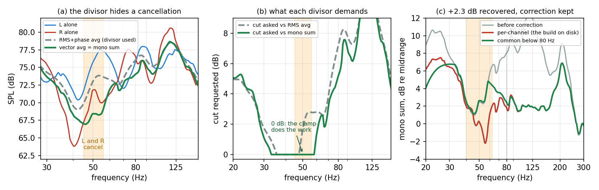
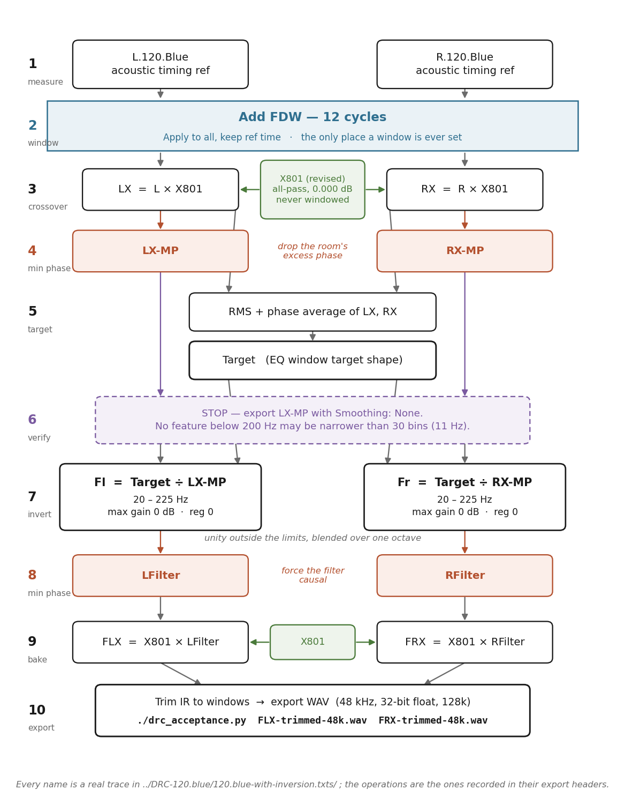

# Room correction by inversion in REW

**A step-by-step guide, with the reasoning behind each choice.**

---

## About this document

This is a **procedure**, not a lab notebook. Every number in it has been
measured, but the measurements, the false starts and the corrections live in
`NOTES.md`; nothing of that is repeated here. If a statement here disagrees
with `NOTES.md`, this document is the later one and wins.

**Scope.** Producing a pair of FIR room-correction filters for a stereo pair,
in REW, by **inverting the measured response** — as opposed to fitting
parametric filters with Auto EQ. The filters are minimum phase, exported as
WAV, and convolved by BruteFIR.

**The configuration assumed throughout** is `DRC-120.blue`, which is the
current one:

| | |
|---|---|
| Loudspeakers | B&W **Nautilus 801**, 3-way, crossovers at 350 Hz and 4 kHz, third order |
| Placement | **120 cm** from the front wall; microphone 449 cm from the front wall |
| Room | ≈ 58 m³, irregular (7.40 m long, 4.186 → 5.986 m wide, ceiling 2.4 → 3.0 m, open corridor) |
| Schroeder frequency | **≈ 166 Hz** |
| Correction band | **20 – 225 Hz** |
| Sample rate | 48 kHz throughout |
| Crossover correction | `X801.wav`, built in rePhase, 131072 taps |
| Convolution engine | BruteFIR |
| Data | `../DRC-120.blue/120-blue-with-inversion.mdat` and the exports in `../DRC-120.blue/120.blue-with-inversion.txts/` |

**Not covered:** subwoofers, speaker placement, Auto EQ, room treatment.

---

# Contents

- [Part I — What inversion actually does](#part-i--what-inversion-actually-does)
  - [1. The method in one paragraph](#1-the-method-in-one-paragraph)
  - [2. What it can correct, and what it provably cannot](#2-what-it-can-correct-and-what-it-provably-cannot)
  - [3. Do you still need X801?](#3-do-you-still-need-x801-yes--and-here-is-the-proof)
  - [4. The one law you cannot escape](#4-the-one-law-you-cannot-escape)
  - [5. The failure this guide exists to prevent](#5-the-failure-this-guide-exists-to-prevent)
- [Part II — Decisions to take before you measure](#part-ii--decisions-to-take-before-you-measure)
  - [6. One microphone position, or several?](#6-one-microphone-position-or-several)
  - [7. With several positions, do you still need the FDW?](#7-with-several-positions-do-you-still-need-the-fdw)
  - [8. How much regularisation — choosing the FDW cycles](#8-how-much-regularisation--choosing-the-fdw-cycles)
  - [9. Which smoothing, and why the smoothing menu will not help you](#9-which-smoothing-and-why-the-smoothing-menu-will-not-help-you)
  - [10. The correction band](#10-the-correction-band)
  - [11. Below 80 Hz, correct the sum — not each channel](#11-below-80-hz-correct-the-sum--not-each-channel)
  - [12. What a magnitude filter cannot do — and the one cheap way round it](#12-what-a-magnitude-filter-cannot-do--and-the-one-cheap-way-round-it)
- [Part III — The procedure](#part-iii--the-procedure)
- [Part IV — Reference](#part-iv--reference)
  - [R1. The IR window dialog, field by field](#r1-the-ir-window-dialog-field-by-field)
  - [R2. Choosing a window shape](#r2-choosing-a-window-shape)
  - [R3. Minimum phase — the two places you take it](#r3-minimum-phase--the-two-places-you-take-it-and-the-one-place-you-must-not)
  - [R4. How to invert: `÷`, `1/A` and `1/|A|`](#r4-how-to-invert--1a-and-1a)
  - [R5. The three boost guards](#r5-the-three-boost-guards)
  - [R6. Getting the room's decay figure](#r6-getting-the-rooms-decay-figure)
  - [R7. X801 — what it is, and do not redesign it](#r7-x801--what-it-is-and-do-not-redesign-it)
  - [R8. Acceptance tests](#r8-acceptance-tests)
  - [R9. Does the source correlation invalidate §11?](#r9-does-the-source-correlation-invalidate-11)
  - [R10. Troubleshooting](#r10-troubleshooting)
  - [R11. Glossary](#r11-glossary)

---

# Part I — What inversion actually does

## 1. The method in one paragraph

Measure the loudspeaker in the room. Decide what you *want* that response to
be — the **target**. Divide the target by the measurement. The quotient is a
correction curve: wherever the room was 6 dB loud the quotient is −6 dB,
wherever it was 4 dB shy the quotient is +4 dB. Turn that curve into an
impulse response and convolve it with the music. Because convolution in time
is multiplication in frequency, `measurement × correction = target` — the room
is cancelled by construction.

That is the whole idea, and it is exact. Everything difficult about the method
comes from one place: **the division is an ill-posed inverse.** Where the
measurement is very small, the quotient is very large; where the measurement
has a razor-thin notch, the quotient has a razor-thin resonance. An
unguarded inversion faithfully reproduces every defect of the measurement,
including the ones that are not properties of the room at all.

**So the whole craft of this method is deciding what the inversion is allowed
to see.** Every setting in this guide is a form of that decision.

## 2. What it can correct, and what it provably cannot

Any measured response factors — uniquely — into two parts:

```
H(measured)  =  H(minimum phase)  ×  H(excess phase)
```

- **`H(min)`** carries all the magnitude. Its phase is not free: it is fixed
  by the magnitude through the Hilbert relation. Know the magnitude and you
  know the phase.
- **`H(excess)`** has magnitude exactly 1 everywhere. It is pure phase — pure
  delay and rotation, invisible in an amplitude plot.

This procedure produces a **minimum-phase** filter (that is what steps 4 and 8
enforce). A minimum-phase filter is derived from a magnitude. Therefore:

> **A minimum-phase inversion corrects `H(min)` completely and `H(excess)`
> not at all — not "poorly", but exactly zero.**

That is not a limitation to be engineered around; it is the point. Look at
what `H(excess)` contains here:

| component of the excess phase | invert it? | why |
|---|---|---|
| bulk propagation delay | **no** | it is the speed of sound; inaudible, and inverting it is acausal |
| **room reflections** | **no** | position-specific, changes over 10 cm, and its inverse is acausal — it pre-rings |
| **crossover all-pass** | **yes** | a property of the loudspeaker; position-independent; deterministic; known in closed form |

Two of the three must be left alone. The one that should be corrected is the
one the minimum-phase route cannot reach. **That is the entire job of X801,**
and it is why the crossover correction is a separate, model-based filter
rather than something the inversion discovers.

> **Restricting the inversion to minimum phase is therefore a choice, not a
> shortcoming.** A **complex** inversion — dividing by the raw measured
> response, phase and all — would correct all three rows of that table,
> including the two that must not be corrected. It would invert the room's
> reflections, which needs an acausal filter, pre-rings, and is valid only at
> the microphone point. Steps 4 and 8 exist to make sure that never happens.
> The price of that safety is the third row, and X801 is what pays it.

## 3. Do you still need X801? Yes — and here is the proof

The question is fair: if inversion corrects the response, shouldn't it correct
the phase everywhere too, by definition?

It would — if it were a **complex** inversion. It is not: steps 4 and 8 force
the filter to minimum phase, and §2 gives the reason — a complex inversion
would also invert the room's reflections, which must not be inverted. And the
crossover's contribution is precisely the kind of thing a minimum-phase
inversion is blind to:

A third-order Butterworth crossover sums to

$$\frac{1}{(s{+}1)(s^2{+}s{+}1)} + \frac{s^3}{(s{+}1)(s^2{+}s{+}1)}
 = \frac{s^2 - s + 1}{s^2 + s + 1}$$

— a **second-order all-pass**. Magnitude 1.000000 across the whole band, 359°
of phase rotation. A 4th-order Linkwitz-Riley sums to the same form with
Q = 0.707 instead of 1.0. **Any crossover that sums to flat magnitude puts its
phase where magnitude-derived correction cannot see it.**

Measured on the actual file, over the whole band 5 Hz – 23 kHz:

```
|X801.wav|   min -0.00000 dB   max +0.00000 dB
```

And the decisive test — take the minimum-phase version of `X801.wav`:

| | result |
|---|---|
| peak | **1.000000 at sample 0** |
| energy anywhere but sample 0 | **2.96 × 10⁻¹⁴ %** |

**The minimum-phase copy of X801 is a unit impulse.** Not approximately — to
fourteen decimal places. Ask the inversion to correct the crossover and it
correctly answers "there is nothing here".

> ### The answer, stated plainly
> **Yes, you still need X801, and no amount of inversion will ever replace
> it.** They address disjoint parts of the response — magnitude and
> magnitude-implied phase on one side, crossover all-pass on the other — and
> because X801 has exactly flat magnitude, cascading them cannot
> double-correct anything. See [R7](#r7-x801--what-it-is-and-do-not-redesign-it).

*(Could a full complex inversion do both at once? Yes, and it would also try
to invert the room's excess phase — position-specific, acausal, pre-ringing.
Separating loudspeaker excess phase from room excess phase needs
frequency-dependent windowing of the kind DRC-FIR, Acourate and Audiolense do.
That is a different tool, not a REW setting.)*

## 4. The one law you cannot escape

> **Δf · Δt ≈ 1**

A feature Δf wide in frequency takes about 1/Δf seconds to unfold in time. It
is not a rule of thumb, it is the Fourier transform. It appears in this
procedure in four disguises, and they are all the same statement:

| you choose | you have thereby chosen |
|---|---|
| frequency resolution of the correction curve | **the length of the filter's ringing** |
| the length of the IR window | the frequency resolution |
| the number of FDW cycles | the highest Q the correction may contain |
| smoothing bandwidth | the highest Q the correction may contain |

Made concrete at 50 Hz:

| resolution of the correction curve | width at 50 Hz | shortest possible ringing |
|---|---|---|
| 1 FFT bin (no smoothing at all) | 0.37 Hz | **2731 ms** |
| 1/48 octave — REW's "Var" below 100 Hz | 0.72 Hz | **1385 ms** |
| 1/12 octave | 2.89 Hz | 346 ms |
| **1/6 octave** | 5.78 Hz | **173 ms** |
| 1/3 octave | 11.58 Hz | 86 ms |

Read the right-hand column as *"how long the woofer keeps moving after the
music stops"*. **You do not get to choose the correction's resolution and its
ringing separately. They are one number.**

This is why "just correct everything accurately" is not available. The finer
the correction, the longer the filter rings — and beyond some point you are
trading an inaudible frequency-response error for an audible time-domain one.

## 5. The failure this guide exists to prevent

Run the inversion with defaults and this is what you get. It happened here, in
September 2025, and the filters were in service for months.

The left channel's measurement contains a **38.3 dB null at 28.93 Hz** — a
razor-thin canyon, 2 FFT bins wide. It is not a room mode: the right channel
varies only 6.4 dB over the same span, so it is one loudspeaker's path to one
microphone point. Nothing was regularised, so the inversion did its job
faithfully and built the exact inverse: a **Q = 40** resonator.

| what the deployed filter did | |
|---|---|
| narrowest feature below 200 Hz | **0.8 FFT bins** |
| group delay excursion, 20–200 Hz | **80 ms** (a correction filter should show a few ms) |
| 28.7 Hz gated note, time to fall 40 dB | **1348 ms** |

Audible as *the music stops and the woofers keep moving*. And the tell that it
was never real: a Q of 40 at 29 Hz implies a 3.07 second decay. In 58 m³ that
is physically impossible. **The filter was correcting something that does not
exist.**

Every non-default setting in Part III is aimed at this one failure.

---

# Part II — Decisions to take before you measure

## 6. One microphone position, or several?

**Multiple positions is the only change on the list that attacks the cause
rather than the symptom.** Everything else in this guide suppresses narrow
features on the grounds that they are *probably* not real. Spatial averaging
finds out.

### Why it works, and why it works especially well here

A genuine room mode is a property of the volume: a 50 Hz mode is at 50 Hz
everywhere in the room, and only its *amplitude* varies with position. An
interference null is a property of a path: two arrivals cancelling at one
point, and it moves or vanishes when you move.

Average several positions and modes survive while interference washes out.
That is a **discrimination no amount of smoothing can perform** — smoothing
blurs everything equally, because a single measurement contains no information
about which features are which.

And deep nulls are the most position-sensitive feature there is. A 38 dB null
requires two arrivals to cancel to within a fraction of a decibel; move
20 cm and that balance is gone. So even a modest spread attacks exactly the
feature that causes the damage.

### The caveats, honestly

1. **Use the RMS average. Never the vector average.** REW's help:
   > *"**Vector average** … averages the currently selected traces taking into
   > account both magnitude and phase. It … is most appropriate for multiple
   > measurements taken from the same position, or measurements which have been
   > time and level aligned."*

   Vector-averaging *different* positions lets the position-dependent phase
   cancel and **manufactures new nulls** — the exact disease you are trying to
   cure. The **RMS average** is a power average, so a null at one position is
   filled by the others; that is the behaviour you want.
2. **Level-align first.** REW again:
   > *"If the measurements were made at different positions (spatial averaging)
   > it is usually best to first use the **Align SPL…** feature to remove
   > overall level differences due to different source distances."*
3. **Spacing buys you less at low frequency than you would like.** Two points
   decorrelate when they are a useful fraction of a wavelength apart:

   | | 30 Hz | 50 Hz | 100 Hz | 200 Hz |
   |---|---|---|---|---|
   | λ | 11.4 m | 6.9 m | 3.4 m | 1.7 m |
   | λ/4 | 2.9 m | 1.7 m | 0.86 m | 0.43 m |

   A ±30 cm cluster around one seat decorrelates well above ~250 Hz, partly
   from 100–250 Hz, and hardly at all below 60 Hz. **Spatial averaging does
   not solve the bass by itself.** It still helps below 60 Hz — via the
   null-depth sensitivity above — but do not expect the 30 Hz region to be
   cleaned up by moving the mic 30 cm.
4. **It is not free.** 5 positions × 2 channels = 10 sweeps, and one
   contaminated position (mic bumped, door opened) poisons the average
   silently.

> ### Size the cluster from how the listener actually sits
> Not from what decorrelates best — a spread wider than the seat optimises a
> place nobody's head goes. On this sofa the honest envelope is **asymmetric**:
> sideways the head barely moves (ear separation is 17 cm, and you do not slide
> across the seat), but **front-to-back it moves ~20 cm** — slouching, and one
> or two cushions behind the back push you that far forward.
>
> That is not a small effect. The 2026-04-28 sweeps were taken about 20 cm
> behind the 2026-08-10 ones — both perfectly normal seating — and below 200 Hz
> the two differ by **3 to 6 dB**, with the room's upper-bass dominance moving
> from 4.1 dB to 2.8 dB. **A normal shift in how you sit changes the bass more
> than any panel move measured in this room, and more than the choice of house
> curve.** That is the argument for averaging: not statistical hygiene, but the
> fact that a single-point filter is tuned to a posture.

### Recommended

| | |
|---|---|
| **positions** | **5** — the listening position, then **±10 cm left/right** and **±20 cm forward/back**, all at ear height. Asymmetric on purpose: it maps the seat, not a sphere |
| **per channel** | yes, L and R separately; do not average L with R at this stage |
| **combine with** | **RMS average**, after **Align SPL…** |
| **then** | the averaged L and the averaged R become the `L` and `R` of the procedure — everything downstream is unchanged |

### If you stay single-point

Survivable, and this is the configuration the numbers in this guide come from.
**Frequency-domain regularisation is the single-point substitute for spatial
averaging** — both suppress narrow position-specific structure; the FDW just
does it without moving the microphone. Accept these:

1. **The FDW is mandatory, not advisory.** With a spatial average you could
   argue for 20 cycles; with one point you cannot.
2. **Never boost a narrow null.** A deep narrow null is destructive
   interference between two arrivals — it is **not minimum phase**, so a
   minimum-phase inverse is the wrong *shape*, not merely the wrong size. The
   0 dB max-gain setting enforces this; do not raise it.
3. **Keep the L/R average as the target** (step 5). It is already a partial
   average and it stops each channel chasing its own private nulls.
4. **Trust nothing below ~35 Hz.** The N801s are −6 dB around there anyway;
   correction buys excursion, not output.
5. **Above Schroeder (~166 Hz) single-point is fine** — the response there is
   direct sound and early reflections, which barely move over a seat.

The honest cost: a single-point correction is about as good as a multi-point
one *at the microphone*, and noticeably worse one seat over. **It will not
ring**, which is the thing you are fixing.

## 7. With several positions, do you still need the FDW?

**Yes. Less of it, but you cannot drop it.** This is the question people get
wrong, so it is worth being precise about *why*.

Spatial averaging and time windowing answer **different questions**:

| | spatial averaging | FDW |
|---|---|---|
| the question it answers | *is this feature real, or is it this seat?* | *how long may the correction be allowed to ring?* |
| removes | features that differ between positions | energy arriving late |
| what it does to a genuine high-Q room mode | **nothing** — it is at the same frequency everywhere | caps its Q at N |

That second row is the whole argument. **A room mode survives spatial
averaging with its Q intact** — that is what makes it a mode rather than an
artefact. If the average still shows a Q = 25 peak at 45 Hz, it is real; and
inverting it still builds a filter that rings

`T60 = 2.2 · Q / f₀ = 2.2 × 25 / 45 = 1.2 seconds.`

Averaging established that the feature is genuine. It said nothing about
whether correcting it is a good idea. **Only the FDW bounds the filter**, and
§4's conservation law makes that inescapable: no number of microphone
positions can make a 1 Hz-wide correction shorter than a second.

**What multi-position buys you is permission to relax the FDW**, because it is
no longer doing two jobs at once:

| measurement | FDW | reasoning |
|---|---|---|
| single point | **12 cycles** | must suppress interference *and* cap Q |
| 5-position RMS average | **15–20 cycles** | interference already suppressed; only the Q cap is left |
| 9+ positions, well spread | **20 cycles** | as above, with more confidence |

Never off, and never above ~25 — beyond that you are no longer regularising
anything and §5 becomes available again.

## 8. How much regularisation — choosing the FDW cycles

The **frequency-dependent window** is a Gaussian time window whose width
varies inversely with frequency. Its width is set in **cycles**, and the
conversion is exact and worth memorising:

> A window of **N cycles** is N/f seconds wide at frequency f, so its
> bandwidth is f/N and its **fractional bandwidth is exactly 1/N**.
> Therefore **N cycles ↔ a cap of Q = N**.

| FDW setting | fractional bandwidth | ≈ octave fraction |
|---|---|---|
| 15 cycles (REW default) | 1/15 | ~1/10 octave — mild |
| **12 cycles** | 1/12 | ~1/8 octave — the starting point; **see the N = 8 callout below** |
| ~9 cycles | 1/9 | 1/6 octave |
| ~4.3 cycles | 1/4.3 | 1/3 octave |


**(a)** the FDW is not one window but a *family*, one per frequency, of width
N/f — at 12 cycles that is 480 ms at 25 Hz, 240 ms at 50 Hz, 60 ms at 200 Hz.
**(b)** the same windows as frequency kernels: **equally wide on a log axis**,
which is what constant fractional bandwidth means and why the FDW behaves like
fractional-octave smoothing. **(c)** the real measurement through it at 4, 12
and 30 cycles.

### The three constraints that pin N down

**1. The floor — do not truncate real modal decay.** N must exceed the Q of
the modes you intend to keep. From the room's measured decay
([R6](#r6-getting-the-rooms-decay-figure)):

| at | credible T60 | implied Q | cycles needed |
|---|---|---|---|
| 50 Hz | ~400 ms | 9.1 | 9 |
| 80 Hz | ~350 ms | 12.7 | 13 |
| 120 Hz | ~300 ms | 16.4 | 16 |

→ **N ≳ 12.**

**2. The ceiling — refuse position-specific interference.** The features that
wrecked the September filters had Q = 40 and Q = 63. N must be far below them.

→ **N ≪ 40.**

**3. The measurement must actually contain the window.** At 25 Hz, N = 30 asks
for 1200 ms of clean decay above the noise floor. It is rarely there.

**N = 12 sits inside all three, and the floor and ceiling are a factor of 3
apart — this is not a knife-edge setting.**

> ### The floor is about modes. It does not apply to a cancellation — use N = 8
> Constraint 1 says N ≳ 12 because N must exceed the **Q of the modes you
> intend to keep**. A speaker-boundary null has no Q to keep: it is two paths
> cancelling, not energy being stored and released. The floor simply does not
> bind on it, and where the sharpest feature in the band is a cancellation
> rather than a mode, **N = 8 is the better setting.**
>
> Built both ways from the same 2026-08-10 measurements, everything else
> identical:
>
> | | FDW 12 | **FDW 8** |
> |---|---|---|
> | 74 Hz null, depth below its 60–95 Hz shoulders | **−27.8 dB** | **−15.6 dB** |
> | narrowest feature, L / R | 31.6 ✓ / 25.9 ✗ bins | **49.6 ✓ / 49.6 ✓** |
> | group delay, L / R | +24.1 / +24.5 ms | **+17.2 / +17.4 ms** |
> | gated tones failing, L / R | 2 / 5 | **1 / 0** |
>
> The raw measurement puts that null 18.8 dB below its shoulders. **A 12-cycle
> window made it 27.8 dB — nine decibels deeper than it really is**, by
> stripping the late energy that fills it (the warning in "Two things the FDW
> is not"). The filter then built correspondingly steep shoulders, and those
> shoulders were the 63 and 79 Hz tails.
>
> **What it cost**, measured as the change to the correction curve over
> 20–225 Hz: **0.58 dB rms on L, 0.77 on R**, and spent where you would want
> it — −1.4 dB at 74 Hz, +1.2 at 80, −1.3 at 100, and **0.0 to 0.3 dB below
> 63 Hz**. The §11 bass work is untouched and the delivered mono sum moved
> 0.11 dB or less in every band bar 160–225.
>
> So the rule is not "12 is wrong" but: **N is chosen against the sharpest
> feature you intend to correct.** Identify what that feature is first. If it
> is a mode, constraint 1 applies and N ≳ 12. If it is a boundary
> cancellation — which this room's is, at 74 Hz, predicted by geometry at
> 75.3 Hz — the floor is not in force and a shorter window is both more honest
> about the measurement and kinder to the filter.

### What 12 cycles does to the feature that caused the trouble

The 38.3 dB razor null at 28.93 Hz:

| | level at 28.93 Hz | depth below the 27.10 Hz peak |
|---|---|---|
| raw, no FDW | 33.7 dB | **38.3 dB** |
| FDW 30 cycles | 50.7 | 20.4 |
| **FDW 12 cycles** | **58.5** | **11.7** |
| FDW 8 cycles | 62.8 | 6.9 |
| FDW 4 cycles | 68.3 | 1.3 |

**12 cycles turns a 38 dB canyon into a 12 dB dip** — no longer something an
inversion will build a Q-40 resonator to fill — while the surrounding modal
structure survives intact.

> ### Two things the FDW is not
> **It is not magnitude smoothing.** It is a time gate, so it changes the
> **complex** response. Where late energy had been *filling* a direct-sound
> null, tightening the window can make that null **deeper**, not shallower —
> visible on the 4-cycle trace near 70 Hz in panel (c). The 28.93 Hz null
> shallows because it is late-arriving interference; a genuine early-arrival
> null would not.
>
> **It is not destructive.** The window is a *derivation setting* over a
> retained impulse response: untick it, press Apply Windows, and the original
> response returns exactly. What is **not** reversible is anything you already
> derived from it — see step 2.

## 9. Which smoothing, and why the smoothing menu will not help you

**Set the smoothing menu to whatever you find easiest to read. It will not
reach the arithmetic.** This is the single most important practical fact in
the procedure, and it is documented:

> *"The result of arithmetic on measurements that have compatible impulse
> responses is smoothed using the measurement A smoothing, **unsmoothed data is
> used during the calculations**."* — REW help, All SPL Graph → Trace Arithmetic

That sentence reads as self-contradictory and is not. It joins two clauses
about different objects: the **output** trace inherits A's smoothing *setting*
for display; the **input** to the math is the raw impulse response. Compute on
raw data, then hand the result A's display setting.

So the truthful summary is:

| REW operation | uses smoothed data? |
|---|---|
| text / log export | **yes** — "the smoothing for the exported data" |
| EQ target match (Auto EQ) | **yes** — "apply … before running the target match" |
| **trace arithmetic on IR-compatible measurements** | **NO — unsmoothed, always** |
| trace arithmetic on non-IR traces (e.g. 96 PPO imports) | yes, whatever they carried |

Applying 1/6 octave to `LX-MP` and pressing divide **does nothing at all.**
REW reaches past it to the impulse response.

**What does reach the arithmetic is the window**, because the window *defines*
that impulse response. REW says so of the FDW specifically:

> *"Any frequency-dependent settings are excluded, applying an FDW to the
> result would amount to applying the window twice, **as it is already applied
> to the data used to produce the result**."*

That is why this procedure is built around the FDW and not around the
smoothing menu.

> ### If you ever do need smoothing to stick
> Round-trip it: apply the smoothing, `File → Export → Measurement as text`
> **with that smoothing selected in the export dialog**, then re-import. The
> exported numbers carry the smoothing, and on re-import they *are* the data.
> This is redundant if the FDW is set, and is listed as optional in step 4a.

**And do not use REW's recommended smoothing here.** "Variable smoothing is
recommended for responses that are to be equalised" is advice for the
**target-match / parametric** path, which carries its own filter-count, max-Q
and max-boost guards. A bare inversion has none of them. Worse, Variable is
**1/48 octave below 100 Hz**, which at these frequencies is not smoothing at
all:

| freq | 1/48 oct width | in FFT bins (0.3662 Hz) |
|---|---|---|
| 20 Hz | 0.29 Hz | **0.79** |
| 25 Hz | 0.36 Hz | **0.99** |
| 28.9 Hz | 0.42 Hz | **1.14** |
| 51.3 Hz | 0.74 Hz | **2.02** |
| 100 Hz | 1.44 Hz | 3.94 |

**A kernel narrower than one bin is an identity operation.** Below ~50 Hz,
selecting 1/48 octave is identical to selecting None.

For *looking* at the response while you work, plain **1/6 octave** is the right
choice — it shows you roughly what the FDW is doing to the data. Avoid
**Psychoacoustic** for anything but viewing: it uses a cubic mean, a
deliberately peak-biased estimator worth up to **+1.03 dB** on this dataset,
which becomes over-cutting if it ever reaches an inversion.

## 10. The correction band

**20 – 225 Hz.**

| edge | why |
|---|---|
| **20 Hz** low | below it the N801 is rolling off and the room measurement is mostly noise; correction there buys woofer excursion, not output |
| **225 Hz** high | above Schroeder (166 Hz) the response is direct sound plus early reflections — a property of the loudspeaker and the seat, not of the room. It is already good, it does not need a 128k-tap filter, and correcting it from one microphone point fits that point |

The 225 Hz figure gives about half an octave of overlap above Schroeder, which
is enough to let the correction die away gracefully rather than stop dead.
REW blends the limits over **one octave**, so the correction is effectively
fully out by ~320 Hz and fully in by ~160 Hz.

---

## 11. Below 80 Hz, correct the sum — not each channel

§5 warns against letting each channel chase its own nulls, and fixes it by
giving both channels a **common target**. That is necessary and it is not
sufficient. The divisor is still each channel's **own** response, and below
about 80 Hz that is enough to do real damage.

### The failure this section exists to prevent

Measured on the 2026-08-10 Rscreen pair, at 50 Hz:

| | L alone | R alone | RMS+phase average | **vector average = the mono sum** |
|---|---|---|---|---|
| level | 75.92 | 71.83 | 73.19 | **68.45 dB** |

The two speakers **cancel each other** at the listening position across
45–56 Hz — the sum is 4.7 dB *below* the average of the parts. The RMS
average cannot show this: it is a power average, it has no phase, and filling
nulls is exactly what it is for.

So the divisor said "73.2 dB, target 71.4, cut it", and the build cut **L by
4.20 dB and R by 0.00 dB**. But L was the *louder of two nearly anti-phase
contributors*. Making them more equal made the cancellation more complete:

| | before | after the per-channel build |
|---|---|---|
| mono sum at 50 Hz | 68.45 | **65.96 dB** |
| 40–62.5 Hz, re midrange | −0.90 | **−3.49 dB** |

The region that was already the weakest in the response became the deepest
hole in it, and the filter did that — correctly, by its own arithmetic.

### The one-line reason

> If both channels receive the **same** correction `C`, then `new sum = sum + C`
> **exactly**: the ratio between the two contributions never changes, so the
> depth of any cancellation between them is untouched. Only a **differential**
> correction can deepen a mono null.

Per-channel division against a common target is differential by construction.
Above the transition it is what you want — it is how each speaker's own
response gets flattened. Below it, it is unforced error.

### The fix is the divisor, not the target

**The target does not change.** Keep the EQ-window target built from the
RMS+phase average exactly as §5 prescribes — a null in one path filled by the
other, one common shape for both channels. Change only **what you divide by**,
and only below 80 Hz:

| Hz | target | cut asked vs **RMS average** | cut asked vs **mono sum** |
|---|---|---|---|
| 20 | 69.79 | 4.98 | 5.05 |
| 25 | 72.21 | 3.99 | 4.27 |
| 31.5 | 72.56 | 1.34 | 0.62 |
| 40 | 72.17 | 0.00 | 0.00 |
| 45 | 71.81 | 0.00 | 0.00 |
| **50** | 71.36 | **1.65** | **0.00** |
| **56** | 70.89 | **2.78** | **0.00** |
| 63 | 70.20 | 2.73 | 2.40 |
| 71 | 69.53 | 4.27 | 3.55 |
| 80 | 68.84 | 7.19 | 5.17 |

Against the sum the filter asks for **nothing** at 45–56 Hz — not because
anything was special-cased, but because the sum is already below target there
and **the cut-only clamp engages by itself**. The deep-bass trim at 20–31.5 Hz
survives intact. This is the whole technique: give the division a divisor that
knows about the cancellation, and the existing guard does the rest.



### Where 80 Hz comes from

Two independent arguments land on the same number.

**Coherence.** Below ~80 Hz the two speakers arrive at the seat correlated, so
they sum as pressure and the sum is the physical quantity. Above it they
decorrelate and the vector average stops meaning anything — measured here, RMS
average minus vector average:

| 20 | 31.5 | 40 | **50** | **56** | 63 | 125 | 200 Hz |
|---|---|---|---|---|---|---|---|
| −0.07 | +0.71 | +1.23 | **+4.61** | **+4.55** | +0.33 | +0.16 | **−2.75** |

They agree within a decibel everywhere except the cancellation — and by 200 Hz
the vector average has fallen 2.75 dB below, which is decorrelation, not
information. **Use the sum only where it means something.**

**How differential the correction is anyway.** Channel minus average, rms:

| | 20–40 | **40–63** | 63–80 | 80–160 | 160–225 Hz |
|---|---|---|---|---|---|
| L | 1.22 | **2.68** | 1.23 | 1.16 | 2.87 |
| R | 2.09 | **3.09** | 2.00 | 1.36 | 1.87 |

The differential is worst exactly in the cancellation band and modest
elsewhere, so a crossover at 80 Hz removes the harm and forfeits almost
nothing. This is also the standard bass-management crossover (Dolby, THX,
ITU), chosen for the same reason: localisation cues are weak below it.

### Building it: two divisions, spliced at 80 Hz

```
FL  =  [ Target ÷ SUM ]   ×   [ Target ÷ LX ]
        limited 20–80 Hz      limited 80–225 Hz
```

Both factors are the same kind of object — **the target divided by a
measurement** — and both are ordinary cut-only divisions. Outside its own
limits each reverts to unity, so only one is ever doing work:

| | below 80 Hz | above 80 Hz |
|---|---|---|
| `Target ÷ SUM`, limited 20–80 | active | **unity** |
| `Target ÷ LX`, limited 80–225 | **unity** | active |
| **product** | **Target ÷ SUM** — common | **Target ÷ LX** — per channel |

The splice is seamless because REW's two band-limit ramps are
**complementary**: the roll-off at the upper limit of the first is exactly one
minus the rise at the lower limit of the second, each a raised cosine over one
octave. So in decibels the product is

```
FL(dB)  =  w·(Target − SUM)  +  (1 − w)·(Target − LX),     w: 1 → 0 over 57–113 Hz
```

— a clean crossfade from the common correction to the per-channel one. Nothing
steps, and at no frequency is any correction applied twice.

> ### Both factors stay cut-only — nothing has to be allowed to boost
> This is the property that makes the construction safe without a post-hoc
> check. `Target ÷ LX` is a target-over-measurement division like any other, so
> **Maximum gain 0.0 dB on both factors**, and cut-only is then structural
> rather than something you verify afterwards.

> ### The equivalent form, and why it is the worse way to build it
> The same filter can be written as a common correction times a *differential*
> one, `(Target ÷ SUM) × (SUM ÷ LX)`, with the first factor spanning the full
> 20–225 Hz and the second limited to 80–225. `SUM` then cancels algebraically
> above 80 Hz and the result is the same filter — measured on the 2026-08-11
> data, the two agree to **0.088 dB rms and 0.425 dB maximum** over 20–225 Hz.
>
> Prefer the spliced form anyway. `SUM ÷ LX` is a ratio of two *measurements*,
> so it genuinely needs to boost wherever a channel sits below the sum, and
> clamping it breaks the algebra:
>
> | | `(T÷SUM) × (SUM÷LX)` | **`(T÷SUM) × (T÷LX)`** |
> |---|---|---|
> | boost the second factor wants | **+6.59 dB** | +0.22 dB |
> | Maximum gain it must be given | **+6.0 dB** | **0.0 dB** |
> | maximum of the product, 20–225 Hz | **+0.20 dB** | **+0.00 dB** |
> | cut-only is | verified after the fact | **structural** |
>
> The differential form ends up 0.20 dB *above* unity — harmless in itself, but
> it means the cut-only guarantee is no longer something the settings enforce.
> The spliced form never leaves it.

### What it delivers

Predicted mono sum, dB relative to the untouched midrange:

| band | before | per-channel build | **common < 80 Hz** | recovered |
|---|---|---|---|---|
| 20–40 | +8.06 | +6.15 | +5.82 | −0.33 |
| **40–62.5** | **+2.68** | **+0.32** | **+2.63** | **+2.31** |
| 62.5–100 | +7.85 | +2.22 | +2.89 | +0.67 |
| 100–160 | +10.25 | +1.85 | +1.85 | **0.00** |
| 160–225 | +6.96 | +4.38 | +4.38 | **0.00** |

The 40–62.5 Hz loss comes back essentially in full, and the correction that
was doing real work — the 100–160 Hz lump, 8.4 dB of it — is untouched.

### This is not a local invention

Correcting the summed low-frequency field rather than each source is the
mainstream approach: **bass management** in every multichannel standard sums
below 80 Hz; **Dirac Live Bass Control** jointly optimises all bass sources
rather than each independently; **Multi-Sub Optimizer** optimises the summed
response at the seats for precisely the reason above; **Trinnov**,
**Audyssey Sub EQ HT** and **Anthem ARC Genesis** all apply shared correction
below the crossover; **Harman's Sound Field Management** optimises the
combined field. The only unusual thing here is that the shared bass sources
are the two main speakers rather than a subwoofer. The physics is identical.

### If you cannot measure L+R

A measured `L+R` sweep is the honest divisor. Failing that, REW's **vector
average** of `LX` and `RX` reconstructs it, and here that is trustworthy: the
two measurements share one acoustic timing reference and their impulse peaks
sit **0.013 ms** apart, which is 0.23° of phase at 50 Hz. Use the vector
*average*, not a sum — it is level-consistent with the RMS+phase average the
target was built from, so no 6 dB bookkeeping is needed.

Verify it when you can. A computed complex sum and a measured `L+R` have
disagreed by 0.84–2.68 dB rms in this project before.

> **It has since been verified.** The 185 cm configuration (`DRC-185/L0.txt`,
> `R0.txt`, `LR.txt`) includes a genuine measured `L+R` sweep alongside the two
> channels. Computing the complex sum of `L0` and `R0` reproduces the measured
> `L+R` to **0.50 dB rms over 20–250 Hz**. The substitution is sound.

---

## 12. What a magnitude filter cannot do — and the one cheap way round it

Everything above corrects **magnitude**. There is one low-frequency failure it
cannot address at all, and one inexpensive tool that can. This section is the
worked case, from the 185 cm configuration in this repository.

### The failure

Speakers 1.85 m from the front wall, microphone at 4.54 m, measured `L+R`:

| | |
|---|---|
| deepest point of the mono sum, 20–300 Hz | **−17.9 dB** re midrange, at 41 Hz |
| L alone, at its own worst | −8.3 dB |
| R alone, at its own worst | −10.0 dB |

**The sum is far worse than either channel**, and it has two stacked causes:

| | each channel already down | L and R cancel a further | total |
|---|---|---|---|
| 36 Hz | −5.6 dB | −4.5 dB | −9.8 |
| **40 Hz** | **−6.0 dB** | **−7.3 dB** | **−13.1** |
| 43 Hz | −5.6 dB | −5.7 dB | −11.1 |
| 46 Hz | −3.7 dB | −3.5 dB | −7.0 |

The first column is **SBIR**: 1.85 m from the front wall gives an excess path
of 3.70 m and a null at `343/(4 × 1.85)` = **46.4 Hz**, and it hits both
channels identically because both sit at the same distance. The second is that
L and R arrive at the seat **142° apart** at 40 Hz and partially cancel.

Neither is reachable by a cut-only filter, and boosting is not a serious
option: +11.7 dB at 41 Hz is **15× electrical power and 3.9× cone excursion**,
spent on a null that moves with the listener's head.

### The half of it that is free

The SBIR component is geometry — nothing but moving the speakers fixes it, and
that is what the 120 cm configuration is (it puts the null at 71.5 Hz).

But **the 7.3 dB of L/R cancellation is not a magnitude problem at all.** It is
two sources at 142°, and rotating one of them costs no energy, no headroom and
no excursion. A single second-order **allpass** does it. Measured — `L0`
through a 42.5 Hz, Q 2.5 allpass, summed with `R0`:

| band | `L + R` | `L_ap + R` | change |
|---|---|---|---|
| 20–32 Hz | +1.5 | +1.6 | +0.1 |
| **32–50 Hz** | **−11.8** | **−4.5** | **+7.3** |
| 50–63 Hz | +3.2 | +3.2 | −0.0 |
| 63–100 Hz | +6.0 | +5.5 | −0.5 |
| 100–225 Hz | +0.6 | +0.5 | −0.0 |

Deepest point **−17.9 → −7.3 dB**; at 43 Hz the gain is **+11.7 dB**. Seven
decibels recovered in the problem band, the rest of the range moved by less
than half a decibel, and **not one decibel of boost applied anywhere**.

### What it costs, and what it makes the filter

The measured allpass: magnitude flat to **0.26 dB** across 20–500 Hz, peak
group delay **37.3 ms at 41.7 Hz**, falling to 1.9 ms by 80 Hz.

That 37 ms sits right at the low-frequency group-delay audibility threshold,
and it is applied to one channel only. Below 80 Hz that is benign — the same
reason bass management crosses there: localisation cues are weak, so an L/R
group-delay mismatch has little to act on.

> ### This makes the filter mixed phase — but the harmless kind
> Any causal stable filter factors as *minimum phase × allpass*, and is
> minimum phase exactly when that allpass factor is trivial. Adding one makes
> it non-trivial, so §2's "we restrict ourselves to minimum phase" no longer
> describes the chain.
>
> It is still safe, because there are two different operations both called
> phase correction:
>
> | | what it does | causality | cost |
> |---|---|---|---|
> | **add an allpass** | re-times one source against another | **causal** | group delay only |
> | **invert the room's excess phase** | undoes an allpass the room applied | **acausal** | **pre-ringing** |
>
> The second is acausal by necessity — the inverse of a stable allpass has its
> poles outside the unit circle, so no causal stable inverse exists. That is
> the operation that needs windowing and that pre-rings.
>
> This filter is the first kind. Its impulse response was checked: **16384
> taps, peak at sample 0, exactly zero energy before the peak.** It can only
> delay. There is nothing in front of the impulse to pre-ring with.

### What this is, in the wider landscape

Plain two-channel **Dirac Live would not find this.** It measures L and R
separately and corrects each toward the target — which at 142° is exactly the
operation §11 warns about, driving the cancellation *deeper*. The tools that
find it are the ones that optimise the **summed** field across sources:
**Multi-Sub Optimizer** (free, and the closest match to what was done here),
**Dirac Live Bass Control / ART**, and **Trinnov** source optimisation.

REW can generate the filter natively: the EQ window offers an **All-Pass**
filter type taking frequency and Q, and it exports into the impulse response
like any other. No mixed-phase design software is required.

### When to reach for it

Only when the mono sum is materially worse than either channel alone. Test it
in one step: compare `L+R` against `max(L, R)`. Coherent summation gives about
+6 dB; anything at or below 0 dB means the channels are fighting, and that
deficit — not the magnitude response — is what to fix first. Above ~80 Hz
leave it alone: the phase relationship there varies too fast with position to
be worth chasing, and localisation does depend on it.

---

# Part III — The procedure



Eleven steps (the diagram folds 10 and 11 into one box). Every trace name below
is a real trace in `../DRC-120.blue/120.blue-with-inversion.txts/`, and every operation is the one
recorded in that file's export header — this is the chain that was actually
run, with the guards added.

---

### Step 1 — Measure L and R

**Do:**

| setting | value |
|---|---|
| sweep | **256k log swept sine**, one sweep |
| level | **−12 dBFS** |
| timing | **acoustic timing reference** — required |
| sample rate | 48 kHz |
| channels | L and R **separately**, same microphone position |
| name them | `L.120.Blue`, `R.120.Blue` |

Multi-position: sweep all 5 positions per channel, `Align SPL…`, then **RMS
average** ([§6](#6-one-microphone-position-or-several)). The RMS averages then
*are* `L` and `R` for everything below.

**Why the acoustic timing reference:** it puts t = 0 at the impulse peak. The
FDW is centred on the window reference time, and REW's help is explicit that
"for best results this should be at the peak of the impulse". Without a timing
reference the reference time is an estimate and the window sits in the wrong
place — quietly, with no error message.

---

### Step 2 — Set the window. Once. Here. Nowhere else.

**Do:** open **IR Windows** on `L`. Change **one** field:

| control | set to |
|---|---|
| Left window shape / width | **leave** (`Rectangular`, 500 ms) |
| Right window shape / width | **leave** (`Rectangular`, 1000 ms) |
| Ref Time | **leave** — it is the IR peak |
| **Add FDW** | ✓ **ticked, 12 cycles** |

Then press **`Apply to all, keep ref time`**.

Apply it to **`L` and `R` only**. Never to `X801`. Never again downstream.

**Why only the FDW:** at 12 cycles the FDW is narrower than the 1 s right
window everywhere above 12 Hz, so it governs the entire working band on its
own. The 1 s rectangular truncation is harmless because the decay is already
in the noise by then. Shortening the rectangular right window instead would
manufacture ripple ([R2](#r2-choosing-a-window-shape)); this route avoids the
question entirely.

**Why `keep ref time` and not `Apply windows to all`:** each measurement has
its own reference at its own IR peak. Plain "apply to all" overwrites those
with *this* measurement's Ref Time and misaligns the others. "Keep ref time"
copies the shapes and widths and leaves each measurement's own peak alignment
intact.

> ### L and R showing different Ref Times is correct, not a fault
> Every measurement carries its own Ref Time because every sweep began at a
> different instant in its own capture. What matters is whether the IRs are
> aligned *after* referencing, and with an acoustic timing reference they are:
> reconstructing the IRs from the exported 2026-08-10 sweeps puts every peak
> within **0.013 ms (4.5 mm)** of its own t = 0, and the L−R offset is
> **4.5 mm** — the two speakers are equidistant to the millimetre, exactly as
> the geometry says.
>
> **And this procedure is immune to it regardless.** The target is built with
> an **RMS average**, which is magnitude-only, and the divisor is taken to
> **minimum phase** in step 6, which discards measured phase altogether. No
> step downstream of the window can see a timing offset between L and R.
> Timing would only matter for a **complex (vector) L+R sum** — which this
> guide never asks for, and which §2's caveat 1 warns against for its own
> reasons.

**Why this is the only window you will ever set** — three quotes from the Trace
Arithmetic documentation:

- *"The currently applied impulse response window settings are used for each
  trace."* → what you set on `L` and `R` is what every downstream operation
  consumes.
- *"The result uses the same window settings as trace A"* → derived traces
  inherit automatically. `LX = L × X801` is built with `L` as trace A, so `LX`
  already carries `L`'s window. There is nothing to re-apply.
- *"Any frequency-dependent settings are excluded, applying an FDW to the
  result would amount to applying the window twice."* → re-applying is not
  neutral, it is a second regularisation. REW deliberately clears the FDW flag
  on results. **Do not put it back.**

**And one thing you cannot repair afterwards:**

> *"…or for division and inversion, **which use windows that span the entire
> resulting impulse response** as the result is typically not causal."*

The divide's output is deliberately un-windowed. **If the inputs were wrong,
the output cannot be fixed.** This is why step 2 comes before everything.

> ### ⚠ The window is reversible. The traces built from it are not.
> Untick the FDW, press Apply Windows, and `L` returns to exactly what it was.
> But trace arithmetic creates a **new measurement, frozen at the moment you
> press the button**. Change the window on `L` afterwards and `LX`, `LX-MP`,
> the division and the exported WAV all keep the old data — they do not
> recompute.
>
> **Set the window first, then do the arithmetic. If you change the window,
> redo the chain from step 3.**

---

### Step 3 — Bake the crossover correction into the measurement

**Do:**

1. `File → Import → Impulse Response` → `X801.wav`. Name it `X801 (revised)`.
   **Leave every window control on it alone** — see the warning below.
2. Trace Arithmetic: `LX` = **A × B**, A = `L.120.Blue`, B = `X801 (revised)`.
3. Likewise `RX` = `R.120.Blue` × `X801 (revised)`.

**Why:** you are going to invert the system *as it will actually play*, and it
will play through the crossover correction. Everything you then look at on
screen — `LX`, `RX` and their average — is the real corrected system.

**A useful thing to know:** because `X801` has magnitude 0.00000 dB
everywhere, `|LX| = |L|` exactly, and therefore `LX-MP` and `L-MP` are
**identical**. Step 3 is magnitude-neutral, and the final filter would come out
the same if you skipped it. Do it anyway, for two reasons: the traces you
inspect are then honest about what you will hear, and if `X801` is ever
replaced by something that is *not* a pure all-pass (`Xo801`, which adds a
bass-alignment term, is such a thing) the step becomes load-bearing without
warning.

> ### ⚠ Never window X801
> It is an all-pass whose energy is spread symmetrically over ±1365 ms by
> design. An FDW or a shortened right window would truncate the very phase
> rotation it exists to apply, silently degrading the crossover correction.
>
> Note that inheritance is correct here without you doing anything: `LX` is
> built with **A = L**, so it inherits `L`'s FDW ✓. In step 9, `FLX` is built
> with **A = X801**, so it inherits `X801`'s window — i.e. none ✓, which is
> right, because a finished filter should not be windowed.

---

### Step 4 — Minimum phase, first time

**Do:** on `LX`, **Generate minimum phase** (same control panel as `Trim IR to
windows`). Name it `LX-MP`. Likewise `RX-MP`.

| dialog option | set to | why |
|---|---|---|
| Cal file effects | **included** | you are modelling the acoustic response as measured, and the mic calibration is part of what the measurement means |
| **LF tail** | **yes**, corner at **15 Hz** | **required** — without it the minimum-phase transform corrupts the magnitude it is supposed to preserve. See the callout below |
| HF tail | no | measured: the error above 1 kHz is 0.000–0.002 dB. The traces already run to 24 kHz = Nyquist, so there is no top-end edge to ring against |

> ### ⚠ The LF tail is not optional — this guide said "no" and was wrong
> A minimum-phase copy has exactly one obligation: **leave |H| unchanged**, and
> supply the phase the magnitude implies. With `No LF tail` REW does not
> satisfy it. Measured on the 2026-08-12 build, max |error| in dB, where every
> entry should be zero:
>
> | conversion | 5–15 Hz | 15–25 Hz | 25–40 Hz | 40–225 Hz |
> |---|---|---|---|---|
> | `LX` → `LX-MP` | **13.41** | 0.58 | 0.03 | 0.33 |
> | `RX` → `RX-MP` | **8.88** | 0.53 | 0.03 | 0.04 |
> | `SUM` → `SUM-MP` | **11.15** | 0.56 | 0.02 | 0.03 |
> | `FL` → `LFilter` | 0.21 | **2.41** | 0.30 | 0.13 |
>
> **The mechanism.** Minimum phase is obtained by a Hilbert transform of the
> log magnitude, which is a *global* operation — it needs the response defined
> across the whole spectrum. Truncate it and the transform rings against the
> edge, decaying away from it. That is why the error is largest at the bottom
> of the data and falls to ~0.03 dB by 25 Hz, and why the top end is spotless:
> the traces run to Nyquist, so there is no upper edge at all.
>
> **Why the corner goes at 15 Hz, not the default 20.** Real sweep data starts
> at **15.01 Hz**; everything below is already synthetic, inherited from
> `X801`'s wider span through the trace multiply. A corner at 15 Hz replaces
> only synthetic data. A corner at 20 Hz would extrapolate over 5 Hz of genuine
> measurement — and that sits inside the band-limit blend (14.1–28.3 Hz), so it
> reaches the filter. If the field will not go below 20, take 20; the cost is
> small because the filter is fading toward unity through there anyway.
>
> **Put the corner at or below the first measured point, not just above it.**
> The 2026-08-12 rebuild used 16 Hz against data starting at 15.0146 Hz, and
> the ~1 Hz of overlap left a **single-bin −140 dB null at exactly 15.01 Hz**
> in the exported WAV, where the tail splices onto the measurement. It is
> harmless — one bin, below the correction band, in a region already 29 dB
> down, and R8 does not see it — but it is free to avoid. Set the corner to
> the sweep's start frequency and the splice has nothing to disagree with.
>
> **Slope:** make the tail resemble what the trace physically is. For a
> measurement, the speaker's own roll-off — **24 dB/oct** for a ported box,
> 12 for a sealed one.
>
> **Verify, do not assume.** Export the copy and its source with
> **Smoothing: None** and subtract. `|LX-MP| − |LX|` must sit at the ~0.03 dB
> level across the whole correction band. This is a two-minute check that
> catches a class of error nothing downstream can undo.

**Why this step exists — it is the most important conceptual step in the
chain.** You are about to divide by this trace. What you divide by determines
what gets inverted:

| divisor | what the filter would try to undo | verdict |
|---|---|---|
| `LX` (the raw measurement) | magnitude **and** the room's excess phase — every reflection, at one point | **acausal, pre-rings, valid at one microphone position** |
| **`LX-MP`** | magnitude, and exactly the phase that the magnitude implies | ✓ **causal, minimum delay, robust** |

Dividing by the raw measurement is the single most common way to produce a
filter that measures beautifully at the microphone and sounds wrong. The
minimum-phase copy throws away the part of the response that is not
correctable, before it can reach the division.

---

### Step 5 — Build the target

**Do:**

1. Select `LX` and `RX` → **RMS + phase average**. Result: `RMS + phase
   average`.
2. Open it in the **EQ window** and save its shape as the target:
   `Target RMS + phase average`. Adjust the house curve here if you want one.

**Why the L/R average and not each channel's own response:** it is already a
partial spatial average — a null in the left path is filled by the right — and
it gives both channels a **common** target, so correction does not pull the
stereo image. Targeting each channel at its own smoothed response instead
would let each chase its own private nulls, which is exactly the failure in
§5.

**Why go through the EQ window:** what comes out is a **smooth curve**, not a
copy of the measurement. It is also where the house curve goes. Note that a
target shape is **magnitude only**, which is fine: only its magnitude survives
step 8.

#### The target level — let REW calculate it, then check it this way

The house curve is a **shape**, defined as 0 dB at 200 Hz. The **target level**
is what anchors that shape in absolute SPL, and it is the single number that
decides whether the corrected bass joins the rest of the spectrum or sits above
or below it.

**Press `Calculate` and let REW set it.** REW anchors the target to the
speaker's **midrange reference level**, which is the right choice and is not
obvious. Measured on the 2026-08-10 `LR.rms+phavg`:

| region | level |
|---|---|
| correction band, 20–225 Hz | 74.07 dB |
| 300 Hz – 3 kHz (midrange) | **68.80 dB** |
| REW's calculated target level | **69.20 dB** |

REW's number lands within **0.4 dB of the midrange**, and the correction band
runs **5.3 dB hot** against it. That elevation is exactly what the filter is
there to remove.

> ### The check that matters: does the band edge join what is above it?
> The filter is unity above 225 Hz, so whatever the correction leaves at the
> top of the band must match the untouched response just above it — otherwise
> you build a step at 225 Hz. With the calculated level:
>
> | 180 Hz | 200 Hz | 225 Hz | 225–315 Hz (untouched) |
> |---|---|---|---|
> | 68.4 | 68.7 | 68.9 dB | **68.5 dB** |
>
> Continuous to a few tenths. **Do not** set the target level by matching the
> measurement's own in-band level at 225 Hz — that keeps the room's bass
> elevation instead of removing it, and leaves the whole band ~4 dB above the
> midrange. If REW's calculated level looks "too low", this is why: the number
> to compare it against is the **midrange**, not the neighbouring bass.

#### The target's LF cutoff — move it to 5–10 Hz, below the correction band

The target shape carries a **low-frequency cutoff**, and REW's default puts it
at **20 Hz, 24 dB/oct** — right at the bottom edge of the match range. Move it
to 5 or 10 Hz.

**Does that corrupt the calculated target level, given the speakers produce
nothing at 10 Hz?** No — and the reason is worth being clear about, because the
worry is reasonable. REW fits the target to the measurement over the **match
range**, 20–225 Hz. What the target does *below* 20 Hz is outside the fit
entirely and never enters the calculation. What a 20 Hz cutoff does instead is
bend the target **inside** the match range:

| target attenuation from the LF cutoff | 20 Hz | 22 Hz | 25 Hz | 31.5 Hz | 40 Hz |
|---|---|---|---|---|---|
| cutoff at **20 Hz** | **−3.01** | −1.66 | −0.67 | −0.11 | −0.02 dB |
| cutoff at **10 Hz** | −0.02 | −0.01 | −0.00 | −0.00 | −0.00 dB |
| cutoff at **5 Hz** | −0.00 | −0.00 | −0.00 | −0.00 | −0.00 dB |

With the cutoff at 20 Hz, **10.9 % of the match range is pulled down by more
than 0.5 dB**; at 10 Hz or 5 Hz, none of it is. Averaged across 20–225 Hz the
depression is **−0.185 dB** at fc = 20 and **−0.001 dB** at fc = 10, so moving
the cutoff shifts REW's calculated target level by about **0.2 dB** — the
target no longer has to sit slightly high to compensate for its own bend. That
is the whole effect on the level, and it is negligible.

**It does not make the filter reach below 20 Hz either.** The division is
band-limited to 20–225 Hz and reverts to unity below, blended over one octave;
and max gain 0 dB clamps every boost regardless. Extending the cutoff changes
**the target's shape, not the filter's reach** — there is no excursion risk
from a target that is defined at 10 Hz.

> ### Why this should clear two of the three acceptance-test failures
> On the 2026-08-11 build, two of the three [R8](#r8-acceptance-tests) failures
> localise to **20.32 Hz** (narrowest feature) and **19.59 Hz** (group delay) —
> both sitting on the band edge, not on anything acoustic.
>
> A 24 dB/oct corner *inside* the correction band is a steep feature, and the
> division reproduces it faithfully in the filter. Steep means high Q, and high
> Q means simultaneously a narrow feature and a long group delay — which is
> precisely the pair of tests that fail, at precisely the corner frequency. It
> is the same trade as §4: you cannot have the sharp edge and the short filter.
>
> Putting the corner at 5–10 Hz leaves the target smooth across the whole
> 20–225 Hz band, so the filter has no steep band-edge feature to build and
> both tests should clear. The third failure is a separate matter and this will
> not touch it. **Verify on the rebuild rather than assuming** — this is a
> prediction from the mechanism, not a measured result.

#### Choosing a target the filter can actually reach

This is the decision that determines whether the correction does anything at
all, so it is worth more than a moment. With max gain at 0 dB the filter only
cuts, therefore:

> **achieved = min(target, measurement)**

A target that sits **above** the measurement produces no correction whatever —
not a partial one, none. So the target is not a wish. It is a **ceiling you
slide down under the measured curve**, and the measurement is its upper bound.

Measured here after step 2 (FDW 12 cycles), in dB relative to each channel's
own level at 200 Hz — i.e. exactly that upper bound:

| | 20 | 25 | 31.5 | 40 | 50 | 63 | 80 | 100 | 125 | 160 | 200 Hz |
|---|---|---|---|---|---|---|---|---|---|---|---|
| **L** | +3.7 | +6.1 | +1.9 | **−5.2** | +6.9 | +0.1 | +6.0 | +2.7 | +7.2 | +1.0 | −0.1 |
| **R** | +4.6 | +7.8 | +2.8 | −0.8 | +2.0 | +5.0 | **+11.2** | +0.3 | **+9.4** | +6.5 | 0.0 |

**This room is not bass-shy at 120 cm.** Below 160 Hz it runs *above* its own
200 Hz level almost everywhere. What it actually has is **lumps at 80 and
125 Hz** and a **hole near 40 Hz** — and the hole is 4.4 dB deeper on L than on
R, so it is one channel's path, not a room property, and must not be filled
(§6 rule 2). The job here is mostly **cutting**, not lifting.

> ### ⚠ Ask for more lift than the room offers and you get no correction at all
> The deployed chain used a **+6.5 dB** shelf. Against the table above that
> target sits over the measurement across most of the low band, so the clamp
> engaged and the filter did nothing:
>
> | | 25 Hz | 35 Hz | 45 Hz | 63 Hz |
> |---|---|---|---|---|
> | correction produced | **0.00 dB** | **+0.01** | **+0.01** | **+0.01** |
>
> Roughly half the correction band received no correction. A house curve you
> cannot reach is not a gentle preference — it silently switches the filter
> off.

#### Four candidate shapes, and what each actually delivers

Computed as `min(target, measurement)` on the real FDW-12 data, both channels,
everything in dB relative to 200 Hz:

| target | **deep** 20–45 | **upper** 63–160 | **balance** | ripple | band cut | deepest cut |
|---|---|---|---|---|---|---|
| *no correction (the room)* | +2.8 | **+6.1** | **−3.3** | 4.21 | — | — |
| **A** as deployed, +6.5 shelf | +2.6 | +1.6 | +1.0 | 2.59 | 57 % | 8.6 dB |
| **B** reachable, +3.0 shelf | +1.1 | +0.3 | +0.8 | 1.84 | 68 % | 10.0 dB |
| **C** +4 low, **−3 upper-bass** | +1.5 | **−2.2** | **+3.7** | 2.07 | 78 % | 12.9 dB |
| **D** flat | −0.8 | −0.2 | −0.6 | 1.41 | 74 % | 10.6 dB |

**"Balance" is the number that decides how much bass you hear**: deep minus
upper, i.e. how far the bottom two octaves stand clear of the upper bass. Read
the first row and the problem is obvious — **this room is upper-bass dominant by
3.3 dB.** That is the 80 and 125 Hz lumps, and they mask everything below them.

- **D (flat) is the wrong answer.** It cuts the deep bass along with everything
  else and ends up with *less* low-end weight than doing nothing.
- **A (as deployed) is doing least of all** — 57 % of the band, because most of
  the shelf is unreachable and clamps.
- **C is the one to use if you want low end.** It gives **+3.7 dB of balance
  against A's +1.0** — nearly 3 dB more apparent weight — with *less* ripple
  than A, and it costs only 1.1 dB of absolute deep bass relative to A.

> ### More bass comes from a deeper cut, not a taller shelf
> With a cut-only filter a taller shelf means *less* cutting, so it buys
> loudness and lumpiness together. The lever that actually delivers low end is
> the **upper-bass scoop**: pulling 80–160 Hz down un-masks the 20–45 Hz region
> that is already there. Cutting is always reachable, so this direction is free
> in a way that lifting never is.

**Recommended: shape C** — about **+4 dB below ~45 Hz**, through 0 dB near
70 Hz, to a broad **−2 to −3 dB centred around 110–120 Hz**, back to 0 dB by
200 Hz. Start the scoop at −2 dB and deepen it by ear; too much hollows out
male voice and cello. The extra cut costs headroom (12.9 dB at the worst peak,
against 8.6 dB now), which is amplifier gain, not excursion.

**Two things the target cannot do:**

- **Anything above 225 Hz.** The filter is unity there (step 7), so the target's
  shape above the band is decoration. If you want a treble tilt it has to be a
  separate broad shelving filter, not this target.
- **Fill the 40 Hz hole.** It is destructive interference on one channel.
  Boosting it costs excursion and does not fill it.

*(If you want more low-end than the reachable ceiling allows, the honest fixes
are placement and treatment, not the target — the same conclusion as §5's.)*

---

### Step 6 — Stop and verify

**Do:** export `LX-MP` with **Smoothing: None** and run **two** checks.

> **6a. The minimum-phase copy must have preserved the magnitude.**
> Export `LX` too, subtract, and require `|LX-MP| − |LX|` to sit at the
> **~0.03 dB** level across 20–225 Hz. Repeat for `RX-MP` and `SUM-MP`.
>
> This is a property, not a tolerance: a minimum-phase copy changes phase and
> nothing else, so any visible deviation is an artifact. If it fails, the LF
> tail in step 4 is off — see the callout there. Nothing downstream can undo
> an error in the divisor, because everything downstream divides by it.

> **6b. No *peak* below 200 Hz may be both narrower than ~30 FFT bins (≈ 11 Hz)
> and more than ~6 dB above its surroundings.**

**Why peaks and not dips.** Because max gain 0 dB (step 7) already disarms the
dips, and only the peaks reach the WAV:

| in the divisor | what the division makes of it | survives? |
|---|---|---|
| narrow **dip** | filter wants a narrow *boost* → **clamped to unity** | no |
| narrow **peak** | filter builds a narrow *deep cut* | **yes** |

This matters, because an honest divisor routinely contains narrow dips and
they are not a defect. On the 2026-08-11 build:

| trace, un-smoothed, 20–200 Hz | narrowest peak | narrowest dip |
|---|---|---|
| `LX-MP` (the divisor) | 14 bins, 3.9 dB @ 35.5 Hz | **6 bins, 40.1 dB @ 188 Hz** |
| `RX-MP` (the divisor) | 23 bins, 4.1 dB @ 50.5 Hz | 13 bins, 4.1 dB @ 57.9 Hz |
| **`Fl`** (what ships) | **38 bins, 5.8 dB @ 98.9 Hz** | 12 bins, 3.0 dB @ 35.5 Hz |

A rule applied to *any* feature would have rejected `LX-MP` over a 6-bin dip
and thrown away a build whose filter is comfortably inside the threshold. The
same applies to the 74 Hz front-wall null that a 12-cycle FDW exposes on the
left channel (§8): across 60–90 Hz `LX-MP` swings **35.7 dB**, while `Fl`
swings **11.7 dB** — at the null itself the filter sits at exactly 0.00 dB,
unity, with the cut confined to the shoulders. **Windowing revealing a null is
working as intended; it is not a Step 6 failure.**

**Why the FDW still matters even so.** The clamp defuses dips, not peaks, and
un-windowed modal peaks are exaggerated by reverberant energy that belongs to
the room and not to the direct sound — invert those and you cut deep narrow
notches fitted to one microphone point. It also keeps the shoulders around a
null from being over-cut right next to a unity notch. §5's disaster was a dip,
and cut-only alone would have blunted it; the FDW is what keeps the rest of
the filter honest.

**If a narrow tall peak does survive**, the FDW in step 2 did not take. Common
causes: it was applied to the wrong measurement; `Apply Windows` was never
pressed; or the arithmetic in step 3 was done *before* step 2 and is holding
stale data. Thirty bins is the acceptance threshold from
[R8](#r8-acceptance-tests), applied one step early — and the surest version of
this test is to run it on `Fl` itself once step 7 is done.

*(Optional belt-and-braces, step 4a: bake the smoothing in by round trip —
apply 1/6 octave to `LX`/`RX`, export as text **with that smoothing selected
in the export dialog**, re-import, and take the minimum phase of the
re-imported traces. Redundant if step 2 was set properly. Doing neither is
what produced §5.)*

---

### Step 7 — The division

**Two divisions and a multiply, not one division.** One shared setup (7a, 7b)
and then two operations per channel (7c, 7d). The reason is §11: below 80 Hz
the two speakers cancel each other at the seat, and dividing by each channel
separately deepens that cancellation.

**7a — the sum, and its minimum-phase copy.** Select `LX` and `RX` →
**Vector average** → name it `SUM`. (If you have a measured `L+R` sweep, use
`L+R × X801` instead — better. See §11's last note.) Then
**Minimum phase copy** → `SUM-MP`.

**7b — the common filter, below 80 Hz.** Trace Arithmetic, **A over B**:

| field | value |
|---|---|
| A | `Target RMS + phase average` |
| B | **`SUM-MP`** |
| Lower / upper frequency limit | **20 Hz / 80 Hz** |
| Maximum gain | **0.0 dB** |
| Regularisation | **leave at 0** — see below |

Name it `Fcommon`. There is only one, shared by both channels.

**7c — the per-channel filters, above 80 Hz.** Trace Arithmetic, **A over B**:

| field | value |
|---|---|
| A | `Target RMS + phase average` — *the same A as 7b* |
| B | **`LX-MP`** (the minimum-phase copy, not `LX`) |
| Lower / upper frequency limit | **80 Hz / 225 Hz** |
| Maximum gain | **0.0 dB** |
| Regularisation | 0 |

Name it `Fper_L`. Repeat with B = `RX-MP` for `Fper_R`.

**7d — combine.** Trace Arithmetic, **A times B**: `Fcommon × Fper_L` → `Fl`.
Same with `Fper_R` → `Fr`.

Both factors are cut-only, so the product is cut-only: **no maximum-gain
setting anywhere in this step is above 0.0 dB, and none needs to be.** The
80 Hz splice is seamless because REW's band-limit ramps are complementary —
§11 has the algebra and the measured agreement.

*(To reproduce the older single-division behaviour — per-channel everywhere —
skip 7a and 7c, and in 7b use B = `LX-MP` with limits 20 Hz / 225 Hz. The
tables below were measured on that version, and the boost/cut asymmetry they
show is unchanged.)*

**Why the frequency limits are what makes this a filter, not a curve.**
Outside the limits the result reverts to **unity gain**, blended over one
octave centred on the limit. Measured on the deployed file:

| 10 Hz | 20 Hz | 225 Hz | 250 Hz | **300 Hz** | **1 kHz** | **15 kHz** |
|---|---|---|---|---|---|---|
| +0.04 dB | +0.02 | −3.26 | −0.25 | **+0.01** | **+0.01** | **+0.01** |

Unity to within 0.04 dB outside the band, and the one-octave blend is visible
in the 225 → 250 → 300 Hz run. Without the limits you would be exporting the
whole target curve as a filter.

> ### What max gain 0 dB actually does: the filter only ever cuts
> Read off the deployed chain — the correction the target asked for, against
> what the division produced:
>
> | | 25 Hz | 35 Hz | 45 Hz | 63 Hz | 80 Hz | 125 Hz |
> |---|---|---|---|---|---|---|
> | Target − `LX-MP` (wanted) | +2.2 | +4.3 | +2.6 | +2.5 | −2.0 | −4.4 dB |
> | what came out | **0.00** | **+0.01** | **+0.01** | **+0.01** | −3.7 | −4.8 dB |
>
> **Every boost is clamped flat; every cut passes.** That is the setting doing
> exactly what it says, and it is the right conservative choice — a deep null
> at one microphone point is destructive interference, not a deficiency of
> output, and filling it with gain wastes excursion and does not fill it.
>
> Know what it implies: **the correction is cut-only.** It will lower the
> peaks toward the target and leave the dips where they are. If your target
> looks nothing like the result, this is why.
>
> *(Figures read off the 96 ppo exports, which carry display smoothing; the
> divide itself ran on unsmoothed data, so treat the decibels as indicative
> and the boost/cut asymmetry as exact.)*

**Why regularisation is left at zero here, and when it would matter.**
Regularisation puts a floor under the divisor so the quotient cannot run away
where the divisor is tiny. It is the right tool for one specific disease: **a
deep null being filled with gain.** With **max gain at 0 dB there is no gain
anywhere**, so it has nothing to act on — and this is not an argument from
principle, it is what the deployed filter measures:

| `FLX-trimmed-48k.wav`, 20 – 225 Hz | |
|---|---|
| maximum | **+1.19 dB** |
| minimum | −7.24 dB |

**The filter never boosts. A boost limiter cannot change it.**

Set regularisation only if you raise max gain above 0 dB to allow broad dips to
be partly filled. Then choose it by the readout, not by a number from a guide —
REW *"shows the maximum gain corresponding to the regularisation percentage
next to the control"*, so dial the percentage until that reads the gain you
intend. For orientation, the depths that exist in this data, measured relative
to the divisor's own average level over 20–225 Hz:

| divisor | deepest dip below its average |
|---|---|
| L, raw (no FDW) | **−30.4 dB** |
| L, FDW 20 cycles | −24.1 dB |
| **L, FDW 12 cycles** | **−13.7 dB** |
| **R, FDW 12 cycles** | **−8.5 dB** |

After step 2 there is no canyon left to regularise — **the FDW has already
done that job.** Note the trap in these numbers: the small percentages are the
ones that reach a *raw* razor null, precisely because a razor null is deep. A
setting of 3 % puts the floor around 30 dB below average, which is 16 dB below
anything that survives step 2. Small numbers here are not gentle; they are
inert.

> ### ⚠ The feature that caused 1.3 seconds of ringing is **3.5 dB deep**
> `FLX-trimmed-48k.wav` at native 0.3662 Hz resolution, around the null. These
> are absolute filter gains, not relative to anything:
>
> | 28.198 Hz | 28.564 | **28.931** | 29.297 |
> |---|---|---|---|
> | +0.87 dB | −1.64 | **−2.35 dB** | +1.19 |
> | GD +71 ms | −101 | **−105 ms** | +81 |
>
> The bottom of the dip sits at **−2.35 dB**. What matters is the **excursion
> across it**: from +1.19 dB in the bin next door down to −2.35 dB is
> **3.54 dB**, and it happens over **two bins — 0.73 Hz**. That is the whole
> feature. It carries **105 ms of group delay** and rings for **1348 ms**.
>
> **Depth is not what hurts. Width is.** A 3.5 dB wiggle you would never notice
> on an amplitude plot is a Q-40 resonator because Q = 28.93 ÷ 0.73 ≈ 40, and
> §4's law converts 0.73 Hz directly into 1.4 seconds. This is the whole
> reason step 2 exists, and the reason no guard in this step can substitute for
> it.

*(How that dip got there, since the clamp had pinned the magnitude flat:
`LX-MP-INV+0dB` is magnitude-flat to −0.03 dB at 28.93 Hz but its **phase**
jumps from +32° to −116° in one step. The clamp constrains magnitude and leaves
the phase discontinuity behind; step 8 then re-derives phase from a
full-resolution magnitude that was never really flat. A hard clamp constrains
*amplitude*, not *bandwidth* — that part of the old diagnosis stands.)*

---

### Step 8 — Minimum phase, second time

**Do:** **Generate minimum phase** on `Fl` → `LFilter`. Likewise `Fr` →
`RFilter`.

| dialog option | set to | why |
|---|---|---|
| Cal file effects | **not included** | a filter has no microphone. Including the mic calibration would bake the microphone's response into what you play |
| **LF tail** | **yes** — see the note below | as step 4: without it the transform corrupts the magnitude. This is the copy where it does the most damage |
| HF tail | no | as step 4 |

> ### This is where the LF-tail error hurts most
> Step 4's copies are damaged at 5–15 Hz, mostly *below* the correction band.
> Here the damage lands **inside** it — `FL` is unity below ~14 Hz, so the
> transform's sharpest edge is the band-limit transition itself, and that is
> where it rings:
>
> | `\|LFilter\| − \|FL\|` | 5–15 Hz | **15–20 Hz** | **20–25 Hz** | 25–40 Hz | 40–225 Hz |
> |---|---|---|---|---|---|
> | max error | 0.21 | **2.41** | **2.39** | 0.30 | 0.13 dB |
>
> In the exported WAV this resolves into a **−11.4 dB notch at 19.96 Hz**,
> identical on both channels to 0.01 dB — deterministic processing, not
> acoustics. It is 0.23 Hz wide at −6 dB, narrower than REW's 0.366 Hz display
> grid, so **the plot shows only a −4 dB dip and cannot resolve the core.**
> It is what fails the [R8](#r8-acceptance-tests) narrowest-feature and
> group-delay tests, both of which land at ~20 Hz.
>
> **Slope here is a real choice, not just conditioning.** `Fl` is a filter, not
> a loudspeaker — it has no physical roll-off, and it is already unity below
> the band limit. A steep tail imposes a subsonic high-pass on the deliverable.
> That may be welcome, but decide it rather than inherit it: pick the
> **shallowest slope offered** if you want the filter left as designed.
>
> **The target is unaffected**, because Step 5 builds it from `LX`/`RX` rather
> than the minimum-phase copies (that is the reason for the instruction). If
> you are rebuilding after fixing this, `LRrms+phavg`, the target shape and the
> calculated target level all stand — redo from Step 4 onward only.

**Why a second time, when the divisor was already minimum phase.** In exact
arithmetic the quotient of a magnitude-only numerator and a minimum-phase
divisor is minimum phase, so this ought to be a no-op. In practice it is not,
for three reasons: the max-gain clamp and the one-octave band blend both
perturb the phase; the division "uses windows that span the entire resulting
impulse response as the result is typically not causal"; and the target has
zero phase, which is not the same as having none. Measured on the deployed
chain the step moved the 20 Hz phase from −41.6° to −2.3°.

**What it guarantees:** a causal, minimum-delay filter whose phase is exactly
the Hilbert transform of its magnitude. That is the definition of the thing
you meant to build.

---

### Step 9 — Bake the crossover correction in, last

**Do:** Trace Arithmetic, **A times B**:

- `FLX` = A = **`X801 (revised)`**, B = `LFilter`
- `FRX` = A = **`X801 (revised)`**, B = `RFilter`

**Why last, and why A = X801:** keeping the room correction (`LFilter`) and
the crossover correction (`X801`) as separate traces until the end means you
can re-derive one without re-baking the other, and you can A/B the crossover
correction by exporting with and without this multiply. And with `X801` as
trace A, the result inherits `X801`'s window settings — i.e. none — which is
correct for a finished filter.

**Why the cascade is safe:** `LFilter` is magnitude-derived minimum phase and
contributes exactly nothing to crossover phase (§3); `X801` has exactly flat
magnitude and contributes exactly nothing to the magnitude correction. They
are orthogonal. There is no double-correction to worry about.

---

### Step 10 — Export

**Do:**

1. `Trim IR to windows` on `FLX` / `FRX` if you want to set the latency.
2. Export impulse response as WAV: **48 kHz, 32-bit float**. REW writes
   **131072 samples** — there is no tap count to set, the export length is
   fixed.
3. Name them `FLX-trimmed-48k.wav` / `FRX-trimmed-48k.wav`.

**Trimming never changes the filter's response.** `FLX` and `FLX-trimmed` were
compared bin by bin: identical to **0.0000 dB rms at every frequency**. All it
does is move the impulse within the file — it sets latency, nothing else.

So **trim every filter you build**, including every rebuild: each pass through
the chain produces a new `FLX`/`FRX` and each one gets trimmed and exported as
normal. What trimming is not, is a **remedy**. If step 11 fails, re-trimming
the same filter cannot change any of the three test results, because none of
them depends on where the impulse sits in the file. The defect is upstream and
only step 2 can reach it.

**There is no "number of taps" in REW.** rePhase has one; REW does not. The
equivalent lever is the IR window of step 2, which is why that step matters so
much. If you need a genuinely shorter filter, window the exported WAV outside
REW with a **tapered** (Hann/Tukey) window — never a hard truncation, which
produces ripple.

---

### Step 11 — Accept or reject, before deploying

**Do:**

```sh
./drc_acceptance.py ../DRC-120.blue/FLX-trimmed-48k.wav \
                    ../DRC-120.blue/FRX-trimmed-48k.wav --plot check.png
```

Exit status 0 = pass. Full description in [R8](#r8-acceptance-tests).

**If it fails**, do not deploy and do not post-process. Go back to step 2,
lower the FDW cycles, and re-run the chain from step 3. A filter that fails these tests fails audibly.

---

# Part IV — Reference

## R1. The IR window dialog, field by field

Defaults as REW sets them on a full-range sweep:

| field | default | what it does | change it? |
|---|---|---|---|
| Left window shape | `Rectangular` | taper applied **before** the reference time | no |
| Left width | 500 ms | how much pre-arrival is kept | **no — it does not affect resolution** |
| Ref Time | ~0 | position of the window reference relative to t = 0 | **no** — it is the IR peak, which is what the acoustic timing reference bought you |
| Right window shape | `Rectangular` | taper applied **after** the reference time | only on route B below |
| Right width | 1000 ms | how much decay is kept | only on route B below |
| Add FDW | off, 15 cycles | the frequency-dependent Gaussian window | **✓ ticked, 12 cycles** |

> ### Frequency resolution = 1 / (right width). Settled by experiment.
> REW's help says the printed resolution corresponds to *"the current total
> window duration (left and right combined)"*. The dialog does not behave that
> way. Measured:
>
> | left | right | printed resolution | 1/(L+R) | **1/R** |
> |---|---|---|---|---|
> | 500 ms | 1000 ms | 1.00 Hz | 0.67 Hz ✗ | **1.00 Hz ✓** |
> | 500 ms | 500 ms | 2.00 Hz | 1.00 Hz ✗ | **2.00 Hz ✓** |
>
> **The left width does not affect frequency resolution.** It is not a
> resolution control; set the right width and leave the left alone.

**Ref Time** is not something you compute. REW puts t = 0 at the impulse peak,
so Ref Time comes out at ~0 (0.042 ms on `L.120.Blue` — the residual offset of
the peak from the sample grid). Move it only with the Impulse graph's
*Set t = 0 at cursor* / *Offset t = 0* actions.

### Route B — a fixed window instead of the FDW

Only if you want a flat Δf across the band. This gives the **wrong shape** — a
constant Δf is far heavier regularisation at 4 kHz than at 50 Hz — so prefer
the FDW unless you have a specific reason.

| control | set to |
|---|---|
| Right shape | **Tukey 0.5** — change this *before* the width |
| Right width | **173 ms** → prints 5.8 Hz ≈ 1/6 octave at 50 Hz (300 ms → 3.3 Hz is a gentler first try) |
| Left shape / width | leave |
| Add FDW | **off** |

| total window | Δf shown | ≈ octave fraction at 50 Hz |
|---|---|---|
| 1.5 s (default) | 0.67 Hz | 1/52 — **effectively none** |
| 500 ms | 2.00 Hz | 1/17 |
| 300 ms | 3.33 Hz | 1/10 |
| **173 ms** | 5.78 Hz | **1/6** |
| 86 ms | 11.63 Hz | **1/3** |

**Do not do both.** You would be regularising twice, and the printed
resolution would no longer describe the data.

## R2. Choosing a window shape

Only relevant on route B. Read it anyway — it explains why route A avoids the
question.


**(a)** six shapes as REW applies them. **(b)** the same six in frequency —
**this is the smoothing kernel** the response gets convolved with. **(c)** each
applied to the real `L.120.Blue` impulse response at a 173 ms window.

> ### ⚠ Textbook window figures do not apply to a half window
> The familiar numbers (Hann −31 dB sidelobes, Blackman-Harris −92 dB) are for
> **symmetric** windows. REW's right window is truncated at its own peak, so
> the signal meets a step at the reference time however smooth the taper is,
> and that step dominates the kernel. Measured on the actual half-windows at
> 173 ms:
>
> | shape | −3 dB width | leakage outside main lobe | kernel |
> |---|---|---|---|
> | Rectangular | **5.13 Hz** | 9.23 % | 10 nulls — **oscillates** |
> | Tukey 0.25 | 5.86 Hz | 6.90 % | 7 nulls — oscillates |
> | **Tukey 0.5** | 6.59 Hz | **5.66 %** | 3 nulls — **smooth** |
> | Hann | 8.06 Hz | 9.67 % | 0 nulls — smooth |
> | Hamming | 6.59 Hz | 11.72 % | 8 nulls — oscillates |
> | Blackman-Harris | **9.52 Hz** | **12.75 %** | 0 nulls — smooth |
>
> **Blackman-Harris is the worst of both worlds here** — widest main lobe *and*
> highest leakage, the exact opposite of its symmetric-window reputation.

**Use Tukey 0.5**, chosen on measurement rather than reputation: lowest
leakage of the six and a smooth non-oscillating kernel, for only 1.28× the
resolution of rectangular. The distinction that matters is not sidelobe
**level** — all six sit at −13 to −16 dB — but sidelobe **structure**. A
rectangular kernel *rings*; a tapered kernel decays smoothly. Ringing in the
kernel is ringing convolved into every feature of the response.

### Why a time window is a smoothing kernel

Multiplication in time is convolution in frequency. Windowing the impulse
response by `w(t)` replaces `H(f)` with `H(f) ∗ W(f)`:

`Y(f) = ∫ H(ν) · W(f − ν) dν`

Every output frequency becomes a **weighted average** of the input, with `W`
supplying the weights — which is the definition of smoothing. A weighting
function inside an integral operator is called its **kernel** (German *Kern*,
"core"), and here **the kernel is literally `W(f) = FFT{w(t)}`**, which is what
panel (b) plots. A window's shape in time and its kernel in frequency are one
object seen from two sides, which is why "choose a window length" and "choose
a smoothing bandwidth" are one decision.

| window in time | kernel in frequency | behaves like |
|---|---|---|
| rectangular, length T | sinc, main lobe ~1/T, −13 dB sidelobes | crude smoothing at Δf = 1/T, **plus ringing** |
| Tukey / Hann, length T | wider main lobe, sidelobes ≪ | clean smoothing at Δf ≈ 1/T |
| **Gaussian FDW, N cycles** | Gaussian of width f/N | **fractional-octave smoothing, 1/N per octave** |

**One difference that matters.** The smoothing menu convolves the
**magnitude** — it averages `|H|`, so it can only make a null *shallower*.
Windowing convolves the **complex** response, so contributions can cancel and
a window can make a null *deeper*. REW's help says the FDW has "an effect
similar to applying a smoothing of the same octave fraction" — *similar*, not
identical, and this is where it differs.

## R3. Minimum phase — the two places you take it, and the one place you must not

| # | applied to | producing | why |
|---|---|---|---|
| **1** | `LX`, `RX` | `LX-MP`, `RX-MP` | **the divisor must be minimum phase.** Divide by the raw measurement and the filter tries to invert the room's excess phase: acausal, pre-ringing, valid at one microphone point |
| **2** | `Fl`, `Fr` | `LFilter`, `RFilter` | **the filter must be causal.** The clamp, the band blend and REW's un-windowed division output all leave residual non-minimum-phase content |
| **✗** | `X801` | — | **never.** Its magnitude is 0.00000 dB, so its minimum-phase copy is a unit impulse — you would delete the filter entirely |

That last row is measurable, not rhetorical:

```
minimum-phase copy of X801.wav:
  peak                            1.000000  at sample 0
  energy anywhere but sample 0    2.96e-14 %
```

**Cal file effects:** *included* at step 4 (you are modelling the acoustic
response as measured, and the mic calibration is part of what that means),
*not included* at step 8 (a filter has no microphone). Below 200 Hz a decent
measurement mic is nearly flat, so this is a small effect — but the reasoning
is asymmetric and worth following.

## R4. How to invert: `÷`, `1/A` and `1/|A|`

REW offers several operations that all look like "invert". They are not
interchangeable.

| operation | result | outside its frequency limits | guards it offers | use it? |
|---|---|---|---|---|
| **`A ÷ B`**, A = Target, B = `SUM-MP` | Target ÷ the mono sum | **unity**, blended over one octave | maximum gain, **regularisation** | ✓ **the common filter**, 20–**80** Hz ([§11](#11-below-80-hz-correct-the-sum--not-each-channel)) |
| **`A ÷ B`**, A = Target, B = `LX-MP` | Target ÷ one channel | **unity**, blended over one octave | maximum gain | ✓ **the per-channel filter**, **80**–225 Hz |
| `A ÷ B`, A = Target, B = `LX-MP` | Target ÷ measurement | **unity**, blended over one octave | maximum gain, **regularisation** | the older single-division form; deepens the 45–56 Hz mono cancellation |
| `1/A` on `LX-MP` | flat at a chosen level | **unity**, blended over one octave | maximum gain, target level, **exclude notches** | only if you want a flat target and no house curve |
| **1/\|A\|** on `LX-MP` | magnitude inverse | — | — | ✗ **produces a linear-phase result** — symmetric pre-ring, and no phase correction at all |
| `A ÷ B` with B = `LX` | inverts magnitude **and** room excess phase | | | ✗ acausal, pre-rings, one-point-only |

**Why `A ÷ B` and not `1/A`:** the division takes a **target curve**, so the
house curve of step 5 comes along for free. `1/A` takes only a scalar *target
level*, so it can only aim at flat. If you are happy with flat-at-the-average
across 20–225 Hz, `1/LX-MP` in one step is perfectly respectable and gives you
the **exclude notches** option, which `A ÷ B` does not have.

**The one thing `1/A` has that division does not** is that notch-exclusion
checkbox, which drops notch-like features out of the inversion entirely rather
than merely limiting their boost. If a null survives step 2, that is the one
remaining lever — at the cost of the target curve.

**Never `1/|A|`.** REW's help: *"The 1/|A| and 1/|B| operations produce a
linear phase result."* A linear-phase filter is symmetric: half its energy
arrives **before** the impulse. That is the opposite of what step 8 is for.

## R5. The three boost guards

| guard | belongs to | mechanism | effect on bandwidth | set it to |
|---|---|---|---|---|
| **Maximum gain** | division, inversion | hard clamp at a level | **none** — a clamp is a discontinuity, and a discontinuity is a narrow feature | **0 dB** — gives a cut-only filter |
| **Regularisation** | division | a floor under the divisor, as a % of its average level | none | **0**, unless max gain is above 0 dB |
| **Exclude notches** | inversion only | drops notch-like features from the inverse | removes them entirely | off |

**All three limit boost. None of them limits bandwidth.** So none of them can
prevent the failure in §5, which was a *dip* — 0.73 Hz wide, 3.5 dB from rim
to bottom — in a filter that never boosted at all. **The FDW is not a backstop
to these controls; these controls are a footnote to the FDW.**

With 12 cycles applied at step 2 the 38.3 dB null is already an 11.7 dB dip and
the deepest point in the whole 20–225 Hz divisor is 13.7 dB below its average
level, so the clamp barely engages and there is nothing left for a floor to
sit under.

REW's own framing of regularisation:

> *"Applying regularisation limits the boost which occurs when the divisor
> becomes very small (or zero!), **such as where the divisor has notches in
> its response**, and so produces a more stable and manageable result. The
> maximum gain corresponding to the regularisation percentage is shown next to
> the control, at 25% (the maximum setting) no gain is allowed."*

## R6. Getting the room's decay figure

You need one number to choose the FDW cycles: how long this room actually
decays in the 40–100 Hz region. **No single method gives it below ~150 Hz.**

| tool | gives | trustworthy where | use it for |
|---|---|---|---|
| **RT60** (T20 / T30 / EDT / Topt) | numbers per band | **above Schroeder only** (~166 Hz) | mid/high-band RT, treatment work |
| **Waterfall** | 3D ridges | qualitative | *which* modes ring; before/after |
| **Spectrogram** | 2D map, colour = level | qualitative, ±2× | *how long* — the referee |
| **Peak bandwidth** | numbers per mode | below Schroeder, **if cross-checked** | **the figure you actually use** |

**Route 1 — from peak bandwidth.** Since `T60 = 2.2·Q/f₀` and `Q = f₀/Δf`, the
frequency cancels:

> **T60 = 2.2 / Δf**, where Δf is the −3 dB bandwidth of the peak, in Hz.

Decay depends *only* on bandwidth. A 5 Hz-wide peak decays in 440 ms whatever
its frequency. Measure Δf off the **unsmoothed** trace with the cursor.

**Its blind spot:** a single-point magnitude measurement **cannot distinguish a
genuine high-Q mode from a narrow interference peak.** Both are narrow, and
the formula converts either into a decay time. On this dataset it returns
2215 ms at 53.8 Hz — physically impossible in 58 m³ — which is the §5 trap
seen from the frequency side.

**Route 2 — RT60 graph.** Standard, but meaningful only **above** Schroeder.
Below it the field is modal rather than diffuse, "reverberation time" is not
well defined, and the analysis band filter has its own floor: a 1/3-octave
filter at 25 Hz rings 205 ms unaided. Numbers from this route below ~150 Hz
are not trustworthy.

**Route 3 — spectrogram, as the referee.** It cannot give a number, but it
answers the one question the others cannot: *how long does energy at this
frequency actually persist?* Here, the 40–100 Hz band fades in roughly
**300–400 ms**.

**Why no view can give you a number — the same law, again.** Both waterfall
and spectrogram are built on an analysis window of length W, and that window
sets *both* axes: frequency resolution ≈ 1/W, time smearing ≈ W. To resolve a
5 Hz-wide mode at 50 Hz you need W ≥ 200 ms; but a 200 ms window cannot
resolve a decay much shorter than 200 ms, and the decay you are measuring is
~400 ms. There is no setting that gives both. `Δf · Δt ≈ 1` (§4), now limiting
the instrument you would use to check the instrument.

These views are reliable to a **factor of about two** — enough to reject
2200 ms, nowhere near enough to separate 300 from 400 ms. Referee, not
instrument.

**Reading a spectrogram without fooling yourself:**

- Analysis window ≈ **300 ms** for bass work: long enough to separate modes
  ~3 Hz apart, short enough not to invent decay.
- Level range so the floor sits **35–40 dB** below the peak. Too wide and
  everything looks like it rings forever; too narrow and real decay vanishes.
- Read decay as *where a streak fades relative to where it started*, with the
  cursor — not by eye off a screenshot.
- **Ignore everything below ~20–25 Hz.** The sweep has little energy there and
  the window is many cycles long; the smear is the analysis, not the room.

**So: route 1 for the numbers, route 3 to reject the impossible ones.** Any
peak whose bandwidth implies a decay far longer than the spectrogram shows is
interference, not a mode, and **must not be corrected**. Cross-checked that
way, the credible decays here are **300–400 ms** in the 40–100 Hz band, which
is the table in [§8](#8-how-much-regularisation--choosing-the-fdw-cycles).

Applying the same arithmetic to the features the September filter built:

| feature in `FLX` | Q | source resonance it implies | verdict |
|---|---|---|---|
| **28.93 Hz** | 40.4 | **T60 = 3.07 s** | impossible |
| **51.27 Hz** | 62.7 | **T60 = 2.69 s** | impossible |
| 81.67 Hz | 11.9 | 321 ms | plausible |
| 116.46 Hz | 15.7 | 297 ms | plausible |

**Independent proof that the two worst features were never room modes** — and
the answer to "does the window throw away something real": for exactly those
features, no.

## R7. X801 — what it is, and do not redesign it

`X801.wav` linearises the two Nautilus 801 crossovers and nothing else.
Measured directly from the file:

| | value |
|---|---|
| magnitude, 5 Hz – 23 kHz | **−0.00000 to +0.00000 dB** — a perfect all-pass |
| group delay fit, low crossover | **375.4 Hz, Q 0.706** |
| group delay fit, high crossover | **3945.5 Hz, Q 0.686** |
| residual of the two-all-pass fit, 25 Hz – 15 kHz | **0.0076 ms rms** |
| fitting the high crossover alone | **26× worse** |
| relative group delay, 20 Hz vs treble | −1.30 ms |
| length | 131072 samples, 32-bit float, 48 kHz, centred |

It contributes **nothing** to magnitude and therefore nothing to low-frequency
ringing. It is ready to use as-is.

> ### ⚠ `X801.rephase` on disk does **not** match `X801.wav`
> The saved rePhase project has an **empty filter type** on the 355 Hz row,
> but the WAV measurably corrects both crossovers. **Open that project and
> re-export and you will silently lose the 350 Hz correction — which carries
> ~95 % of the group delay.**
>
> **The WAV is the artifact of record.** If it must ever be rebuilt: low row at
> ~355–375 Hz, `LR 24 dB/oct` (Q ≈ 0.707), which is what the fit says is
> actually in there.

**How it is designed in rePhase:** the *filter linearization* tab, entering
the two crossover frequencies and their topology. That is the whole design,
and it is the correct minimal one.

> ### Not to be confused with `Xo801.wav`
> `DRC-185/Xo801.wav` is the *same two crossovers* — they agree above 350 Hz
> to **0.0051 ms rms** — **plus** an extra low-frequency term: a 4th-order
> high-pass at **20.66 Hz**, i.e. a bass-reflex box alignment. It is not wrong,
> it is a different **scope**.
>
> **Use the crossover-only `X801`.** `Xo801`'s cost is genuinely small (1.6 ms
> of pre-ring at −40 dB), but its 20.7 Hz figure is a model fitted to the
> filter itself and never checked against a nearfield measurement of a real
> 801 — and below 100 Hz the room contributes several times more phase than
> the ~22 ms it corrects. Low cost, unverified benefit. Restore it only after
> measuring the speaker's rolloff nearfield.

**Minor open point:** the N801 crossover is nominally third-order, whose sum is
an all-pass of Q = 1.0, while the fit says Q ≈ 0.706 (LR4-like). If the real
acoustic sum is Q = 1.0 at 350 Hz, about 0.6 ms of rotation remains
uncorrected — at or under the Blauert & Laws audibility threshold. A
refinement, not a defect.

## R8. Acceptance tests

**`drc_acceptance.py`**, in this directory. Run it on the WAV BruteFIR
actually loads. Exit status 0 = pass.

```sh
./drc_acceptance.py ../DRC-120.blue/FLX-trimmed-48k.wav \
                    ../DRC-120.blue/FRX-trimmed-48k.wav --plot check.png
```

| test | pass | September `FLX` |
|---|---|---|
| sharpest feature below 200 Hz | **Q of 12 or less** | Q 73 ✗ |
| group delay excursion, 20–200 Hz | **< 10 ms** | 80 ms ✗ |
| gated-tone tail, any tone below 200 Hz | **< 100 ms** | 1348 ms ✗ |
| magnitude, DC … 20 Hz | flat, no correction | ok |

> ### ⚠ The first test used to be in FFT bins. That was wrong
> Bin spacing is `fs / n`, so a bin-based threshold **passes or fails the same
> filter depending on how long the exported file is.** Trimming one of these
> filters from 262144 to 131072 taps changed its verdict without changing the
> filter: the band-edge feature measures **9.07 Hz** wide in one and **9.37 Hz**
> in the other — the same feature — but 49.6 bins against 25.6, because each
> bin doubled in width.
>
> The criterion is now **Q = centre frequency ÷ bandwidth**, which is
> dimensionless and length-independent. The threshold follows from
> [§8](#8-how-much-regularisation--choosing-the-fdw-cycles): an N-cycle FDW caps
> fractional bandwidth at 1/N, so a divisor windowed at 8–12 cycles cannot
> legitimately yield a feature sharper than about 12.
>
> Calibrated against this project's history:
>
> | | width | at | **Q** | |
> |---|---|---|---|---|
> | Sept 2025 deployed filter | 0.30 Hz | 28.9 Hz | **73** | ✗ rang 1348 ms |
> | no-LF-tail notch | 0.27 Hz | 20.0 Hz | **73** | ✗ |
> | 74 Hz SBIR shoulder, 12-cycle build | 5.78 Hz | 73.2 Hz | **12.7** | ✗ marginal |
> | 8-cycle build | 13.1 Hz | 99.6 Hz | **7.6** | ✓ |
> | 20 Hz band-edge transition | 9.37 Hz | 25.6 Hz | **2.7** | ✓ |
>
> Note this also changes *which* feature is reported: "sharpest" now means
> largest `f₀/bandwidth`, not smallest bandwidth. A 13 Hz feature at 100 Hz is
> sharper in the sense that matters than a 9 Hz one at 25 Hz.
>
> Bins are still printed, for reference only.

The script uses a **matched-latency control** for the gated-tone test and
applies a **4-period floor** — a 40 dB decay of a 28.7 Hz tone cannot resolve
faster than ~139 ms, so demanding less would measure the envelope estimator
rather than the filter. Verified behaviour: `X801.wav` **passes** all three;
`FLX-trimmed-48k.wav` **fails** all three.

**What to run it on:** `FLX-trimmed-48k.wav` / `FRX-trimmed-48k.wav`. Also run
it on `LFilter`/`RFilter` if you want to separate room-correction ringing from
anything the crossover filter contributes — `X801.wav` passes on its own, so
any failure is the room part.

**By hand, if you prefer**, import the filter as a measurement
(`File → Import → Impulse Response`) and look at **Group Delay** first. It is
one graph and it caught every failure in this dataset:

| | 28.93 Hz | 51.27 Hz | 79 Hz | 116.5 Hz | max 20–200 Hz |
|---|---|---|---|---|---|
| `FLX` (L) | **−105 ms** | **−97 ms** | −0.9 | −35 | **+80 ms** @ 29.3 Hz |
| `FRX` (R) | +0.7 | +0.8 | **−65 ms** | −32 | **+52 ms** @ 75.4 Hz |

A correction filter should show group delay of a **few milliseconds** below
200 Hz. Tens of milliseconds means you have built a resonator.

### Seeing all three tests in REW, and comparing two filters

Every number the script produces has a REW view behind it. Import the WAV with
`File → Import → Impulse Response` and it becomes a measurement like any other.

| REW view | what it shows | script test |
|---|---|---|
| **Waterfall** (CSD) or **Spectrogram** | how long each frequency keeps ringing | gated-tone tails |
| **Group Delay** | resonators, as GD peaks | group delay excursion |
| **SPL**, `Smoothing: None` | narrow features | narrowest feature |
| **Step Response** | pre-ringing and overshoot | pre-peak energy |

**Waterfall settings for a filter** (not for a room — the defaults assume a
room): time range **~400 ms**, rise time **100 ms**, **40 dB** range. Anything
still standing at the back of the plot is what the script calls a tail.

**To compare two filters**, import both and use the **Overlays** window. `All
SPL` and `Group Delay` overlay directly, which is the fastest way to see what
a rebuild changed. Waterfalls do not overlay — flip between them with the
measurement selector.

> ### Thresholds, so you can judge audibility rather than pass/fail
> The script's thresholds are deliberately conservative — they are there to
> catch construction faults, not to predict audibility. These are the numbers
> for the second question. Both are approximate and the literature disagrees
> by roughly a factor of two.
>
> **Group delay** (Blauert & Laws; Møller):
>
> | 20 Hz | 50 | 100 | 200 | 500 | 1 kHz |
> |---|---|---|---|---|---|
> | ~45 ms | ~32 | ~24 | ~18 | ~12 | ~6 ms |
>
> **Modal ringing:** audibility for bass decay is usually placed around
> **200–300 ms** for normal program material.
>
> Applied to this project's filters:
>
> | | worst group delay | verdict | worst tail | verdict |
> |---|---|---|---|---|
> | April build | −104.6 ms @ 28.9 Hz | ~2.5× over threshold | >2000 ms @ 28.7 Hz | far over |
> | 8-cycle build | +17.2 ms @ 31.9 Hz | **under** (~38 ms there) | 114 ms @ 79 Hz | **under** |
>
> The 8-cycle build still **fails** the script on group delay — 17.2 ms against
> a 10 ms criterion — while sitting **below the audibility threshold** at the
> frequency where it occurs. That is the criterion doing its job: it is a
> build-quality gate, not a verdict on the sound. Read a failure as "look at
> this", not as "this is audible".

### What the guards cost

Rebuilding the left filter from its own magnitude with LF regularisation:

| gated note | as deployed | 1/6 oct < 200 Hz | 1/3 oct < 200 Hz |
|---|---|---|---|
| 28.7 Hz | **1348 ms** | 1 | 1 |
| 51.2 Hz | **787** | 72 | 16 |
| 79 Hz | **1209** | 72 | 34 |
| 81.6 Hz | **511** | 46 | 35 |
| 116.5 Hz | 264 | 45 | 30 |
| 145.5 Hz | **465** | 30 | 9 |
| narrowest feature < 200 Hz | 0.8 bins | 31.5 bins | 126.7 bins |
| **change to the correction curve** | — | **1.29 dB rms** | 1.52 dB rms |

**1.29 dB rms of correction accuracy buys the removal of 1.3 seconds of
ringing.** That is the trade this whole procedure makes, quantified.

### How the gated-tone test works

Worth understanding, because it is the one test that maps directly onto
something you can hear. For each of ten tones — 28.7, 40, 51.2, 63, 79, 100,
116.5, 128.2, 145.5, 180 Hz, the room's modal frequencies — the script:

1. builds a **1-second sine**, with 5 ms raised-cosine ramps at both ends so
   that switching it off does not itself click;
2. appends **2 seconds of silence** — the note stops dead;
3. **convolves it with the filter**;
4. takes the **Hilbert envelope**, reads the steady-state level from the 300 ms
   before note-off, and times how long the envelope takes to fall **40 dB**
   below it.

That time is the **tail**. It tests **the filter alone**, not the filter in the
room: whatever it rings is *added* to the room's own decay.

The **control** column is a pure delay pushed through the identical chain. It
should ring for zero time, so whatever it reports is the measurement's own
floor — the envelope estimator needs several cycles to resolve a 40 dB drop,
which takes longer as frequency falls. Hence controls of ~124 ms at 28.7 Hz
falling to 3 ms at 180 Hz. The limit is
`max(100 ms, 3 × control, 4000/f₀ ms)`, the last term being four periods.

> ### ⚠ A single tone length is not a measurement
> The gate closes at whatever phase the tone happens to be in, and the
> envelope of a low tone ripples at 2f₀, so the 40 dB crossing lands on either
> side of a ripple lobe. On an **unchanged** filter, 28.7 Hz returned 80, 82,
> 149, 217, 259 or 85 ms depending on a 2 % change in tone length.
>
> The script therefore reports the **median over nine lengths** and an **IQR
> spread column**, and flags any entry whose spread exceeds half its median as
> `noisy`. **Entries flagged noisy are not evidence in either direction** —
> read the spread before believing any tail.
>
> This is not academic. The single-length version made the 8-cycle rebuild
> above look *worse* than the 12-cycle one, on two filters that are
> magnitude-identical at 28.7 Hz to 0.04 dB and therefore cannot differ there.
> The **control** was hit harder than the filter: it drew 0 ms at 28.7 Hz
> while reading 94 ms at 40 Hz. A pure delay's floor must grow monotonically
> as frequency falls, so that zig-zag was the tell — and because the limit is
> `3 × control`, a control that collapses to zero drops the 28.7 Hz limit from
> 373 ms to 139 and fails filters that pass.
>
> **If the controls in your output are not monotonic in frequency, do not
> trust the tails.**

### Worked example: R8 blinded by processing, then not

The 2026-08-12 rebuild is the clearest demonstration of what these tests are
for. The same filter, built twice from identical measurements, differing only
in the **LF tail** of step 4 and step 8:

| test | `No LF tail` | **LF tail at 16 Hz** |
|---|---|---|
| narrowest feature < 200 Hz | ✗ 1.49 bins @ **19.96 Hz** | ✓ **31.56 bins @ 73.24 Hz** |
| group delay, 20–200 Hz | ✗ **+257.4 ms** @ 20.32 Hz | ✗ **+24.1 ms** @ 74.52 Hz |
| gated tones failing | **5**, worst **>2000 ms** @ 28.7 Hz | **2**, worst 228 ms @ 63 Hz |

Two things to take from it.

**First, the frequency response barely moved** — the delivered mono sum changed
by +0.01 to +0.12 dB in every band. All three tests improved by an order of
magnitude while the thing you would look at in REW stayed put. That is the
entire argument for running time-domain acceptance tests at all: **the defect
was invisible on the magnitude plot**, and REW's own 0.366 Hz grid could not
resolve it even in principle (§ step 8).

**Second, look at where the failures moved to.** Every remaining one sits at
**63–92 Hz**, and the filter there reads:

| 68 Hz | 71 | **73** | **74** | 76 | 79 | 85 | 92 |
|---|---|---|---|---|---|---|---|
| −2.68 | −0.88 | **−0.04** | **−0.12** | −1.51 | −6.22 | −10.37 | −8.09 dB |

That unity plateau at 73–74 Hz between two cuts is the front-wall SBIR null
being clamped to unity by max gain 0 — the mechanism [step 6](#step-6--stop-and-verify)
describes, with geometry predicting the null at 75.3 Hz. Ten decibels of swing
in half an octave is a high-Q feature, and a high-Q feature is a long tail:
63 and 79 Hz are the **shoulders of that null**.

So R8 stopped reporting an artifact and started reporting the one real acoustic
problem in the room. **A failing test that has moved onto a feature you can
point at in the geometry is a different kind of failure from one sitting on a
band edge.** The first is a decision about how hard to correct; the second is a
bug.

## R9. Does the source correlation invalidate §11?

§11 divides by the **vector sum**, which is the response you get when both
speakers reproduce *the same waveform*. Real music below 80 Hz is not
necessarily the same in both channels, so the question is fair: is the divisor
describing a situation your recordings are not in?

### Correlation, in one paragraph

Two speakers can only cancel each other if they are **playing the same thing**.
The 45–56 Hz cancellation is destructive interference between the left and
right arrivals — which requires the two arrivals to carry the same waveform.
Feed the speakers unrelated signals and there is nothing to cancel; the two
just add in energy, like two people talking at once. The measure of "same
waveform" is the correlation **r** between the channels, band-limited to the
region of interest:

| r | the two channels contain | consequence at the seat |
|---|---|---|
| **+1** | the identical waveform | the speakers cancel fully — the measured null is real |
| **0** | unrelated waveforms | **no cancellation at all** — powers simply add |
| **−1** | the same waveform, inverted | cancellation on the mono sum is at its worst |

Note r runs from **−1 to +1**, and negative values do occur in real
recordings. Note also that correlation is **not** the same as balance: equal
energy in both channels with r ≈ 1 gives a solid centre image, while equal
energy with r ≈ 0 gives diffuse bass with no location at all.

### What the room measurement assumes

A sine sweep is perfectly correlated by construction. So the vector sum shows
the r = 1 case — **the deepest the null can ever be**. The physically correct
divisor for source correlation r is

```
|H_L|² + |H_R|² + 2r · Re(H_L · H_R*)
```

which is the vector sum at r = 1 and the power sum — essentially the RMS
average — at r = 0.

### What is actually on the discs

Measured over 71 albums of this collection, one track each, band-limited to
20–80 Hz:

| | median r | energy-weighted mean | range |
|---|---|---|---|
| all tracks | +0.65 | +0.46 | −0.57 … +0.99 |
| tracks with >3 % of energy below 80 Hz | **+0.50** | **+0.44** | −0.57 … +0.99 |

Fully spread — Mendelssohn organ discs at 0.93–0.99, Shostakovich's 1st and
15th at **−0.57**. At r ≈ 0.45 the correct divisor sits between the two
extremes, and it differs from the vector sum by **2.9 dB rms across 45–56 Hz,
worst 4.5 dB**, while agreeing to within 0.25 dB everywhere else.

### And yet it changes nothing — because of the clamp

That 2.9 dB is an error in the **divisor**, not in the **filter**. Carried
through to what the filter does:

| Hz | target | divisor r=1 | divisor r=0.45 | cut applied, r=1 | cut applied, r=0.45 |
|---|---|---|---|---|---|
| 45 | 71.5 | 67.2 | 67.9 | **0.00** | **0.00** |
| 50 | 71.1 | 67.7 | 70.4 | **0.00** | **0.00** |
| 56 | 70.6 | 63.9 | 68.6 | **0.00** | **0.00** |
| 71 | 69.3 | 71.3 | 71.7 | −2.06 | −2.45 |
| 80 | 68.6 | 74.9 | 75.3 | −6.33 | −6.75 |

Across 45–56 Hz the divisor lies **below** the target on either assumption — by
3.5 dB at 50 Hz with r = 1, still 0.7 dB with r = 0.45. Both ask for a
**boost**, and **max gain 0 dB clamps every boost**. The clamp is engaged on
100 % of bins in that band with both divisors, so the filter is identical.

The only real difference is **≈0.4 dB more cut at 71–80 Hz** — below session
repeatability, and not worth a rebuild.

> ### The general lesson, which is the reason this appendix exists
> An error in the divisor is only an error in the filter **where the filter is
> acting**. Below 80 Hz this design spends most of its time clamped, so
> discrepancies there are absorbed rather than propagated. The same reasoning
> retires the narrow dips in [step 6](#step-6--stop-and-verify) and the deep
> null at 74 Hz. **Before acting on a divisor discrepancy, carry it through
> `min(Target − divisor, 0)` and see whether it survives.** It usually does not.

*(Caveat worth keeping: one 90-second excerpt per album is decent breadth and
thin depth, and r varies within a work as much as between works. The
conclusion above is robust because the clamp absorbs the whole range of r, not
because 0.45 is a precise figure.)*

## R10. Troubleshooting

| symptom | cause | fix |
|---|---|---|
| Woofers keep moving after the music stops | narrow features in the correction curve → high-Q resonators | FDW at step 2. Verify at step 6 |
| Group delay spike of tens of ms below 100 Hz | same | same |
| Step 6 fails — features still 1–2 bins wide | the FDW never reached the data | check it was applied to `L`/`R`, that `Apply Windows` was pressed, and that step 3 was done **after** step 2 |
| Filter is not flat above 300 Hz | the division's frequency limits were not set | step 7 — set 20 Hz and 225 Hz |
| Filter has energy *before* its peak | **1/\|A\|** was used, which is linear phase; or the divisor was `LX` not `LX-MP` | steps 4 and 7 |
| Crossover phase unchanged after correction | expected — a minimum-phase inversion cannot see an all-pass | step 9; see [§3](#3-do-you-still-need-x801-yes--and-here-is-the-proof) |
| Applying 1/6 octave smoothing changed nothing | trace arithmetic ignores the smoothing menu | [§9](#9-which-smoothing-and-why-the-smoothing-menu-will-not-help-you) — use the FDW |
| Correction sounds right at the mic, wrong one seat over | single-point correction of position-specific features | more positions ([§6](#6-one-microphone-position-or-several)), or fewer FDW cycles |
| Changed the window, the filter did not change | derived traces are snapshots, not live views | redo the chain from step 3 |
| Deep null got *deeper* after the FDW | the FDW convolves the complex response; that null is early-arrival, not late | it is real — do not try to fill it |

## R11. Glossary

**FFT bin.** A measured response is a list of values at evenly spaced
frequencies. The spacing here is 48000 ÷ 131072 = **0.3662 Hz**. Nothing
narrower than one bin can exist in the data, so a "2-bin feature" is 0.73 Hz
wide — the finest structure the format can represent, and a guarantee that no
averaging of any kind was applied.

**Kernel.** The weighting function inside an integral operator — the shape of
the weights used when averaging neighbouring bins. For a time window, the
kernel is literally the FFT of the window. Its width is what "1/6 octave"
specifies. From German *Kern*, "core". A kernel narrower than one bin changes
nothing.

**Minimum phase.** A system whose phase is the Hilbert transform of the log of
its magnitude — the unique causal system with a given magnitude and the least
possible delay. Invertible with a causal, stable filter, which is why the
whole procedure passes through it.

**Excess phase.** What is left after factoring out the minimum-phase part:
magnitude exactly 1, pure delay and rotation. Contains the propagation delay,
the room's reflections, and the crossover all-pass.

**Q and decay.** A resonance of quality factor Q at f₀ decays 60 dB in
`T60 = 2.2·Q/f₀`, and 40 dB in `t₄₀ ≈ 1.47·Q/f₀`. Inverted: to keep ringing
under T milliseconds you need `Q < T·f₀/1466`.

| target | at 50 Hz | at 80 Hz | at 120 Hz |
|---|---|---|---|
| ring < 100 ms | Q < 3.4 | Q < 5.5 | Q < 8.2 |
| ring < 50 ms | Q < 1.7 | Q < 2.7 | Q < 4.1 |

**Note that Q is not a setting anywhere in this procedure.** In the parametric
/ Auto EQ path it is an explicit control. In the inversion path there is no
filter list and no Q field — the filter is a spectrum, and Q is an *output*,
determined entirely by how narrow the features in your correction curve are.
You control it only through the FDW. **The Q rule is an acceptance test, not a
setting.**

**Gated-tone tail.** Play a steady sine, stop it abruptly, measure how long the
output takes to fall 40 dB. The direct numerical version of "the music stops
and the woofer keeps moving". Unlike band-filtered decay it needs no analysis
bandpass, so it has no artifact floor to subtract.

**Schroeder frequency.** `2000·√(T60/V)` — above it the room is diffuse and
statistical, below it modal and position-specific. Here, ≈ 166 Hz. It is the
frequency above which a single-point measurement starts to mean something.
